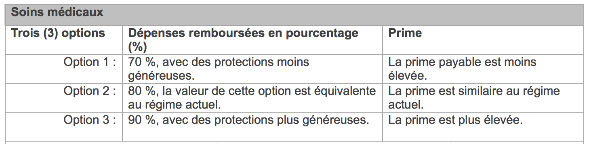

## Introduction à l'information cachée et l'assurance

Quelques faits empiriques sur l'assurance :

- Le prix varie selon le risque.
- Les firmes spécifient et un prix et une quantité.
- Un contrat n'est pas en force si le client a deux contrats d'assurance.

La mesure de risque :

- Il y a des facteurs de risque observables.
- Il y a des facteurs de risque non-observables qui sont révélés en équilibre.

## Les facteurs de risque observables sont parfois subtile

{width=80%}

## Un menu de choix

L'université de Montréal m'offre trois choix d'assurance médicale:

- Le choix révèle de l'information cachée pertinente.
- Population pertinente : *tous* les profs à l'U de M.
- Pas de variation par âge, sexe ou autres indices.
- Choix limité de quantité; l'assurance à 100\% n'est pas une option.
- Autres exemples : assurance auto, vie, immeuble.

## Décisions face à l'incertitude - objets de choix

* Il y a deux états du monde possibles, mutuellement exclusifs et exhaustifs
* Voici deux exemples stylisés :
    * montée de la bourse (rendement de $u=0.10$), chute de la bourse (rendement de $d=-0.05$), 
    * un accident de voiture n'arrive pas, un accident de voiture arrive
* Un panier est $(x,y)$, où
    * $x$ est la consommation réelle dans le « bon » état,
    * $y$ est celle dans le « mauvais ».
* Dans le papier de Rothschild et Stiglitz, $(x,y)$ est $(W_1,W_2)$.

## Décisions face à l'incertitude - préférences

- Utilité espérée objective
    - Le mauvais état a une probabilité objective de $\pi$; le bon, $1-\pi$.
		- Les probabilités sont primitives et objectives.
		- Si les préférences (sur les lottéries) vérifient les axiomes de von Neumann-Morgenstern, il existe une fonction d'utilité $U(\cdot)$ tel que les préférences sont représentées par la fonction d'utilité
			\[
				V(x,y) = (1-\pi) U(x) + \pi U(y).
			\]
		- Tous les agents dans un modèle connaissent les probabilités.
- Utilité espérée subjective
    - Si les préférences vérifient les axiomes de Savage, il existe des probabilités
			$\pi$ et $1-\pi$ et une fonction d'utilité $U(\cdot)$ tel que les préférences sont
			représentées par la fonction d'utilité
			\[
				V(x,y) = (1-\pi) U(x) + \pi U(y).
			\]
		- Les probabilités font partie de la représentation.
		- Les agents ont des probabilités subjectives différentes.

## L'aversion pour le risque

- Par l'hypothèse habituelle, $U(\cdot)$ est croissante et concave.
- Si $U(\cdot)$ est concave, l'agent a de l'aversion pour le risque.
- Une implication de la concavité de $U(\cdot)$ est
\[
	U((1-\pi) x + \pi y) \geq (1-\pi) U(x) + \pi U(y).
\]
- C'est à dire qu'un agent avec une aversion pour le risque préfère la valeur espérée sûre d'une loterie à la loterie.
- Une autre implication de la concavité de $U(\cdot)$ est la concavité de $V(x,y)$.

## Illustration - aversion pour le risque

{width=80%}

## Décisions face à l'incertitude - dotation

- Exemple de bourse
    - L'investisseur a un montant $w$ à investir.
		- Par défaut, il obtient un rendement réel sans risque de $r$.
		- Sa dotation est $(w(1+r),w(1+r))$.
		- L'utilité de sa dotation est de $U(w(1+r))$.
- Exemple d'auto
    - Par défaut, le conducteur n'a pas d'assurance.
		- Si l'accident ne se produit pas, il a une consommation $W$.
		- Si l'accident se produit, il perd $d$ et sa consommation est $W-d$.
		- Sa dotation est $(W,W-d)$.
		- L'utilité de sa dotation est de $(1-\pi) U(W) + \pi U(W-d)$.

## Décisions face à l'incertitude - contraintes I

Dans l'exemple de bourse, (rendements $r$, $u$, $d$ avec $d<r<u$)

- L'investisseur place $c$ dans la bourse avec résultat
\[
	x = (w-c)(1+r) + c(1+u) = w(1+r) + c(u-r)
\]
\[
	y = (w-c)(1+r) + c(1+d) = w(1+r) - c(r-d)
\]
- On peut exprimer la contrainte budgétaire comme
\[
	(1-p) x + p y = w(1+r),
\]
où
\[
  (1-p) = \frac{r-d}{u-d}, \qquad p = \frac{u-r}{u-d}.
\]
- Panier pour $c=0$ (dotation) : $(w(1+r),w(1+r))$
- Panier pour $c=w$ : $(w(1+u),w(1+d))$
- Interprétation de $c>w$ : levier
- Interprétation de $c<0$ : vente à decouvert

## Illustration de la contrainte I

{width=80%}

## Décisions face à l'incertitude - contraintes II

Dans l'exemple de client d'assurance,

- On suppose que l'assureur offre des contrats qui donnent un dollar dans le mauvais état, en quantité illimitée, pour un prix $p$ par contrat.
- On l'observe rarement. Habituellement les assureurs spécifient et une quantité et un prix.
- Le client achète $c$ contrats, avec résultat
\[
	x = W - pc, \qquad y = W - d + c - pc.
\]
- Si on élimine $c$ on obtient le budget
\[
	(1-p)x + py = (1-p)W + p(W-d) = W - pd.
\]
- Panier pour $c=0$ (la dotation) : $(W,W-d)$.

## Illustration de la contrainte II

{width=80%}

## Les contraintes à cote juste

- On ne suppose pas *a priori* que le prix $p$ et la probabilité $\pi$ sont reliés.
- Une contrainte où $p=\pi$ est dite à cote juste.
- Le profit espéré de l'assureur associé à un contrat est
\[
  \Pi = (1-\pi) p + \pi (p-1) = p - \pi.
\]
- Avec les prix à cote juste, le profit espéré est zéro.
- L'entrée et la sortie des firmes dirigent le profit vers zéro.
- La contrainte pour un actif qui coûte sa valeur espérée est à cote juste.
- La contrainte pour une assurance où $\pi$ est le prix d'un dollar dans le mauvais état est à cote juste.

## Choix optimal de l'agent

- Dans les deux exemples, on a la contrainte
\[
	(1-p)x + py = \theta,
\]
où $\theta = w(1+r)$ (bourse) ou $\theta = W - pd$ (auto).
- $p$ est le prix de consommation dans le mauvais état; $(1-p)$, celui dans le bon.
- Le numéraire est le prix de consommation certaine.
- Le problème du consommateur est
\[
  \max_{x\geq 0, y\geq 0} (1-\pi) U(x) + \pi U(y) \quad \mbox{s.c.} \quad (1-p)x + py = \theta.
\]
- Une condition nécessaire pour un maximum est que le taux marginal de substitution égal le ratio de prix:
\[
  \frac{(1-\pi) U'(x)}{\pi U'(y)} = \frac{1-p}{p}.
\]

## Le théorème d'assurance complète

Le théorème de l'assurance complète dit que	le choix optimal face à une contrainte à cote juste est $x^* = y^* = \theta$.

- Les deux conditions nécessaire pour un maximum:
\[
  \frac{(1-\pi) U'(x)}{\pi U'(y)} = \frac{1-p}{p}, \qquad (1-p)x + py = \theta,
\]
deviennent, quand $p=\pi$, $x = y = \theta$.
- Pour le choix optimal, la consommation ne dépend pas de l'état du monde.
- On dit que l'assurance est complète et le risque est éliminé.
- Si $p>\pi$, la contrainte n'est pas à cote juste et l'assurance est incomplète : le taux marginal de substitution est moins grand que $(1-\pi)/\pi$ ssi $x>y$.

## Notes sur l'équilibre pour le modèle de base

- Les clients sont identiques : la probabilité $\pi$, la dotation $(W,W-d)$ et l'utilité $U(\cdot)$ sont fixes.
- Ou il y a un grand nombre de clients ou des assureurs sont neutres au risque:
    - le risque agrégé est zéro ou n'est pas important.
- Il y a un grand nombre d'assureurs, avec la possibilité d'entrée et de sortie:
    - en équilibre il n'y a pas de profits.
- Le profit espéré d'un assureur qui vend une police au prix $p$ à un client qui en achète $c$ unités est de $pc - \pi c$.
- Si $p < \pi$, l'assureur perd de l'argent. Impossible dans un équilibre, parce que l'assureur partirait.
- Si $p > \pi$, il y a un profit. Un autre assureur peut offrir un meilleur prix et attirer des clients.
- En équilibre, $p=\pi$.

## Équilibre pour le modèle sans action ni information cachée

Un équilibre est un prix $p$ et un panier $(x^*,y^*)$ tel que

- $(x^*,y^*)$ maximise $V(x,y) = (1-\pi) U(x) + \pi U(y)$ sous la contraint $(1-p)x + py = (1-p)W + p(W-d) = W-pd$,
- la firme maximise son profit espéré,
- le profit de la firme est zéro.
Result: en équilibre, $p=\pi$, $x^*=y^*=W-pd$.

## Efficacité de l'équilibre (modèle sans action cachée)

- En équilibre, $p^*=\pi$ et $x^*=y^*= \theta \equiv W-\pi d$.
- L'efficacité de cet équilibre est une conséquence du premier théorème de bien-être.
- Démonstration directe:
    - Supposez que l'équilibre n'est pas efficace: l'utilité est plus élevée à $(x',y')$.
    - $(x^*,y^*)$ maximise l'utilité dans la région $(1-\pi) x + \pi y \leq w$, alors $(1-\pi) x'+ \pi y'>w$.
    - Dans une économie avec un grand nombre de clients, $(x',y')$ n'est pas faisable.

## Assurance avec information cachée - clients

- Nous passons maintenant au modèle Rothschild-Stiglitz.
- Attention: dans ce papier, $p$ est une probabilité; $\pi$, un profit.
- Deux types de clients, haut risque ($H$) et bas risque ($B$)
- $n_H$ clients de type $H$, $n_B$ de type $B$, $n_H$ et $n_B$ très grands.
- Le type est (habituellement) de l'information cachée.
- La probabilité d'un accident est $\pi_H$ ou $\pi_B$, selon le type et
\[
  \pi_H > \pi_B.
\]
- Il n'y a pas d'action cachée : la probabilité est exogène.
- Leur dotation (peut importe le type) est $(W,W-d)$, ou
    - $W$ est celle dans le bon état,
    - $W-d$ est la consommation dans le mauvais état.

## Assurance avec information cachée - utilité

- Les utilités sont
\[
	V_t(x,y) = (1-\pi_t) U(x) + \pi_t U(y), \quad t=B,H,
\]
où $x$ est la consommation dans le mauvais état, $y$ est celle dans le bon état.
- Monotonicité, aversion pour le risque : $U'>0$, $U''<0$.
- Le taux marginal de substitution est toujours moins élevé pour le type $H$ :
\[
	\frac{(1-\pi_H) U'(x)}{\pi_H U'(y)} < \frac{(1-\pi_B) U'(x)}{\pi_B U'(y)}.
\]

## Assurance avec information cachée - firmes

- Beaucoup de firmes en concurrence.
- Elles offrent des contrats de la forme $\alpha = (\alpha_1,\alpha_2)$, où $\alpha_1$ est le prix d'assurance et $\alpha_2$ est le paiement net en cas d'accident.
- On peut décrire le même contrat comme $(x,y)$, où $x = W-\alpha_1$, $y=W-d+\alpha_2$.
- Les firmes peuvent offrir plusieurs contrats : $(x_1,y_1)$, $(x_2,y_2)$, \ldots et peuvent interdire l'achat de contrats multiples.
- Profit espéré pour un contrat $(x,y)$ vendu à un client de type $t$ :
\[
	(1-\pi_t) \alpha_1 + \pi_t (-\alpha_2) = (1-\pi_t) (W-x) + \pi_t (W-d-y)
\]
- Condition pour un profit nul espéré pour un type connu $i$ est
\[
	(1-\pi_t) x + \pi_t y = W - \pi_t d.
\]

## Profit pour un mélange

- La condition pour un profit nul espéré pour un seul contrat accepté par les deux types est
\[
	(1-\pi) x + \pi y = W-\pi d,
\]
où
\[
	\pi \equiv \frac{\pi_H n_H + \pi_B n_B}{n_H + n_B}.
\]
- Pourquoi? Si $A$ est l'évènement où le mauvais état arrive pour un client de type inconnue,
\[
	\begin{aligned}
			\Pr[A] &= \Pr[t=H] \Pr[A|t=H] + \Pr[t=B] \Pr[A|t=B] \\
			&= \frac{n_H}{n_H+n_B} \pi_H + \frac{n_B}{n_H+n_B} \pi_B.
	\end{aligned}
\]

## Régions de profit

{width=80%}

## Cas d'information complète

- Mettons que la firme observe les types et peut discriminer.
- Elle offre le contrat $(x_t,y_t) = (W-\pi_t d, W-\pi_t d)$ aux clients de type $t$, $t=B,H$.
- Les clients des deux types acceptent leur contrat.
- Au contrat $(x,y)$ quelconque, le taux marginal de substitution du type $t$ ($t=B,H$) est de
\[
	\frac{\partial V_t(x,y)/\partial x}{\partial V_t(x,y)/\partial y}
	= \frac{(1-\pi_t) U'(x)}{\pi_t U'(y)}.
\]
- En équilibre, le TMS du client de type $t$ au contrat $(x_t,y_t)$ est de $(1-\pi_t)/\pi_t$.
- Le risque disparaisse, l'allocation est efficace.

## L'équilibre en cas d'information complète

{width=80%}

## Équilibre avec information cachée

Un équilibre est un ensemble de contrats $\{(x_1,y_1), (x_2,y_2),\ldots\}$ et un allocation $(x,y)$ pour chaque client tel que

- l'allocation à chaque client est le contrat (ou la dotation) qui maximise son utilité,
- les firmes maximise le profit espéré,
- les firmes peuvent entrer ou sortir du marché,
- il n'y a pas d'autre contrat qui donne un profit (à une firme qui l'offre) si tous les clients	qui le préfère le prend.

## Nombre de contrats en équilibre

- Proposition : tous les clients de type $i$ choisit le même contrat.
- Preuve : supposons que non, il y a deux contrats $(x_1,y_1)$ et $(x_2,y_2)$ choisis par des clients de type $i$.
On peut conclure
    - $U(x_1,y_1) = U(x_2,y_2)$ (sinon personne choisirait l'inférieur)
    - les profits s'égalent (sinon le moins profitable est retiré)
    - Soit $(x,y) = (\lambda x_1 + (1-\lambda) x_2, \lambda y_1 + (1-\lambda) y_2)$, pour $\lambda \in (0,1)$.
    - $(x,y)$ donne le même profit à la firme et le client le préfère.
    - Il y a une occasion pour profiter, impossible dans un équilibre.
    - Il y a un contradiction, la proposition doit être vraie.

## Assurance, information cachée - équilibre mélangeant

- Un contrat unique en équilibre $(x_P,y_P)$ doit vérifier
    - deux contraintes de participation :
		\[
			V_t(x_P,y_P) \geq V_t(W,W-d), \quad i=B,H,
		\]
    - la condition de profit zéro :
		\[
			(1-\pi) x_P + \pi y_P = W-\pi d,
		\]
		où $\pi$ est la probabilité marginale d'un accident :
		\[
			\pi = \frac{\pi_H n_H + \pi_B n_B}{n_H + n_B}.
		\]
- Aussi, il ne peut pas y avoir des possibilités de profit avec des déviations.
- Un tel équilibre est impossible (graphiques).

## Impossibilité de l'équilibre mélangeant I

{width=80%}

## Impossibilité de l'équilibre mélangeant II

{width=80%}

## Impossibilité de l'équilibre mélangeant III

{width=80%}

## Impossibilité de l'équilibre mélangeant IV

{width=80%}

## Impossibilité de l'équilibre mélangeant V

{width=80%}

## Assurance avec information cachée - équilibre «séparant»

Des contrats $(x_B,y_B)$, $(x_H,y_H)$ en équilibre doivent vérifier

- deux contraintes de participation :
\[
	V_t(x_t,y_t) \geq V_t(W,W-d), \quad t=B,H,
\]
- les conditions de profit zéro :
\[
	(1-\pi_t) x_t + \pi_t y_t = W-\pi_t d, \quad t=B,H,
\]
- les contraintes d'auto-sélection :
\[
	V_B(x_B,y_B) \geq V_B(x_H,y_H),
	\quad
	V_H(x_H,y_H) \geq V_H(x_B,y_B).
\]

Notes :

- En équilibre les types $H$ obtiennent de l'assurance parfaite, $x_H = y_H = W - \pi_H d$.
- La contrainte d'auto-sélection est saturée pour les $H$, non les $B$.

## Un équilibre séparant

{width=80%}

## En équilibre, $x_H = y_H$, assurance parfaite

{width=80%}
