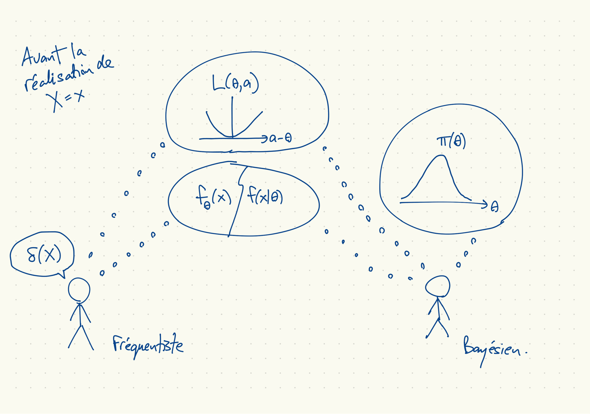
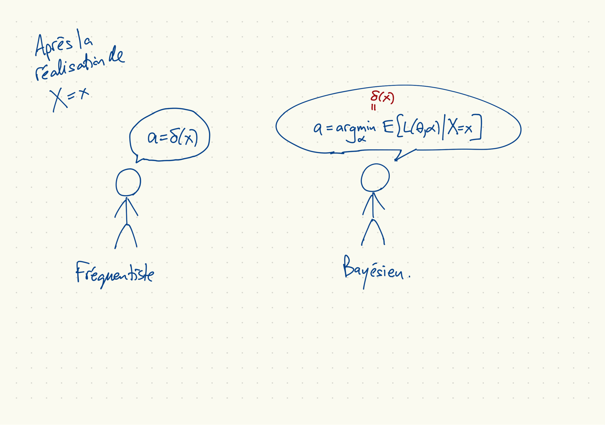

## Éléments de la théorie de décision

Objets :

* $X = (X_1,\ldots,X_n)$, données aléatoires
* $x = (x_1,\ldots,x_n)$, réalisation des données
* $\theta$, le paramètre de la loi des données
* $a$, une action (par exemple, le choix d'une estimation de $\theta$)

Fonctions primitives :

* $f(x|\theta)$, la densité des données
* $\pi(\theta)$, la densité *a priori* de $\theta$
* $L(\theta,a)$, une fonction de perte

Fonction (ou règle) de décision :

* $\delta(X)$ est l'action comme fonction des données.

## Fréquentiste et bayésien avant l'observation des données

## Fréquentiste et bayésien après l'observation des données

## Fonction de risque

* Pour une fonction de perte $L(\theta,a)$ donnée et une fonction de décision (souvent un estimateur) $\delta(X)$ donnée,
la fonction de risque est, dans la notation de Casella et Berger :
$$ R(\theta,\delta) = E_\theta[L(\theta,\delta(X))]. $$

* L'espérance est par rapport à la loi de $X$ pour $\theta$ donné.

* Pour un bayésien, $\theta$ est aléatoire et on peut écrire
$$ R(\theta,\delta) = E[L(\theta,\delta(X))|\theta]. $$
* Problèmes :
    - Spécifier la fonction $\delta(\cdot)$ peut être onéreux et il est nécessaire pour calculer $R(\theta,\delta)$ même pour une seule valeur de $\theta$.
    - $R(\theta,\delta)$ est une fonction de $\theta$. Ce qui marche bien pour une valeur de $\theta$ ne marche pas toujours bien pour une autre.

## Risque de Bayes

* Le risque de Bayes, pour une densité *a priori* $\pi(\theta)$ donnée, est
\[
  \begin{aligned}
    r(\pi,\delta) &\equiv E[R(\theta,\delta)]
    = \int \pi(\theta) E[L(\theta,\delta(X))|\theta] \, d\theta \\
    &= E[E[L(\theta,\delta(X))|\theta]] \\ &= E[L(\theta,\delta(X))].
  \end{aligned}
\]
* Attention : la première espérance est par rapport à la loi *a priori* de $\theta$,
la denière espérance est par rapport à la loi conjointe de $\theta$ et $X$.
* En même temps,
$$ r(\pi,\delta) = E[E[L(\theta,\delta(X))|X]]. $$

## Règles (de décision) de Bayes

* Rappel : $r(\pi,\delta) = E[E[L(\theta,\delta(X))|X]].$

* Une *règle de Bayes* est une fonction de décision $\delta^*$ qui minimise $r(\pi,\delta)$ pour $\pi(\theta)$ et $L(\theta,a)$ donnés.

* Difficultés potentielles :
    * non-unicité de $\delta$
    * absence d'une solution parce que $r(\pi,\delta) = \infty$ pour tous $\delta$

* Même si $r(\pi,\delta)$ est toujours infini, on peut souvent trouver, pour $x$ donné, $\delta(x)$ qui minimise la perte *a posteriori* espérée $E[L(\theta,\delta(X))|X]$ quand $X=x$.
    * C'est une règle de Bayes *généralisée*.
    * En pratique, on calcule $\delta(\cdot)$ à $x$ observée seulement; $\delta(x)$ a souvent la même dimension que $\theta$.
    * Pour la perte quadratique, $\delta(x)$ est la moyenne *a posteriori*.
    * Pour la perte valeur absolue, $\delta(x)$ est la médiane *a posteriori*.
    * Pour une autre perte, on peut approximer $\delta(x)$ par simulation.

## Dominance et admissibilité

* La fonction de décision $\delta^*$ *domine* la fonction de décision $\delta$ par rapport à la fonction de perte $L(\theta,a)$ si $R(\theta,\delta^*) \leq R(\theta,\delta)$, avec une inégalité stricte pour au moins une valeur de $\theta$.

* Une fonction de décision est admissible s'il n'y a pas d'autre fonction de décision qui la domine.

* Analogie : l'admissibilité et l'optimalité dans le sens de Pareto
    - $R(\theta, \delta)$ comme moins l'utilité pour l'individu $\theta$ de l'allocation $\delta$.
    - Comme une allocation Pareto peut être très injuste, une règle admissible peut être très mauvaise pour des valeurs importantes de $\theta$ : l'estimateur $\delta(X)=0$ de $\theta$ dans le modèle Bernoulli avec perte quadratique ne peut pas être dominée.

## Les règles de bayes et l'admissibilité

* L'admissibilité de $\delta$ est quasi-nécessaire pour que $\delta$ soit une règle de bayes; elle est quasi-suffisante pour que $\delta$ soit une règle de bayes généralisée.

* Supposons que $\delta$ minimise $r(\pi,\delta) = \int \pi(\theta) R(\theta,\delta)\, d\theta$, pour une fonction $\pi \colon \Theta \to \mathbb{R}_+$.
L'inadmissibilité de $\delta$ est possible seulement si $\delta$ est dominé sur un ensemble de $\pi$-mesure zéro :
    * Si $\delta$ est inadmissible, il existe une $\delta^*$ qui la domine : il y a un ensemble $\bar{\Theta}$ où $R(\theta,\delta) > R(\theta,\delta^*)$.
    Il faut que $\pi(\bar{\Theta}) = 0$. Sinon, $r(\pi,\delta^*) < r(\pi,\delta)$ et $\delta(x)$ ne minimise pas $r(\pi,\delta)$.
    
* À quelques conditions techniques près, un estimateur admissible est une règle de Bayes généralisée (avec possiblement une loi *a priori* impropre). (Complete class theorem)

## Biais, EMQ

* Notation, définitions
    * $W$ est un estimateur de $\theta$ ou plus généralement de $\tau(\theta)$
    * Le biais de $W$ est $E_\theta[W] - \theta$ ou $E_\theta[W] - \tau(\theta)$
    * L'espérance moyenne quadratique est $E_\theta[(W-\theta)(W-\theta)^\top] = \mathrm{Var}_\theta[W] + \mathrm{biais}_\theta[W]\mathrm{biais}_\theta[W]^\top$.

* L'importance du biais et l'EMQ est largement due à la solubilité des problèmes.

* La perte quadratique est seulement un choix possible parmi plusieurs. Quelques problèmes :
    * paramètres d'échelle, qui sont toujours positifs,
    * impossibilité de la perte asymétrique,
    * non-existance de la moyenne ou la variance d'un estimateur.

* Le non-biais n'est pas un principe fiable, si on considère l'exemple suivant.

## Un estimateur non-biaisé ridicule (RUBE)

* $X_i \sim \mathrm{Po}(\lambda)$, $n=1$.
* On veut estimer $\tau(\lambda) = e^{-3\lambda}$.
* Considérons la statistique $T(X) = (-2)^X$.
* Vraiment ridicule :
    * Pour $x = 9, 10, 11$, $T(x) = -512, 1024, -2048$
    * Pour $\lambda = 10$, $e^{-3\lambda} \approx 9.357623\times 10^{-14}$.
* Mais non-biaisé :
\[
  E[T] = e^{-\lambda} \sum_{k=0}^\infty \frac{(-2)^x \lambda^x}{x!} = e^{-3\lambda}.
\]
* Par complétion de la famille de loi Poisson, $T$ est l'estimateur *unique* non-biaisé de $\tau(\lambda)$.
    * Si $E_\lambda[g(X)] = 0$ pour tous $\lambda$, $P(\{g(X)=0\}) = 1$.
    * Soit $g(x) = T(x) - T'(x)$ la différence entre deux candidats pour un estimateur non-biaisé.

## Statistiques suffisantes dans un modèle gaussien

* Modèle : $X_i \sim \mathrm{iid}\, N(\mu,\sigma^2)$, $\theta = (\mu,\sigma^2)$

* Densité des données :
$$
\begin{aligned}
f(x|\theta) & = \prod_{i=1}^n (2\pi\sigma^2)^{-1/2}
\exp\left[-\frac{1}{2} \frac{(x_i-\mu)^2}{\sigma^2} \right] \\
& = (2\pi)^{-n/2} \sigma^{-n} \exp\left[-\frac{1}{2\sigma^2}\sum_{i=1}^n (x_i-\mu)^2 \right] \\
& = (2\pi)^{-n/2} \sigma^{-n} \exp\left[-\frac{1}{2\sigma^2} ((n-1)S^2 + n(\bar{x}-\mu)^2) \right]
\end{aligned},
$$
où $S^2 \equiv \frac{1}{n-1} \sum_{i=1}^n (x_i - \bar{x})^2$
* Une statistique suffisante minimale pour $(\mu,\sigma^2)$ : $(\bar{x},S^2)$.

## EMQ de $\hat{\sigma}^2$ et $S^2$ dans le modèle $X_i \sim \mathrm{iid}\, N(\mu,\sigma^2)$

* Rappel: $S^2 = \frac{1}{n-1} \sum_{i=1}^n (x_i - \bar{x})^2$.

* L'estimateur EMV de $(\mu,\sigma^2)$ est $(\hat{\mu},\hat{\sigma}^2) = (\bar{x},  \frac{1}{n} \sum_{i=1}^n (x_i - \bar{x})^2)$.

* $S^2$ est non-biaisé ; $\hat{\sigma}^2$ est biaisé mais sa EMQ est moins grande, peu importe la valeur de $\sigma^2$.
(exemples 7.3.3, 7.3.4)

## Analyse bayésienne avec une loi *a priori* conjugée

* Soit $\omega = \sigma^{-2}$, $\theta = (\mu, \omega)$.
* Densité des données, en termes de $\omega$ :
\[
  f(x|\theta) \propto
  \omega^{n/2} \exp\left[-\frac{\omega}{2} ((n-1)S^2 + n(\bar{x}-\mu)^2)\right]
\]
* La famille des lois *a priori* conjugée est Normal-gamma, où
    * $\omega \sim \mathrm{Ga}(\alpha_0, \beta_0)$
    * $\mu|\omega \sim N(\mu_0, (\omega\lambda_0)^{-1})$
* Après des manipulations, on découvre que
\[
  \omega|x \sim \mathrm{Ga}\left(
    \alpha_0 + n/2,
    \beta_0 + \frac{1}{2}
    \left((n-1)S + \frac{\lambda_0n(\bar{x}-\mu_0)^2}{\lambda_0 + n}\right)
  \right),
\]
\[
  \mu|\omega,x \sim N\left(
    \frac{\lambda_0 \mu_0 + n\bar{x}}{\lambda_0 + n}, (\omega(\lambda_0 + n))^{-1}
  \right).
\]
* Détails à https://en.wikipedia.org/wiki/Normal-gamma_distribution,
section "Posterior distribution of the parameters"

## La fonction de score

* Soit $L(\theta;x)$ une vraisemblance, $f(x|\theta)$ la densité des données.

* La fonction de score est le gradient :
$$ V(\theta,x) = \frac{\partial \log L(\theta;x)}{\partial \theta^\top}
= \frac{1}{L(\theta;x)} \frac{\partial L(\theta;x)}{\partial \theta}. $$

* Si on peut changer l'ordre de l'intégrale et la dérivée,
$$ E\left[ \frac{\partial \log L(\theta;x)}{\partial \theta^\top} \right]
= \int \frac{f(x|\theta)}{f(x|\theta)} \frac{\partial f(x|\theta)}{\partial \theta^\top}\, dx = \frac{\partial \int f(x|\theta)\, dx}{\partial \theta^\top} = 0. $$

* Conditions suffisantes pour pouvoir changer l'ordre de l'intégrale et la dérivée
    1. La densité $f(x|\theta)$ a un support borné et ce support ne dépend pas de $\theta$.
    1. La densité $f(x|\theta)$ a un support infini et est continument différentiable en $\theta$ ; l'intégral converge uniformement sur $\Theta$.

## Inégalité Cramér-Rao

* Échantillon $X_1,\ldots,X_n$, pas nécessairement iid, densité $f(x|\theta)$.

* Supposons que $E[V(\theta,X)] = 0$, où $V(\theta,X)$ est la fonction de score.

* Supposons que $W(X)$ est un estimateur de $\tau(\theta)$, $\mathrm{Var}_\theta[W(X)] < \infty$, et
$$ \frac{d}{d\theta} E_\theta[W(X)] = \int \frac{\partial }{\partial \theta} [W(x) f(x|\theta)]\, dx. $$

* Alors
$$ \mathrm{Var}_\theta[W(X)] \geq \frac{\left(\frac{d}{d\theta}E_\theta[W(X)]\right)^2}
{E_\theta\left[V(\theta,X)^2\right]}. $$

## Preuve de l'inégalité Cramér-Rao

* L'égalité encore :
$$ \mathrm{Var}_\theta[W(X)] \geq \frac{\left(\frac{d}{d\theta}E_\theta[W(X)]\right)^2}
{E_\theta\left[V(\theta,X)^2\right]}. $$

* Preuve :
\[
  \begin{aligned}
  \frac{d}{d\theta} E_\theta[W(X)]
  &= \int W(x) \left[\frac{\partial f(x|\theta)}{\partial \theta}  \right]\, dx \\
  &= \int W(x) \left[\frac{\partial \log f(x|\theta)}{\partial \theta}  \right]f(x|\theta) \, dx \\
  &= E_\theta\left[W(X) V(\theta,X) \right] = \mathrm{Cov}_\theta[W(X), V(\theta,X)]
  \end{aligned}
\]
et
\[
\mathrm{Var}_\theta[V(\theta,X)] = E_\theta[V(\theta,X)^2]
\]
et par l'inégalité de Cauchy-Schwarz :
\[
  \mathrm{Var}_\theta[W(X)] \mathrm{Var}_\theta[V(\theta,X)]
  \geq \mathrm{Cov}_\theta[W(X),V(\theta,X)]^2.
\]

## Remarques, inégalité Cramér-Rao

* Le dénominateur est l'information de Fisher, qui dépend du modèle et non l'estimateur.
* L'inégalité est très utile dans le cas où $W(X)$ est non-biaisé pour $\tau(\theta) = \theta$ :
    - $E_\theta[W(X)] = \theta$ alors le numérateur est 1
    - la variance $\mathrm{Var}_\theta[W(X)]$ a une borne qui ne dépend pas de l'estimateur.
* La borne est toujours une fonction de $\theta$, par contre.
* Un estimateur qui atteint la borne est dit "efficace".
* Attention :
    * un estimateur biaisé peut avoir une EMQ en dessous de cette borne.
    * le critère de non-biais et la fonction de perte quadratique ne sont pas sans difficultés.

## Théorème Rao-Blackwell

* Soit $\delta(X)$ un estimateur de $\tau(\theta)$, $T(X)$ une statistique exhaustive pour $\theta$.
* Soit $\delta_1(X) = \delta_1(T(X)) = E[\delta|T]$, un autre estimateur de $\tau(\theta)$.
* Résultat : $\delta_1(X)$ est non-biasé ssi $\delta(X)$ est non-biasé.
* Preuve : $E[\delta(X)] = E[E[\delta(X)|T]] = E[\delta_1(X)]$.
* Théorème Rao-Blackwell :
\[
  E[(\delta_1(X)-\tau(\theta))^2] \leq E[(\delta(X)-\tau(\theta))^2]
\]
* Preuve :
\[
  \begin{aligned}
    E[(\delta(X)-\tau(\theta))^2] &= E[E[(\delta(X)-\tau(\theta))^2|T]] \\
    &= E[Var[\delta(X)|T] + (\delta_1(X) - \theta)^2] \\
    &\geq E[(\delta_1(X)-\theta)^2].
  \end{aligned}
\]

## Exemple, Rao-Blackwellisation

- Soit $X_1,\ldots,X_n \sim \mathrm{Po}(\lambda)$,
- Soit $\tau(\lambda) = e^{-\lambda}$ (probabilité de l'évènement $X_i=0$)
- Soit $\delta(X) = 1_{\{X_1 = 0\}}$.
- Soit $S_n = \sum_{i=1}^n X_i$, une statistique exhaustive minimale.
- Utilisez $S_n$ pour améliorer l'estimateur :
\[
  \begin{aligned}
    \delta_1(X) &= E[\delta(X)|S_n = s_n] \\
    &= P(X_1=0, \sum_{i=2}^n X_i = s_n) / P(S_n = s_n) \\
    &= \frac{((n-1)\lambda)^{s_n} e^{-\lambda n}}{s_n!} \cdot \frac{s_n!}{(n\lambda)^{s_n} e^{-\lambda n}} = \left(1-\frac{1}{n}\right)^{s_n}.
  \end{aligned}
\]
- Notez que $S_n \log(1-\tfrac{1}{n}) \approx \tfrac{S_n}{n}$ pour $n$ grand.
