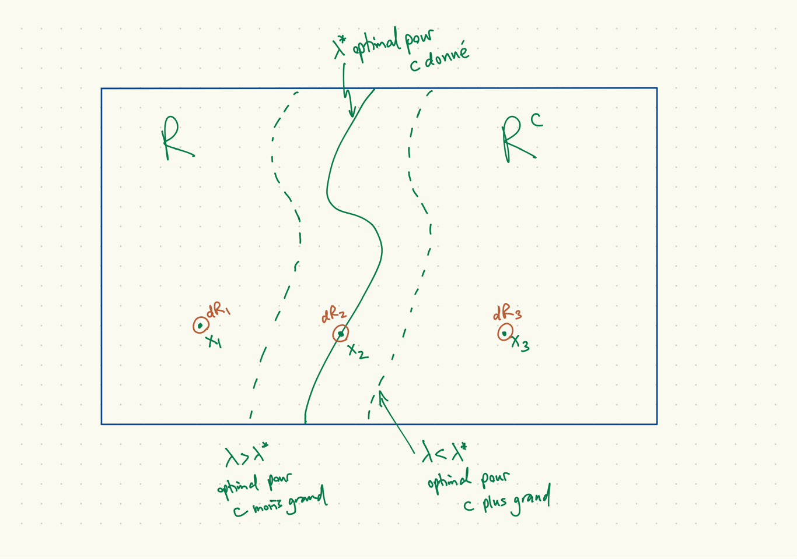

```{r setup, include=FALSE}
knitr::opts_chunk$set(echo = FALSE)
```

## Hypothèses sur un paramètre $\theta \in \Theta$

* Deux hypothèses sur $\theta$ :
    * hypothèse nulle $H_0$, $\theta \in \Theta_0$
    * hypothèse alternative $H_1$, $\theta \in \Theta_0^c$

* Notes :
    * Les hypothèses viennent d'une question scientifique d'intérêt.
    * Il n'y a rien ici de classique ou de bayésien.
    * La spécification de $\Theta_0$ devrait précèder la recherche d'un test et l'évaluation d'un test.
    * Il y a une asymmétrie qui n'est pas explicite ici.
    * L'asymétrie est une question d'erreur : on favorise le control d'un type d'erreur.

## Tests

* Deux décisions (même notation pour les actions)
    * $a_0$, ne pas rejeter $H_0$
    * $a_1$, rejeter $H_0$

* Deux régions de l'espace échantillonal :
    * région critique (ou de rejet) $R \subseteq {\cal X}$
    * région de non-rejet $R^c$

* Notes :
    * Une règle de décision est un $\delta \colon {\cal X} \to \{a_0,a_1\}$
    * $R = \{x \colon \delta(x) = a_1 \}$, $R^c = \{x \colon \delta(x) = a_0\}$.
    * réduction de dimension, comme dans le cas d'estimation ponctuelle : il y a souvent une statistique $W(X)$ scalaire tel que $R$ ou $R^c$ prend la forme $\{x \colon W(x) \in [a,b]\},$ des fois avec $a=-\infty$ ou $b=\infty$.
    * attention : quand $W(X)$ est un estimateur de $\theta$, il est facile de confondre une hypothèse avec une région ($R$ ou $R^c$).
    
## Optimalité par fonction de perte

* Une fonction de perte assez générale :
$$ L(\theta, a_0) = \begin{cases}
0 & \theta \in \Theta_0 \\
c_{II} & \theta \in \Theta_0^c
\end{cases} $$
$$ L(\theta, a_1) = \begin{cases}
c_I & \theta \in \Theta_0 \\
0 & \theta \in \Theta_0^c
\end{cases} $$

* Notes :
    * $c_I$ est le coût d'une erreur du type I, $c_{II}$ le coût d'une erreur du type II
    * Avec cette généralité, on peut briser la symétrie des deux hypothèses : choisir $c_I \neq c_{II}$.

## Les fonctions de risque et de puissance

* Le risque $R(\theta,\delta) = E_\theta[L(\theta,\delta(X))]$ est
$$
R(\theta,\delta) = \begin{cases}
0 \cdot P_\theta(\delta(X)=a_0) + c_I \cdot P_\theta(\delta(X)=a_1), & \theta \in \Theta_0, \\
c_{II} \cdot P_\theta(\delta(X)=a_0) + 0 \cdot P_\theta(\delta(X)=a_1), & \theta \in \Theta_0^c.
\end{cases}
$$
* Cela motive la définition de la fonction de puissance :
$$ \beta(\theta) \equiv P_\theta(X\in R) = P_\theta(\delta(X)=a_1) $$
* On peut écrire tout court
$$ R(\theta,\delta) = \begin{cases}
c_I \beta(\theta), & \theta \in \Theta_0, \\
c_{II} (1-\beta(\theta)), & \theta \in \Theta_0^c
\end{cases}
$$

* Rappel : c'est une exercise *ex ante*.
    
## Risque de Bayes

* Rappel : $r(\pi,\delta) = \int R(\theta,\delta) \pi(\theta)\, d\theta = E[E[L(\theta,\delta(X))|\theta]] = E[L(\theta,\delta(X))] = E[E[L(\theta,\delta(X))|X]]$.

* Pour un échantillon $x$ observé, la perte espérée *a posteriori* est
$$
\begin{aligned}
&E[L(\theta,\delta(X))|x] \\
&= \begin{cases}
    0 \cdot P[\theta \in \Theta_0|x] + c_{II} \cdot P[\theta \in \Theta_0^c|x],
    & \delta(x) = a_0 \\
    c_I \cdot P[\theta \in \Theta_0|x] + 0 \cdot P[\theta \in \Theta_0^c|x],
    & \delta(x) = a_1
\end{cases}
\end{aligned}
$$

* La solution $\delta(x)$ qui minimise la perte *a posteriori* est
$$ \delta(x) = \begin{cases}
a_0, & \frac{c_I}{c_{II}} \frac{P[\theta \in \Theta_0|x]}{P[\theta \in \Theta_0^c|x]} \geq 1, \\
a_1, & \mbox{autrement}.
\end{cases}
$$

* Notes :
    * C'est une exercise *ex post*.
    * La distinction entre $H_0$ et $H_1$ est seulement en termes de $c_{II}/c_I$.

## Intuition Neyman Pearson I

* Supposons qu'il y a deux valeurs possibles de $\theta$ : $\theta_0$ et $\theta_1$.
* On divise $\cal X$ en deux : $R$ où $\delta(x) = a_1$ et $R^c$ où $\delta(x) = a_0$.
* On choisit $R$ pour maximiser $p(R|\theta_1)$ sous la contrainte $p(R|\theta_0) \leq c$.
* Une fonction de Lagrange pour ce problème :
\[
  P[R|\theta_1] - \lambda (P[R|\theta_0]-c). 
\]
* Pour $x_2 \in \cal X$ à la frontière entre $R$ optimal et $R^c$ et un voisinage infinitessimal $dR_2$ autour de $x_2$,
\[
  P[R+dR_2|\theta_1] - P[R|\theta_1] - \lambda (P[R+dR_2|\theta_0] - P[R|\theta_0]) = 0.
\]
ou
\[
  p(x_2|\theta_1) - \lambda p(x_2|\theta_0) = 0.
\]

## Intuition Neyman Pearson II

* De la diapo précédente :
\[
  \frac{p(x_2|\theta_1)}{p(x_2|\theta_0)} = \lambda.
\]
* Pour $x_1 \in \cal X$ à l'intérieure de $R$,
\[
  \frac{p(x_1|\theta_1)}{p(x_1|\theta_0)} > \lambda. 
\]
* Pour $x_3 \in \cal X$ à l'intérieure de $R^c$,
\[
  \frac{p(x_3|\theta_1)}{p(x_3|\theta_0)} < \lambda. 
\]

## Illustration pour l'intuition Neyman Pearson



## Exemple récurrent Bernoulli

* Rappel :
    1. $X_1,\ldots,X_n \sim \mathrm{iid}\, \mathrm{Bn}(\theta)$, $\theta \in [0,1]$.
    1. $L(\theta,x) = \theta^r (1-\theta)^{(n-r)}$, où $r$ est le nombre de uns.
    1. $\hat{\theta}_{\mathrm{EMV}} = \hat{\theta} = r/n$.
* Considérons les hypothèses $H_0:\theta \geq 1/2$ et $H_1:\theta < 1/2$
    * $\Theta_0 = [1/2,1]$, $\Theta = [0,1]$, $\Theta_0^c = [0,1/2)$
* Calculer le rapport des vraisemblances
$$ \sup_{\theta \in \Theta_0} L(\theta|x) =
\begin{cases} L(\hat{\theta}|x) & \hat{\theta} \geq 1/2 \\ L(\frac{1}{2}|x) = \left(\frac{1}{2}\right)^n & \hat{\theta} < 1/2 \end{cases} $$
$$ \sup_{\theta \in \Theta} L(\theta|x) = L(\hat{\theta}|x) $$
$$ \lambda(x) = 
\begin{cases}
    1, & r \geq n/2, \\
    \frac{(n/2)^n}{r^r (n-r)^{n-r}}, & r < n/2.
\end{cases} $$
* Une fonction de la statistique suffisante. En général, on peut utiliser $f(t|\theta)$ directement, obtenir le même résultat.

## Les valeures de $\lambda(x)$ pour $n=12$

|$r$|$\lambda(x)$|$P_\theta(R \leq r)$|
|---|--------|--------------------|
|0|0.000244|$(1-\theta)^n$|
|1|0.007629|$(1-\theta)^n + n\theta(1-\theta)^{n-1}$|
|2|0.054420|$(1-\theta)^n + n\theta(1-\theta)^{n-1} + \binom{n}{2}\theta^2 (1-\theta)^{n-2}$|
|3|0.208098|$\cdots$|
|4|0.506822||
|5|0.845821||
|6|1||
|$\cdots$|$\cdots$||
|12|1|1|

## La forme d'un LRT

* La forme en général :
$$ \left\{x \in {\cal X} \colon \lambda(x) \equiv \frac{\sup_{\theta \in \Theta_0} L(\theta|x)}{\sup_{\theta \in \Theta}L(\theta|x)} \leq c \right\} $$

* Notes :
    * attrait intuitive
    * réduction de dimension

* $c \in [0,1]$ à spécifier

* Ici, la forme d'un LRT est
$$ \{x \in {\cal X} \colon \sum_{i}x_i \leq r\},\quad r=0,1,2,3,4,5,12 $$

## Quelques fonctions de puissance $\beta_r(\theta)$

* Soit $\beta_r(\theta)$ la fonction de puissance pour la région critique $\{x \colon \sum_i x_i\leq r\}$

```{r betar, include=TRUE, echo=TRUE}
theta = seq(0, 1, by=0.01); n=12
beta_0 = pbinom(0, n, theta) # R = {r <= 0}
beta_1 = pbinom(1, n, theta) # R = {r <= 0}
beta_2 = pbinom(2, n, theta) # R = {r <= 2}
beta_3 = pbinom(3, n, theta)
beta_4 = pbinom(4, n, theta)
beta_5 = pbinom(5, n, theta)
beta_12 = pbinom(12, n, theta)
```

## Graphique des fonctions de puissance

```{r betarplot, include=TRUE, echo=TRUE}
plot(theta, beta_0, type='l'); lines(theta, beta_1)
lines(theta, beta_2); lines(theta, beta_3)
lines(theta, beta_4); lines(theta, beta_5); lines(theta, beta_12)
```

## Exemple, même modèle, hypothèse ponctuelle

* Considérons les hypothèses $H_0:\theta = 1/2$ et $H_1:\theta \neq 1/2$

* Ici, la LRT $\lambda(x)$ est
$$ \lambda(x) = \frac{(n/2)^n}{r^r(n-r)^{n-r}}. $$

## Les valeures de $\lambda(x)$ pour $n=12$

|$r$|$\lambda(x)$|
|---|------------|
|0|0.0002441406|
|1|0.0076294893|
|2|0.0544195584|
|3|0.2080983590|
|4|0.5068216324|
|5|0.8458214659|
|6|1.0000000000|
|7|0.8458214659|
|8|0.5068216324|
|9|0.2080983590|
|10|0.0544195584|
|11|0.0076294893|
|12|0.0002441406|

## Quelques fonctions de puissance $\beta_r(\theta)$

* Soit $\beta_c(\theta)$ la fonction de puissance pour la région critique $\{x \colon |\sum_i x_i-n/2| \geq c\}$

```{r betarpt, include=TRUE, echo=TRUE}
theta = seq(0, 1, by=0.01); n=12
# R = {0,12}
beta_6 = pbinom(0, n, theta) + pbinom(0, n, 1-theta)
# R = {0,1,11,12}
beta_5 = pbinom(1, n, theta) + pbinom(1, n, 1-theta)
beta_4 = pbinom(2, n, theta) + pbinom(2, n, 1-theta) 
beta_3 = pbinom(3, n, theta) + pbinom(3, n, 1-theta)
beta_2 = pbinom(4, n, theta) + pbinom(4, n, 1-theta)
# R = {0,1,2,3,4,5,7,8,9,10,11,12}
beta_1 = pbinom(5, n, theta) + pbinom(5, n, 1-theta)
```

## Graphique des fonctions de puissance

```{r betarptplot, include=TRUE, echo=TRUE}
plot(theta, beta_6, type='l'); lines(theta, beta_5)
lines(theta, beta_4); lines(theta, beta_3)
lines(theta, beta_2); lines(theta, beta_1)
```

## La probabilité *a posteriori* $P(\theta \geq 1/2|x)$, $r=4$

* Soit $n=12$, $\theta \sim \mathrm{Be}(\alpha, \beta)$, où $\alpha=1$, $\beta=1$.
* $\theta|x \sim \mathrm{Be}(\alpha+r, \beta+n-r)$
* Si on observe (mettons) $r=4$, $\theta|x \sim \mathrm{Be}(5, 9)$
* $P(\theta \geq 1/2|r(x) = 4) = 1-F_{\mathrm{Be}(5,9)}(1/2) = `r 1-pbeta(0.5, 5, 9)`$.

## La probabilité *a posteriori* $P(\theta \geq 1/2|x)$, plusieurs $r$

* Soit $n=12$, $\alpha=1$, $\beta=1$, $\Omega_0 = [1/2,1]$
* La probabilité *a posterior* dépend du $r$ observé :

|$r$|$P[\theta \in \Omega_0\|x]$|
|---|----------------------|
|0|0.0001220703|
|1|0.0017089844|
|2|0.0112304688|
|3|0.0461425781|
|4|0.1334228516|
|5|0.2905273437|
|6|0.5000000000|
|7|0.7094726563|
|8|0.8665771484|
|9|0.9538574219|
|10|0.9887695312|
|11|0.9982910156|
|12|0.9998779297|

## Test d'une hypothèse ponctuelle, une approche bayésienne

Un modèle composé, où le modèle $M$, le paramètre $\theta$ et les données
sont aléatoires :
\[
  \begin{aligned}
    f(M,\theta,x) &= \Pr[M=H_0] 1_{\{H_0\}}(M) \delta_{1/2}(\theta) (1/2)^n \\
    &+ \Pr[M=H_1] 1_{\{H_1\}}(m) f_{\mathrm{Be}}(\theta; \alpha, \beta) \theta^r (1-\theta)^{n-r}.
  \end{aligned}
\]

Après l'intégration de $x$,
\[
  f(M,x) = \Pr[M=H_0] 1_{\{H_0\}}(M) f_0(x) + \Pr[M=H_1] 1_{\{H_1\}}(M) f_1(x),
\]
où
\[
  f_0(x) = (1/2)^n, \quad f_1(x) =
  \frac{\Gamma(\alpha+\beta)}{\Gamma(\alpha)\Gamma(\beta)}
  \frac{\Gamma(\alpha+r)\Gamma(\beta+n-r)}{\Gamma(\alpha + \beta + n)}.
\]

## (cont.)

Les probabilités posterieures :
\[
  \Pr[M=H_0|x] = \frac{\Pr[M=H_0] f_0(x)}{\Pr[M=H_0] f_0(x) + \Pr[M=H_1] f_1(x)}
\]
\[
  \Pr[M=H_1|x] = \frac{\Pr[M=H_1] f_1(x)}{\Pr[M=H_0] f_0(x) + \Pr[M=H_1] f_1(x)}
\]

Le rapport de chances (rapport des cotes) postérieur :
\[
  \frac{\Pr[M=H_0|x]}{\Pr[M=H_1|x]} = \frac{\Pr[M=H_0]}{\Pr[M=H_1]} \frac{f_0(x)}{f_1(x)}
\]

La décision optimale :
\[
  \delta(x) = \begin{cases} a_0 & \frac{c_I}{c_{II}} \frac{\Pr[M=H_0]}{\Pr[M=H_1]} \frac{f_0(x)}{f_1(x)} \geq 1, \\ a_1 & \mbox{autrement}.
  \end{cases}
\]

## 

