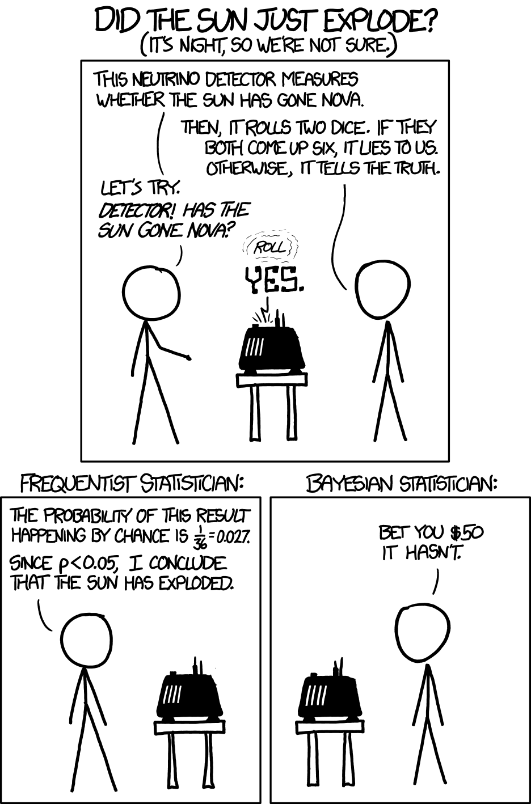

```{r setup, include=FALSE}
knitr::opts_chunk$set(echo = FALSE)
```

## Hypothèses sur un paramètre $\theta \in \Theta$

* Deux hypothèses sur $\theta$ :
    * hypothèse nulle $H_0$, $\theta \in \Theta_0$
    * hypothèse alternative $H_1$, $\theta \in \Theta_0^c$

* Notes :
    * une question scientifique d'intérêt
    * rien ici de classique ou de bayésien
    * la spécification de $\Theta_0$ précède la recherche d'un test, l'évaluation d'un test
    * asymmétrie implicite, pas explicite ici
    * l'asymétrie comme une question d'erreur : favoriser le control d'un type d'erreur

## Tests

* Deux décisions (en termes de la notation pour les actions)
    * $a_0$, ne pas rejeter $H_0$
    * $a_1$, rejeter $H_0$

* Deux régions de l'espace échantillonal :
    * région critique (ou de rejet) $R \subseteq {\cal X}$
    * région de non-rejet $R^c$

* Notes :
    * Une règle de décision est un $\delta \colon {\cal X} \to \{a_0,a_1\}$
    * $R = \{x \colon \delta(x) = a_1 \}$, $R^c = \{x \colon \delta(x) = a_0\}$.
    * réduction de dimension ici aussi : il y a souvent une statistique $W(X)$ scalaire tel que $R$ ou $R^c$ prend la forme $\{x \colon W(x) \in [a,b]\}$
    * attention : quand $W(X)$ est un estimateur de $\theta$, il est facile de confondre une hypothèse avec une région ($R$ ou $R^c$).
    
## Optimalité par fonction de perte

* Une fonction de perte assez générale :
$$ L(\theta, a_0) = \begin{cases}
0 & \theta \in \Theta_0 \\
c_{II} & \theta \in \Theta_0^c
\end{cases} $$
$$ L(\theta, a_1) = \begin{cases}
c_I & \theta \in \Theta_0 \\
0 & \theta \in \Theta_0^c
\end{cases} $$

* Notes :
    * $c_I$ est le coût d'une erreur du type I, $c_{II}$ le coût d'une erreur du type II
    * Avec cette généralité, on peut briser l'asymétrie des deux hypothèses.

## Les fonctions de risque et de puissance

* Le risque $R(\theta,\delta) = E_\theta[L(\theta,\delta(X))]$ est
$$
R(\theta,\delta) = \begin{cases}
0 \cdot P_\theta(\delta(X)=a_0) + c_I \cdot P_\theta(\delta(X)=a_1), & \theta \in \Theta_0, \\
c_{II} \cdot P_\theta(\delta(X)=a_0) + 0 \cdot P_\theta(\delta(X)=a_1), & \theta \in \Theta_0^c.
\end{cases}
$$
* Cela motive la définition de la fonction de puissance :
$$ \beta(\theta) \equiv P_\theta(X\in R) = P_\theta(\delta(X)=a_1) $$
* On peut écrire tout court
$$ R(\theta,\delta) = \begin{cases}
c_I \beta(\theta), & \theta \in \Theta_0, \\
c_{II} (1-\beta(\theta)), & \theta \in \Theta_0^c
\end{cases}
$$

* Rappel : c'est une exercise *ex ante*
    
## Risque de Bayes

* Rappel : $r(\pi,\delta) = \int R(\theta,\delta) \pi(\theta)\, d\theta = E[E[L(\theta,\delta(X))|\theta]] = E[L(\theta,\delta(X))] = E[E[L(\theta,\delta(X))|X]]$.

* Pour un échantillon $x$ observé, la perte espérée *a posteriori* est
$$
\begin{aligned}
&E[L(\theta,\delta(X))|x] \\
&= \begin{cases}
    0 \cdot P[\theta \in \Theta_0|x] + c_{II} \cdot P[\theta \in \Theta_0^c|x],
    & \delta(x) = a_0 \\
    c_I \cdot P[\theta \in \Theta_0|x] + 0 \cdot P[\theta \in \Theta_0^c|x],
    & \delta(x) = a_1
\end{cases}
\end{aligned}
$$

* La solution $\delta(x)$ qui minimise la perte *a posteriori* est
$$ \delta(x) = \begin{cases}
a_0, & \frac{c_{II}}{c_I} \frac{P[\theta \in \Theta_0^c|x]}{P[\theta \in \Theta_0|x]} \leq 1, \\
a_1, & \mbox{autrement}.
\end{cases}
$$

* Notes :
    * C'est une exercise *ex post*
    * Pas de distinction importante entre $H_0$ et $H_1$ (échangeable)
    
## Exemple récurrent Bernoulli

* Rappel :
    1. $X_1,\ldots,X_n \sim \mathrm{iid}\, \mathrm{Bn}(\theta)$, $\theta \in [0,1]$.
    1. $L(\theta,x) = \theta^r (1-\theta)^{(n-r)}$, où $r$ est le nombre de uns.
    1. $\hat{\theta}_{\mathrm{EMV}} = \hat{\theta} = r/n$.

* Considérons les hypothèses $H_0:\theta \geq 1/2$ et $H_1:\theta < 1/2$
    1. $\Theta_0 = [1/2,1]$, $\Theta = [0,1]$, $\Theta_0^c = [0,1/2)$
    
* Calculer le rapport des vraisemblances
$$ \sup_{\theta \in \Theta_0} L(\theta|x) =
\begin{cases} L(\hat{\theta}|x) & \hat{\theta} \geq 1/2 \\ L(\frac{1}{2}|x) = \left(\frac{1}{2}\right)^n & \hat{\theta} < 1/2 \end{cases} $$
$$ \sup_{\theta \in \Theta} L(\theta|x) = L(\hat{\theta}|x) $$
$$ \lambda(x) = 
\begin{cases}
    1, & r \geq n/2, \\
    \frac{(n/2)^n}{r^r (n-r)^{n-r}}, & r < n/2.
\end{cases} $$

## Les valeures de $\lambda(x)$ pour $n=12$

|$r$|$\lambda(x)$|$P_\theta(R \leq r)$|
|---|------------|--------------------|
|0|0.0002441406|$(1-\theta)^n$|
|1|0.007629489|$(1-\theta)^n + n\theta(1-\theta)^{n-1}$|
|2|0.054419558||
|3|0.208098359||
|4|0.506821632||
|5|0.845821466||
|6|1||
|$\cdots$|||
|12|1|1|

## La forme d'un LRT

* La forme en général :
$$ \left\{x \in {\cal X} \colon \lambda(x) \equiv \frac{\sup_{\theta \in \Theta_0} L(\theta|x)}{\sup_{\theta \in \Theta}L(\theta|x)} \leq c \right\} $$

* Notes :
    * attraction intuitive
    * réduction de dimension

* $c \in [0,1]$ à spécifier

* Ici, la forme d'un LRT est
$$ \{x \in {\cal X} \colon \sum_{i}x_i \leq r\},\quad r=0,1,2,3,4,5,12 $$

## Quelques fonctions de puissance $\beta_r(\theta)$

* Soit $\beta_r(\theta)$ la fonction de puissance pour la région critique $\{x \colon \sum_i x_i\leq r\}$

```{r betar, include=TRUE, echo=TRUE}
theta = seq(0, 1, by=0.01); n=12
beta_0 = pbinom(0, n, theta) # R = {r <= 0}
beta_2 = pbinom(2, n, theta) # R = {r <= 2}
beta_3 = pbinom(3, n, theta)
beta_4 = pbinom(4, n, theta)
```

## Graphique des fonctions de puissance

```{r betarplot, include=TRUE, echo=TRUE}
plot(theta, beta_0, type='l'); lines(theta, beta_2)
lines(theta, beta_3); lines(theta, beta_4)
```

## Exemple, même modèle, hypothèse ponctuelle

* Considérons les hypothèses $H_0:\theta = 1/2$ et $H_1:\theta \neq 1/2$

* Ici, la LRT $\lambda(x)$ est
$$ \lambda(x) = \frac{(n/2)^n}{r^r(n-r)^{n-r}}. $$

## Les valeures de $\lambda(x)$ pour $n=12$

|$r$|$\lambda(x)$|
|---|------------|
|0|0.0002441406|
|1|0.0076294893|
|2|0.0544195584|
|3|0.2080983590|
|4|0.5068216324|
|5|0.8458214659|
|6|1.0000000000|
|7|0.8458214659|
|8|0.5068216324|
|9|0.2080983590|
|10|0.0544195584|
|11|0.0076294893|
|12|0.0002441406|

## Quelques fonctions de puissance $\beta_r(\theta)$

* Soit $\beta_c(\theta)$ la fonction de puissance pour la région critique $\{x \colon |\sum_i x_i-n/2| \geq c\}$

```{r betarpt, include=TRUE, echo=TRUE}
theta = seq(0, 1, by=0.01); n=12
# R = {0,12}
beta_6 = pbinom(0, n, theta) + pbinom(0, n, 1-theta)
# R = {0,1,11,12}
beta_5 = pbinom(1, n, theta) + pbinom(1, n, 1-theta)
beta_4 = pbinom(2, n, theta) + pbinom(2, n, 1-theta) 
beta_3 = pbinom(3, n, theta) + pbinom(3, n, 1-theta)
```

## Graphique des fonctions de puissance

```{r betarptplot, include=TRUE, echo=TRUE}
plot(theta, beta_6, type='l'); lines(theta, beta_5)
lines(theta, beta_4); lines(theta, beta_3)
```

## La probabilité *a posteriori* $P(\theta \geq 1/2|x)$, plusieurs $r$

* Soit $n=12$, $\alpha=1$, $\beta=1$, $\Omega_0 = [1/2,1]$

* La probabilité *a posterior* dépend du $r$ observé:

|$r$|$P[\theta \in \Omega_0\|x]$|
|---|----------------------|
|0|0.0001220703|
|1|0.0017089844|
|2|0.0112304688|
|3|0.0461425781|
|4|0.1334228516|
|5|0.2905273437|
|6|0.5000000000|
|7|0.7094726563|
|8|0.8665771484|
|9|0.9538574219|
|10|0.9887695312|
|11|0.9982910156|
|12|0.9998779297|

## 


## Devoirs et lectures

Devoirs, Casella et Berger (matière du cours 11)

1. Exercise 8.12
1. Exercise 8.13
1. Exercise 8.53

Préparation du cours 12, Casella et Berger

1. Chapitre 9 (pas tous les détails des exemples)
1. Questions suggérées : 9.1, 9.2, 9.6, 9.26

