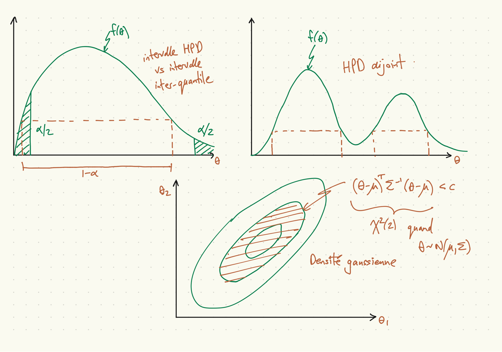
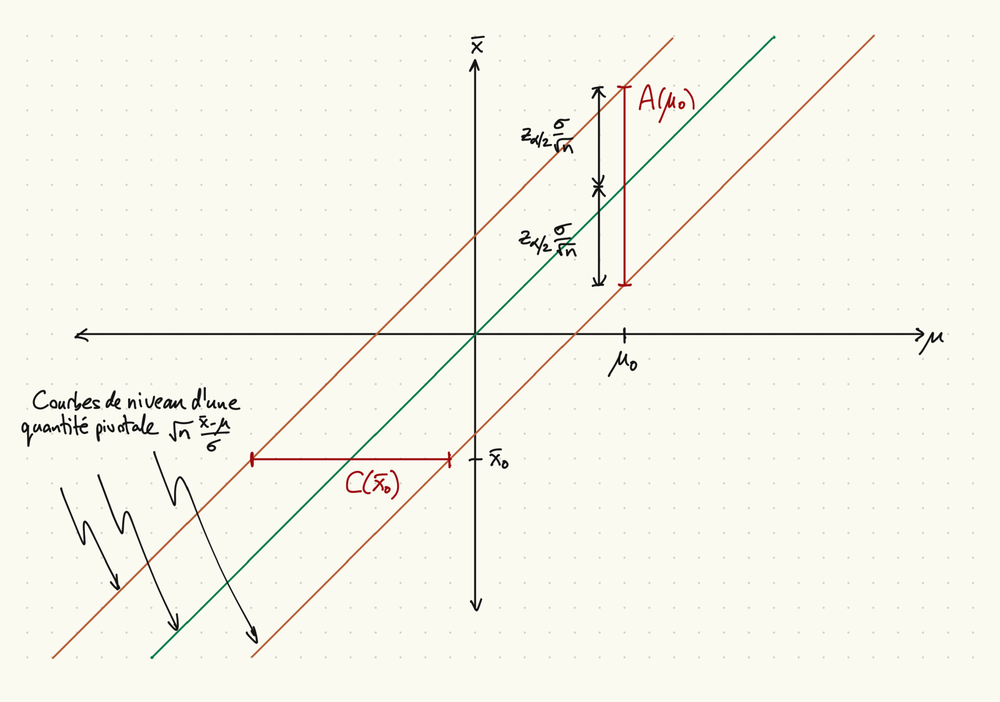
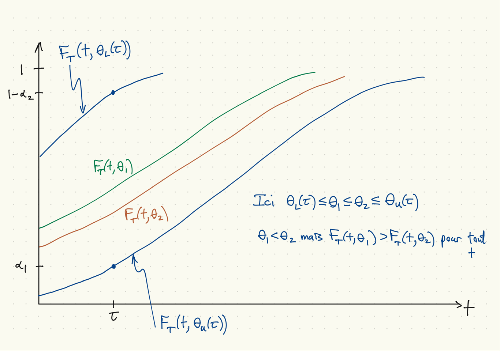

```{r setup, include=FALSE}
knitr::opts_chunk$set(echo = FALSE)
```

## Introduction, estimation par intervalle

* Estimateur par intervalle $[L(X),U(X)]$, estimation par intervalle $[L(x),U(x)]$.
* Les propriétés fréquentistes concernent la probabilité de couverture
$$ P_\theta[L(X) \leq \theta \leq U(X)]. $$
    * souvent une fonction de $\theta$, pas toujours (idéalement non)
    * restrictions sur le modèle pour obtenir cette non-dépendance
    * le coefficient de confiance est $\inf_\theta P_\theta(L(X)\leq \theta \leq U(X))$.
    * arbitrage : haute probabilité de couverture v. intervalle court
* Les propriétés bayésiennes concernent la probabilité
$$ P[L(x) \leq \theta \leq U(x)|x] \quad \mbox{ou} \quad P[l\leq \theta \leq u|x] $$
    * Deux façons populaires pour choiser $L(x)$ et $U(x)$ :
        * $L(x)$ et $U(x)$ sont les quantiles $\alpha/2$ et $1-\alpha/2$ de $\theta$, $U(x) - L(x)$ n'est pas forcément minimale
        * Intervalle de haute probabilité *a posteriori* : $U(x) - L(x)$ minimale sous la contrainte $P[L(x) \leq \theta \leq U(x)|x] = 1-\alpha$.

## Régions de haute probabilité et intervalles interquantile



## Estimation par ensemble

* Estimateur par ensemble $C(X)$, où $C(X) \subseteq \Theta$.
* Estimation par ensemble $C(x)$.
* Probabilité d'intérêt fréquentiste : $P_\theta(\theta \in C(X))$.
    - $\theta$ est fixe
    - la région $C(X)$ est aléatoire
    - analyse *ex ante*
* Probabilité d'intérêt bayésienne : $P(\theta \in C(x)|x)$.
    - $x$ est fixe (l'échantillon observé)
    - l'élément $\theta$ est aléatoire (la probabilité est conditionnelle)
    - analyse *ex post*

## Inversion d'une statistique test

* Pour chaque $\theta_0$, soit $A(\theta_0)$ la région de non-rejet pour un test de niveau $\alpha$ de l'hypothèse nulle $H_0:\theta = \theta_0$.
* Alors $A(\theta)$ vérifie $P_\theta[X \notin A(\theta)] \leq \alpha$.
* Définez, pour chaque $x \in {\cal X}$, $C(x) = \{\theta:x \in A(\theta)\}$.
* Notez que $x \in A(\theta) \Leftrightarrow \theta \in C(x)$.
* Résultat : $C(X)$ est une région de confiance $(1-\alpha)$.
* Preuve :
    * Puisque le niveau du test est de $\alpha$,
    $$ P_\theta[X \notin A(\theta)] \leq \alpha. $$
    * Alors
    $$ P_\theta[\theta \in C(X)] = P_\theta[X \in A(\theta)] \geq (1-\alpha). $$
    * Si on remplace la première inégalité par une égalité, la deuxième devient une
    égalité.

## $C(\bar{x})$ et $A(\theta)$ pour un exemple gaussien, $\sigma^2$ connu



## Exemple gaussien, $\sigma^2$ connu

* Supposons que $X_1,\ldots,X_n \sim \mathrm{iid}\, N(\mu,\sigma^2)$, $\sigma^2$ connu.
* Encore, $\bar{X} \equiv n^{-1} \sum_{i=1}^n X_i$, $S^2 \equiv (n-1)^{-1} \sum_{i=1}^n (X_i - \bar{X})^2$.
* Statistique LRT pour $H_0\colon \mu=\mu_0$ contre $H_1\colon \mu \neq \mu_0$ :
$$ \lambda(x) = \frac{\exp\left[ -\frac{1}{2\sigma^2} \sum_{i=1}^n (x_i-\mu_0)^2 \right]}
{\exp\left[ -\frac{1}{2\sigma^2} \sum_{i=1}^n (x_i-\bar{x})^2\right]} $$
* Puisque $\sum_{i=1}^n (x_i-\mu_0)^2 = \sum_{i=1}^n (x_i-\bar{x})^2 + n(\bar{x}-\mu_0)^2$,
$$ \lambda(x) = \exp[-n(\bar{x}-\mu_0)^2/(2\sigma^2)]. $$
* La loi de $\bar{X}$ est connue : $\bar{X} \sim N(\mu, \sigma^2/n)$
* Pour le test avec $A(\mu_0) = \{x\colon|\bar{x}-\mu_0| \leq z_{\alpha/2} \sigma/\sqrt{n} \}$, la probabilité de rejet quand $\mu = \mu_0$ est de $\alpha$.
* Conditions équivalentes à $x \in A(\mu_0)$ :
$$
\begin{aligned}
|\bar{x}-\mu_0| \leq z_{\alpha/2} \sigma/\sqrt{n}
& \Leftrightarrow
-z_{\alpha/2} \sigma / \sqrt{n} \leq \mu_0 - \bar{x} \leq z_{\alpha/2} \sigma / \sqrt{n} \\
& \Leftrightarrow \bar{x} - z_{\alpha/2}\sigma/\sqrt{n} \leq \mu_0 \leq \bar{x} + z_{\alpha/2}\sigma/\sqrt{n}
\end{aligned}
$$
* Alors $P[\bar{X} - z_{\alpha/2}\sigma/\sqrt{n} \leq \mu_0 \leq \bar{X} + z_{\alpha/2}\sigma/\sqrt{n}] = 1-\alpha$.

## Inversion d'un test, Exemple 9.2.11

* Considérez la construction d'un intervalle pour $p$ dans le modèle $X \sim \mathrm{Bi}(n,p)$.
* Une idée raisonnable est de construire, pour $\alpha$ donné et pour chaque $p$,
la région de non-rejet $A(p) \subseteq \{0,1,\ldots,n\}$ avec le nombre minimal d'éléments,...
* ...puis invertir $A(p)$ pour obtenir $C(X)$.
* Cependant, considerez le résultat quand $n=3$ et $1-\alpha = 0.442$.

## Inversion d'un test, Exemple 9.2.11 (cont.)


## Quantités pivotales

* Une fonction $Q(X,\theta)$ est pivotale si sa loi ne dépend pas de $\theta$.
* Interprétation bayésienne : sa loi ne dépend pas de $f(\theta)$
* Famille $f(x|\mu) = f_0(x-\mu)$ : $Q(X,\theta) = \bar{X}-\mu$ est pivotale.
* Preuve :
    * Soit $Z_i \sim \mathrm{iid}\, f_0(z)$. Sa distribution ne dépend pas de $\mu$.
    * Si $X_i \sim \mathrm{iid}\, f(x|\mu) = f_0(x-\mu)$,
    $$ (X_1,\ldots,X_n) \sim (Z_1+\mu,\ldots,Z_n+\mu) $$
    $$ \bar{X} - \mu \sim \frac{1}{n} \sum_{i=1}^n (Z_i + \mu) - \mu = \bar{Z} $$
    * La loi de $\bar{Z}$ (et de $Q(X,\theta) = \bar{X}-\mu$) ne dépend pas de $\mu$.
* Famille $f(x|\sigma) = \frac{1}{\sigma}f_0(x/\sigma)$ : $Q(X,\sigma^2) = \bar{X}/\sigma$ est pivotale.
* Famille $f(x|\mu,\sigma^2) = \frac{1}{\sigma} f_0((x-\mu)/\sigma)$ : $Q_1(X,\theta) = (\bar{X}-\mu)/\sigma$, $Q_2(X,\theta) = (\bar{X}-\mu)/S$, $Q_3(X,\theta) = S/\sigma$ sont pivotales.

## Utiliser une quantité pivotale pour construire un ensemble de confiance

* Supposez que $Q(X,\theta)$ est une quantité pivotale, ${\cal A}$ est un ensemble.
* $C(X) = \{\theta \colon Q(X,\theta) \in {\cal A}\}$ est un estimateur par ensemble de $\theta$ dont la probabilité $P_\theta(\theta \in C(X))$ ne dépend pas de $\theta$.
* Stratégie : trouver une quantité pivotale $Q(X,\theta)$ et un ensemble ${\cal A}$ avec de bonnes propriétés ($C(X)$ petit, $P_\theta(\theta \in C(X))$ grand).

## Exemples gaussiens I

* Supposons que $X_1,\ldots,X_n \sim \mathrm{iid}\, N(\mu,\sigma^2)$.
* Quantités pivotales :
    * $Z = \sqrt{n} (\bar{X}-\mu)/\sigma \sim N(0,1)$,
    * $T_{n-1} = \sqrt{n} (\bar{X}-\mu)/S \sim t(n-1)$.
    * $(n-1)S^2/\sigma^2 \sim \chi^2_{n-1}$.
* Cas où $\sigma^2$ est connu :
$$ 1-\alpha = P_\theta(-z_{\alpha/2} \leq -Z \leq z_{\alpha/2}) = P_\theta(\mu \in C(X)). $$
où $C(X)$ est l'estimateur par ensemble suivant
$$ C(X) = \{\mu \colon \bar{X} - z_{\alpha/2} \sigma/\sqrt{n} \leq \mu \leq \bar{X} + z_{\alpha/2} \sigma/\sqrt{n} \}. $$

## Exemples gaussiens II

* Cas où $\sigma^2$ n'est pas connu, intervalle pour $\mu$ :
$$ 1-\alpha = P_\theta(-t_{n-1,\alpha/2} \leq -T_{n-1} \leq t_{n-1,\alpha/2}) = P_\theta(\theta \in C(X)), $$
où
$$ C(X) = \{\mu \colon \bar{X} - t_{n-1,\alpha/2} S/\sqrt{n} \leq \mu \leq \bar{X} + t_{n-1,\alpha/2} S/\sqrt{n} \}. $$
* Cas où $\sigma^2$ n'est pas connu, intervalle pour $\sigma^2$ :
$$ 1-\alpha = P_\theta(\chi_{n-1,1-\alpha/2} \leq (n-1)S^2/\sigma^2 \leq \chi_{n-1,\alpha/2}) = P_\theta(\theta \in C(X)), $$
où
$$ C(X) = \left\{\sigma^2 \colon \frac{(n-1)S^2}{\chi_{n-1,\alpha/2}} \leq \sigma^2 \leq \frac{(n-1)S^2}{\chi_{n-1,1-\alpha/2}}\right\}. $$

## Un aparté

* Soit $T$ une variable aléatoire avec fonction de répartion $F$ inversible.
* $F(t)$ est une fonction, $F(T)$ est une variable aléatoire avec une loi sur $[0,1]$.
* Proposition : $F(T) \sim U(0,1)$.
* Preuve :
    * Soit $G$ la fonction de répartition de $F(T)$.
    * Pour $u \in [0,1]$,
\[
  G(u) = P[F(T) \leq u] = P[T \leq F^{-1}(u)] = F[F^{-1}(u)] = u.
\]
    * Alors $F(T) \sim U(0,1)$.

## Pivot de la fonction de répartition

* Soit $T$ une statistique avec fonction de répartition $F_T(t|\theta)$.
* Si $F_T$ est toujours inversible (c.-à-d. pour tous $\theta$), $F_T(T|\theta) \sim U(0,1)$, une loi qui ne dépend pas de $\theta$.
* Supposons que $T$ est stochastiquement croissante en $\theta$.
* C'est à dire que $F_T(t|\theta)$ est décroissante en $\theta$.
* Pour $t$ donné, soit $\theta_L(t)$ et $\theta_U(t)$ les solutions de
$$ F_T(t|\theta_U(t)) = \alpha_1, \quad F_T(t|\theta_L(t)) = 1-\alpha_2. $$
* Pour tous $t$, $\theta$,
$$ \theta > \theta_U(t) \Leftrightarrow F_T(t,\theta) < \alpha_1 $$
$$ \theta < \theta_L(t) \Leftrightarrow F_T(t,\theta) > 1- \alpha_2 $$
* Considérer l'intervalle de confiance $[\theta_L(T), \theta_U(T)]$ :
$$ \{t\colon\theta_L(t) \leq \theta \leq \theta_U(t) \}
= \{t\colon \alpha_1 \leq F_T(t|\theta) \leq 1-\alpha_2\}, $$
$$ P_\theta[\theta_L(T) \leq \theta \leq \theta_U(T)] = P_\theta[\alpha_1 \leq F_T(T|\theta) \leq 1-\alpha_2] = 1-\alpha_1-\alpha_2. $$

## Graphique, pivot de la fonction de répartition



## Exemple gaussien (Question 5(e) de l'examen final 2021)

* Soit $X_1,\ldots,X_n \sim \mathrm{iid}\, N(\mu,1)$.
* $T = \tfrac{1}{n} \sum_{i=1}^n X_i$.
* Soit $F_T(t;\mu)$ la fonction de répartition de $T$ pour $\mu$ donnée.
* Question de l'examen 2021 : montrez que la quantité $F_T(T;\mu)$ est pivotale et utilisez-la pour construire un intervalle de confiance pour $\mu$ avec probabilité de couverture $1-\alpha$.
* Réponse (première partie)
    * Remarquez que la fonction de répartition de $T$ est inversible.
    * Soit $G$ la fonction de répartition de $F_T(T;\mu)$.
    * Pour $u \in [0,1]$,
    \[
      \begin{aligned}
        G(u) &= P(F_T(T;\mu) \leq u) \\
        &= P(T \leq F_T^{-1}(u; \mu)) \\
        &= F_T(F_T^{-1}(u;\mu);\mu) = u.
      \end{aligned}
    \]

## Exemple gaussien, cont.

* Réponse (deuxième partie) (soit $\alpha_1 = 0.025$, $\alpha_2 = 0.975$)
    * Remarquez que $F_T(t;\mu) = P(T \leq t;\mu) = \Phi(\sqrt{n}(t-\mu))$, où $\Phi(\cdot)$ est la fonction de répartition de la loi $N(0,1)$.
    * La solution de $\Phi(\sqrt{n}(t-\mu_U(t))) = \alpha_1 = 0.025$ est celle de
    $$ \sqrt{n}(t-\mu_U(t)) = \Phi^{-1}(\alpha_1) = -z_{0.025}. $$
    * Alors la solution est $\mu_U(t) = t + z_{0.025}/\sqrt{n}$.
    * La solution de $\Phi(\sqrt{n}(t-\mu_L(t))) = \alpha_2 = 0.975$ est celle de
    $$ \sqrt{n}(t-\mu_L(t)) = \Phi^{-1}(\alpha_2) = z_{0.025}. $$
    * Alors la solution est $\mu_L(t) = t - z_{0.025}/\sqrt{n}$.
    * L'intervalle de confiance pour $\alpha_1,\alpha_2$ données est
    \[
      [T-\Phi^{-1}(\alpha_2)/\sqrt{n}, T-\Phi^{-1}(\alpha_1)/\sqrt{n}]
      = [T-z_{0.025}/\sqrt{n}, T+z_{0.025}/\sqrt{n}].
    \]
