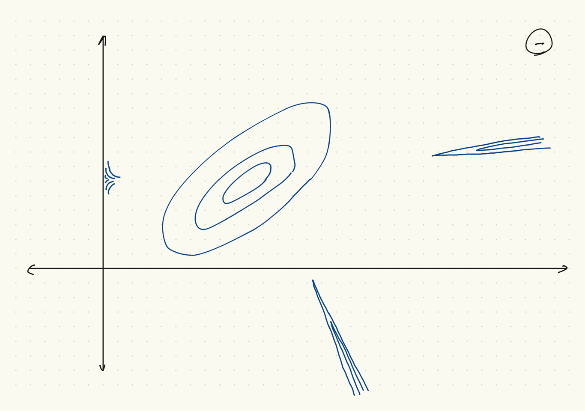

```{r setup, include=FALSE}
knitr::opts_chunk$set(echo = FALSE)
```

## Plan (résultats asymptotique)

* Les résultats asymptotiques reposent sur des conditions de regularité.
* Illustration des violations de ces conditions.
* Théorie asymptotique des estimateurs MV.

## Un modèle de mélange I

* Les $X_i$ sont iid, chaque $X_i$ un mélange de deux gaussiens

$$ F(x_i|\theta) = p \Phi\left(\frac{x_i-\mu_1}{\sigma_1}\right) +
(1-p) \Phi\left(\frac{x_i-\mu_2}{\sigma_2}\right) $$

* Le vecteur de paramètres est $\theta = (p,\mu_1,\mu_2,\sigma_1,\sigma_2)$.

* Irregularité I : paramètres non-identifiés

    * (label switching) $$ f(X|\theta) = f(X|\theta') $$
    où
    $$ \theta' = (1-p,\mu_2,\mu_1,\sigma_2,\sigma_1) $$
    * (non-identification sous l'hypothèse $p=1$)
    $$ f(X|(1,\mu_1,\mu_2,\sigma_1,\sigma_2)) $$ ne dépend pas de $\mu_2$, $\sigma_2$.

## Des mélanges de deux gaussiens

```{r mixtures, include=TRUE, echo=TRUE, fig.height=6}
x = seq(-3, 3, by=0.001); y = dnorm(x, 0, 1)
y1 = 0.5 * (dnorm(x, 0, sqrt(0.5)) + dnorm(x, 0, sqrt(1.5)))
y2 = 0.8 * dnorm(x, -1/4, sqrt(0.8)) + 0.2 * dnorm(x, 1, sqrt(0.8))
plot(x, y, type='l', ylim=c(0, 0.5));
lines(x, y1, col='green'); lines(x, y2, col='red')
```

## La question d'identification (ponctuelle)

* Identification I : (où $\theta_0$ est la vrai valeur)
$$ \theta \neq \theta_0 \Rightarrow f(\cdot|\theta) \neq f(\cdot|\theta_0). $$

* Sinon, $\theta$ et $\theta_0$ sont observationnellement équivalent.

* Identification II :
$$ \theta_1 \neq \theta_2 \Rightarrow f(\cdot|\theta_1) \neq f(\cdot|\theta_2). $$

* La deuxième condition est plus forte. En pratique, elle est souvent la condition à vérifier.

* [Exemples simple ici de la vérification de l'identification](https://en.wikipedia.org/wiki/Identifiability#CITEREFCasellaBerger2001)

## Un mélange extrème de deux gaussiens

* Ici, $p = 0.01$, $\mu_1 = 0$, $\mu_2 = 2$, $\sigma_1 = 1$, $\sigma_2 = 0.01$.

```{r mixture, include=TRUE, echo = TRUE, fig.height=6}
y = 0.01*dnorm(x, 2, 0.01) + 0.99*dnorm(x, 0, 1)
plot(x, y, type='l')
```

## Un modèle de mélange II

* Rappel : $\theta = (p,\mu_1,\mu_2,\sigma_1,\sigma_2)$
* Irregularité II : la vraisemblance n'est pas bornée
    * $x = (x_1,\ldots,x_n)$ est arbitraire. Soit $\bar{x} = n^{-1}\sum x_i$.
    * Soit $\theta(\epsilon) = (p, \mu_1, \mu_2, \sigma_1(\epsilon), \sigma_2) = (n^{-1}, x_1, \bar{x}, \epsilon, s)$.
    * $f(x_1|\theta(\epsilon)) = n^{-1} \frac{1}{\sqrt{2\pi}\epsilon} + (1-n^{-1}) \frac{1}{\sqrt{2\pi}s} e^{-(x_1-\bar{x})/2s^2}$
    * $\lim_{\epsilon \downarrow 0} f(x_1|\theta(\epsilon)) = \infty$,
    * $\lim_{\epsilon \downarrow 0} f(x_2,\ldots,x_n|\theta(\epsilon)) \neq 0$,
    * alors $\lim_{\epsilon \downarrow 0} f(x|\theta(\epsilon)) = \infty$.
    * D'autres chemins où la vraisemblance croit sans borne
        * $p\in(0,1)$ arbitraire
        * d'autres choix de $\mu_2$, $\sigma_2$
        * d'autres choix d'index
* On peut construire des preuves semblables pour montrer que la vraisemblance d'autres modèles de mélange n'est pas bornée.
* On parle de "ill-behaved likelihood"; la faute en revient au modèle ou à la méthode d'inférence?

## Une vraisemblance non-bornée



## Le modèle de mélange, implications pour la loi *a posteriori*

* Mettons que la vraisemblance n'est pas bornée.
* Pour certaines lois *a priori*, la densité *a posteriori* est bornée.
* Pour le modèle de mélange, $\omega_i \equiv \sigma_i^{-1}$ et $\omega_i \sim \mathrm{Ga}(\alpha, \beta)$, la densité *a posteriori* est bornée :
\[
  f(x_i|\theta) \propto
  p \omega_1^{1/2} \exp\left[ -\tfrac{1}{2} \omega_1 (x_i-\mu_1)^2 \right]
  + (1-p) \omega_2^{1/2} \exp\left[ -\tfrac{1}{2} \omega_2 (x_i-\mu_2)^2 \right]
\]
\[
  f(\omega_i) \propto \omega_i^{\alpha-1} e^{-\beta \omega_i}.
\]
* Bornée ou non, si la densité *a priori* est propre, la densité *a posteriori* l'est aussi.
* Même si la densité *a priori* est impropre, la densité *a posteriori* est souvent propre (mais il faut le vérifier).
* Dans le cas où la densité *a posteriori* est propre,
    * la région où la densité postérieure est plus grande que le maximum local régulier a souvent une probabilité négligeable, même si la densité postérieure n'est pas bornée.
    
## Un modèle Bernoulli

* $X_1,\ldots,X_n \sim \mathrm{iid}\, \mathrm{Bn}(p)$, $p \in \Theta = [0,1]$.

* $R = \sum_{i=1}^n X_i$ est une statistique exhaustive minimale pour $p$.

* Irregularité :
    * Si le vrai $p_0 \in \{0,1\}$, $p_0$ est sur la frontière de $\Theta$.
    
* Si $r = 0$,
    * $f(x|p) = (1-p)^n$,
    * La dérivée de $\log f(x|p)$ n'égale jamais à zéro :
    \[
      \frac{\partial \log f(x|p)}{\partial p}
      = \frac{\partial n\log(1-p)}{\partial p}
      = \frac{-n}{1-p}.
    \]
    * $\hat{p}_{MV}(x) = 0$ (solution de coin),
    * $\hat{p}_{MV}(x)$ se trouve sur la frontière de $\Theta = [0,1]$.
    * $\mathrm{Var}_p[\hat{p}_{MV}(X)] = 0$ quand $p = \hat{p}_{MV}(x)$.

* D'autres cas :
    * Modèles avec restrictions sur les paramètres.

## Un modèle Bernoulli, continué

Si $p \sim \mathrm{Be}(\alpha, \beta)$, $p|r \sim \mathrm{Be}(\alpha, \beta+n)$ quand $r=0$.

Voici la densité pour $r=0$, $n=10$, $\alpha = \beta = 1/2$:

```{r Beta_post}
p = seq(0, 1, by=0.001)
plot(p, dbeta(p, 0.5, 10.5), 'l')
```

## Un modèle uniforme

* $X_1,\ldots,X_n \sim \mathrm{iid}\, U(0,\theta)$.

* $X_{(1)} = \max_{i} X_i$ est une statistique exhaustive minimale pour $\theta$.

* Ici,
    * $f(x|\theta) = \theta^{-n} 1_{[x_{(1)},\infty)}(\theta)$.
    * $\hat{\theta}_{MV} = X_{(1)}$, la valeur minimale possible de $\theta$
    * Pour $\theta > x_{(1)}$,
        * $\log f(x|\theta) = -n \log \theta$
        * $\frac{\partial \log f(X|\theta)}{\partial \theta} = -\frac{n}{\theta}$
        * $E_{\theta}[\frac{\partial \log f(X|\theta)}{\partial \theta}] = -\frac{n}{\theta} \neq 0$.
    
* Irregularités :
    * le support de $X_i$ dépend de $\theta$
    * on ne peut pas prendre la dérivé dans l'intégral
    $$ \frac{\partial}{\partial \theta} \int_0^\theta f(x_i|\theta)\, dx = 0
    \quad \mbox{mais} \quad
    \int_0^\theta \frac{\partial}{\partial \theta} f(x_i|\theta)\, dx = \int_0^\theta \frac{-1}{\theta^2}\, dx = -\frac{1}{\theta}. $$

## Combien de livres « Savais-tu? » y a-t-il?


## Un modèle uniforme discret

### Le modèle

* $X_i$ iid, chaque $X_i$ a une loi uniforme sur $\{1,\ldots,\theta\}$
* On observe $X_1,\ldots,X_n$, $\max_i X_i$ est exhaustive.

### La vraisemblance

\[
  L(\theta|x) = \begin{cases}
    \theta^{-n} & \theta \geq \max_i x_i \\ 0 & \text{autrement}
  \end{cases}
\]

### Les données ($n=4$)

|Titre |numéro de série|
|------|---------------|
|Vautours | 6 |
|Coquerelles | 21 |
|Ratons laveurs| 32 |
|Manchots | 68 |

## Vraisemblance pour un modèle uniforme discret

```{r savais}
th = seq(1,100)
plot(th, th^{-4}*(th>=68), type='p', xlab='theta', ylab='L(theta|x))')
abline(v=77, col='red')
```

## Conditions de Régularité (page 516)

Pour convergence de l'estimateur MV :

1. $X_i \sim \mathrm{iid}\; f(x|\theta)$ pour $\theta = \theta_0 \in \Theta$.
1. $\theta = \theta' \rightarrow f(\cdot|\theta) \neq f(\cdot|\theta')$.
1. Le support de $f(x|\theta)$ ne dépend pas de $\theta$, $f(x|\theta)$ est dérivable en $\theta$.
1. $\theta_0 \in \mathrm{int}(\omega)$, pour $\omega \subseteq \Theta$, $\omega$ ouvert.

Pour la normalité et l'efficacité asymptotique on rajoute :

5. Pour tout $x\in {\cal X}$, $f(x|\theta)$ est trois fois continuement dérivable par rapport à $\theta$; $\int f(x|\theta)$ peut être dérivable trois fois à l'intérieure de l'intégral.
1. Une borne sur le troisième dérivé de $\log f(x|\theta)$.

## Information de Fisher, deux formes

* Ici, $X=(X_1,\ldots,X_n)$, $x=(x_1,\ldots,x_n)$.
* Deux dérivées de la log vraisemblance, si elles existent :
\[
\frac{\partial \log f(x|\theta)}{\partial \theta^\top}
= \frac{1}{f(x|\theta)} \frac{\partial f(x|\theta)}{\partial \theta^\top}
\]
\[
  \begin{aligned}
    \frac{\partial^2 \log f(x|\theta)}{\partial \theta \partial \theta^\top}
    &= \frac{1}{f(x|\theta)}
    \frac{\partial^2 f(x|\theta)}{\partial \theta \partial \theta^\top} -     \frac{1}{f(x|\theta)^2} \frac{\partial f(x|\theta)}{\partial \theta^\top}     \frac{\partial f(x|\theta)}{\partial \theta} \\
    &= \frac{1}{f(x|\theta)}
    \frac{\partial^2 f(x|\theta)}{\partial \theta \partial \theta^\top} -     \frac{\partial \log f(x|\theta)}{\partial \theta^\top} \frac{\partial \log     f(x|\theta)}{\partial \theta}
  \end{aligned}
\]

* Espérance des deux côtés, si on peut passer l'espérance après les dérivées :
$$
E_\theta\left[
    \frac{\partial^2 \log f(X|\theta)}{\partial \theta \partial \theta^\top}
\right]
= -E_\theta\left[
    \frac{\partial \log f(X|\theta)}{\partial \theta^\top}
    \frac{\partial \log f(X|\theta)}{\partial \theta}
\right] \equiv -I_n(\theta)
$$

* Attention : existence des dérivées, changement de l'ordre.

## Une remarque

Si l'espérance du score est nulle,
\[
  E_\theta\left[
    \frac{\partial \log f(X|\theta)}{\partial \theta^\top}
  \right] = 0,
\]
alors
\[
  E_\theta\left[
      \frac{\partial \log f(X|\theta)}{\partial \theta^\top}
      \frac{\partial \log f(X|\theta)}{\partial \theta}
  \right] = \mathrm{Var}\left[
    \frac{\partial \log f(X|\theta)}{\partial \theta^\top}
  \right]
\]

## Information de Fisher pour une observation

La même démarche pour $f(x_i|\theta)$ au lieu de $f(x|\theta)$ donne

$$
E_\theta\left[
    \frac{\partial^2 \log f(X_i|\theta)}{\partial \theta \partial \theta^\top}
\right]
= -E_\theta\left[
    \frac{\partial \log f(X_i|\theta)}{\partial \theta^\top}
    \frac{\partial \log f(X_i|\theta)}{\partial \theta}
\right] \equiv -I(\theta)
$$

## Additivité de l'information de Fisher

On considère ici les modèles où les $X_i$ sont iid et on peut échanger l'ordre de l'espérance et le gradient.

* Si les $X_i$ sont indépendantes, les $\partial \log f(X_i|\theta)/\partial \theta$ le sont aussi.
* Si on peut changer l'ordre de l'espérance et le gradient, ils ont une expérance de $0$.
* Alors
$$ \begin{aligned}
I_n(\theta) &= E_\theta\left[
\sum_{i=1}^n \frac{\partial \log f(X_i|\theta)}{\partial \theta^\top}
\sum_{i=1}^n \frac{\partial \log f(X_i|\theta)}{\partial \theta} \right] \\
&= \sum_{i=1}^n E_\theta\left[
\frac{\partial \log f(X_i|\theta)}{\partial \theta^\top}
\frac{\partial \log f(X_i|\theta)}{\partial \theta}
\right] \\
&\equiv nI(\theta).
\end{aligned}
$$

## Exemple gaussien

Supposons que $y = X\beta + u$, $u \sim N(0,\sigma^2I_n)$, la matrice $X$ des covariables est
$n \times K$, le paramètre $\beta$ est $K \times 1$ et le paramètre scalaire $\sigma^2$ est connu.
Alors
\[
  \begin{aligned}
    {\cal L}(\beta ;y)
    &= \frac{n}{2} \log (2\pi \sigma^2) - \frac{1}{2\sigma^2} (y-X\beta)^\top(y-X\beta) \\
    &= \frac{n}{2} \log (2\pi \sigma^2)
    - \frac{1}{2\sigma^2} (y^\top y -2\beta^\top X^\top y + \beta^\top X^\top X \beta)
  \end{aligned},
\]
\[
  \frac{\partial {\cal L}(\beta ;y)}{\partial \beta^\top} = - \frac{1}{\sigma^2} (X^\top X \beta - X^\top y) = \frac{1}{\sigma^2} X^\top u.
\]
Puisque $E[u] = 0$,
\[
  E\left[ \frac{\partial {\cal L}(\beta ;y)}{\partial \beta^\top} \right]
  = 0.
\]
La matrice hessienne ne dépend pas de $\beta$ :
\[
  \frac{\partial^2 {\cal L}(\beta ;y)}{\partial \beta^\top \partial \beta} = - \frac{1}{\sigma^2} X^\top X.
\]

## Exemple gaussien, continué

Ici, la variance du score est moins l'espérance de la matrice hessienne :
\[
  \begin{aligned}
    \mathrm{Var}\left[
      \frac{\partial {\cal L}(\beta ;y)}{\partial \beta^\top}
    \right]
    &=
    E\left[
      \frac{\partial {\cal L}(\beta ;y)}{\partial \beta^\top} \frac{\partial {\cal L}(\beta ;y)}{\partial \beta}
    \right] \\
    &= \frac{1}{\sigma^4} E[X^\top u u^\top X] = \frac{1}{\sigma^2} X^\top X
  \end{aligned}
\]

Dans un contexte bayésien où $\beta \sim N(\bar{\beta}, \bar{H}^{-1})$,
\[
  \beta|y,X \sim N(\bar{\bar{\beta}}, \bar{\bar{H}}^{-1}),
\]
où $\bar{\bar{H}} = \bar{H} + \sigma^{-2} X^\top X$,
$\bar{\bar{\beta}} = \bar{\bar{H}}^{-1} (\bar{H} \bar{\beta} + \sigma^{-2} X^\top X b)$ et
$b = (X^\top X)^{-1} X^\top y$.

## Gradient de la log vraisemblance

* Soit $l(\theta;x) \equiv \sum_{i=1}^n \log f(x_i|\theta)$.
* Soit $\hat{\theta}$ l'estimateur MV, $\theta_0$ la vraie valeur du paramètre.
* Expansion Taylor du gradient à $\hat{\theta}$ (où $\lim_{\theta \to \theta_0} h(\theta) = 0_{K\times K}$)
$$
\frac{\partial l(\hat{\theta};x)}{\partial \theta^\top}
= \frac{\partial l(\theta_0;x)}{\partial \theta^\top} + \frac{\partial^2 l(\theta_0;x)}{\partial \theta \partial \theta^\top} (\hat{\theta} - \theta_0) + h(\hat{\theta}) (\hat{\theta} - \theta_0).
$$
* Alors si le gradient à gauche est nulle,
$$ (\hat{\theta}-\theta_0) = -\left[\frac{\partial^2 l(\theta_0;x)}{\partial \theta \partial \theta^\top} + h(\hat{\theta}) \right]^{-1} \frac{\partial l(\theta_0;x)}{\partial \theta^\top}$$

* Notes : on a besoin de
    * l'existence d'un maximum intérieur de la vraisemblance
    * l'existence des dérivées jusqu'au deuxième ordre
    * la non-singularité de la matrice hessienne

## Continuous mapping theorem

* Si $g(\cdot)$ est continu, $X$, $X_1,X_2,\ldots$ des vecteurs aléatoires,
$$ X_n \to_p X \Rightarrow g(X_n) \to_p g(X), $$
$$ X_n \to_{ps} X \Rightarrow g(X_n) \to_{ps} g(X), $$
$$ X_n \to_d X \Rightarrow g(X_n) \to_d g(X). $$

* Notes
     * Le théorème de Slutsky est un cas spécial parce que $X_n \to_p c \Rightarrow X_n \to_d c$.
     * Slutsky : si $X_n \to_d X$ et $Y_n \to_p c$,
     $X_n + Y_n \to_d X + c$, $X_n Y_n \to_d cX$, $X_n/Y_n \to_d X/c$ si $c>0$.
     * On peut relacher la continuité : $g$ peut avoir un ensemble $D$ de points de discontinuité avec $P(X\in D) = 0$.
     
## Pour préparer une analyse asymptotique

* Pour préparer une analyse asymptotique, on peut écrire
$$ (\hat{\theta}-\theta_0) = \left[-\frac{1}{n}\frac{\partial^2 l(\theta_0;x)}{\partial \theta \partial \theta^\top} + \frac{1}{n} h_n(\hat{\theta}) \right]^{-1} \left[\frac{1}{n} \frac{\partial l(\theta_0;x)}{\partial \theta^\top} \right]. $$

$$ \sqrt{n}(\hat{\theta}-\theta_0) = \left[-\frac{1}{n}\frac{\partial^2 l(\theta_0;x)}{\partial \theta \partial \theta^\top} + \frac{1}{n} h_n(\hat{\theta}) \right]^{-1} \left[\sqrt{n} \frac{1}{n} \frac{\partial l(\theta_0;x)}{\partial \theta^\top} \right]. $$

## Théorème central limite, loi de grand nombres pour le gradient

$$
\sqrt{n} \frac{1}{n} \frac{\partial l(\theta_0;X)}{\partial \theta^\top}
= \sqrt{n} \frac{1}{n} \sum_{i=1}^n \frac{\partial \log f(X_i|\theta_0)}{\partial \theta^\top}
$$

* Pour la vraie valeur $\theta_0$, les termes sont iid, avec
$$ E_{\theta_0}\left[ \frac{\partial 
\log f(X_i|\theta_0)}{\partial \theta^\top} \right] = 0, \qquad
\mathrm{Var}_{\theta_0}\left[ \frac{\partial \log f(X_i|\theta_0)}{\partial \theta^\top} \right] = I(\theta_0). $$

* Par une loi de grand nombres,
$$ \frac{1}{n} \frac{\partial l(\theta_0;x)}{\partial \theta^\top} \to_p 0. $$

* Par un théorème central limite,
$$ \sqrt{n} \frac{1}{n} \frac{\partial l(\theta_0;x)}{\partial \theta^\top} \to_d N(0,I(\theta_0)). $$

## Notes sur le gradient

On a besoin de

* l'existence des dérivées,
* pouvoir échanger l'ordre de l'intégral et la dérivée,
* une variance fini,
* $X_i$ iid.

## Loi de grand nombres pour la matrice hessienne et son inverse

$$ -\frac{1}{n}\frac{\partial^2 l(\theta_0;X)}{\partial \theta \partial \theta^\top} = -\frac{1}{n} \sum_{i=1}^n \frac{\partial^2 \log f(X_i|\theta_0)}{\partial \theta \partial \theta^\top} \to_p I(\theta_0) $$

* Par le théorème « continuous mapping, »
$$ -\left[
\frac{1}{n}\frac{\partial^2 l(\theta_0;x)}{\partial \theta \partial \theta^\top}
\right]^{-1} \to_p I(\theta_0)^{-1}. $$

## Combinaison des résultats

* Convergence de $(\hat{\theta}-\theta)$ en probabilité :
$$
(\hat{\theta}-\theta_0) \approx \left[-\frac{1}{n}\frac{\partial^2 l(\theta_0;x)}{\partial \theta \partial \theta^\top}\right]^{-1} \left[\frac{1}{n} \frac{\partial l(\theta_0;x)}{\partial \theta^\top} \right]
\to_p 0.
$$

* Convergence de $\sqrt{n}(\hat{\theta}-\theta)$ en loi :
$$
\sqrt{n}(\hat{\theta}-\theta_0) \approx \left[-\frac{1}{n}\frac{\partial^2 l(\theta_0;x)}{\partial \theta \partial \theta^\top}\right]^{-1} \left[\sqrt{n} \frac{1}{n} \frac{\partial l(\theta_0;x)}{\partial \theta^\top} \right] \to_d N(0,I(\theta_0)^{-1}).
$$

* Remarquez que $I(\theta_0)^{-1}$ est la borne inférieure Cramer-Rao. Sous les conditions de régularité, $\hat{\theta}_{MV}$ est un estimateur asymptotiquement efficace de $\theta_0$.

## Distribution asymptotique de la statistique test LRT

* Considérez l'hypothèse ponctuelle $H_0 : \theta = \theta_0$.
* Développement quadratique de $l(\theta|x)$ autour de $\theta_0$, évalué à $\hat{\theta}$ :
$$ l(\theta_0|x) = l(\hat{\theta}|x) + \frac{1}{2} (\hat{\theta}-\theta_0)^\top
\frac{\partial^2 l(\hat{\theta};x)}{\partial \theta \partial \theta^\top} (\hat{\theta}-\theta_0) + \ldots $$

* Sous l'hypothèse nulle $H_0 : \theta = \theta_0$,
$$
\begin{aligned}
-2\log \lambda(x) &= -2(l(\theta_0|x) - l(\hat{\theta}|x)) \\
&\to_d (\hat{\theta}-\theta_0)^\top
\frac{\partial^2 l(\hat{\theta};x)}{\partial \theta \partial \theta^\top} (\hat{\theta}-\theta_0) \to_d \chi^2_k.
\end{aligned}
$$
