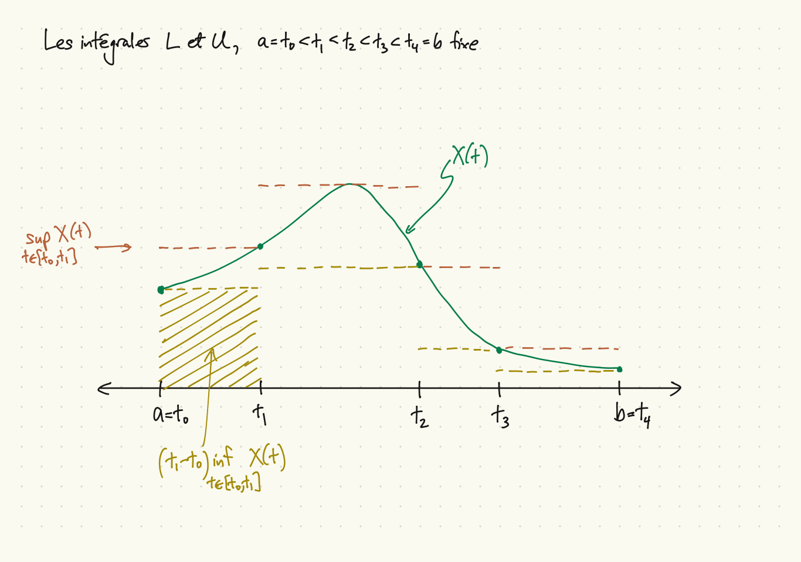
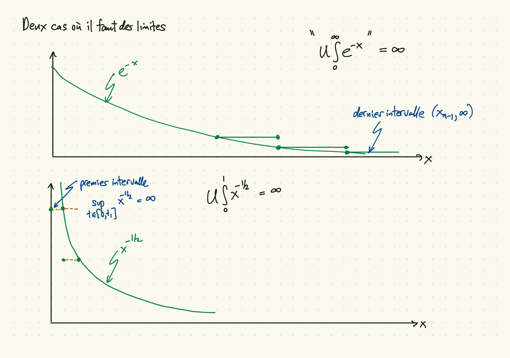
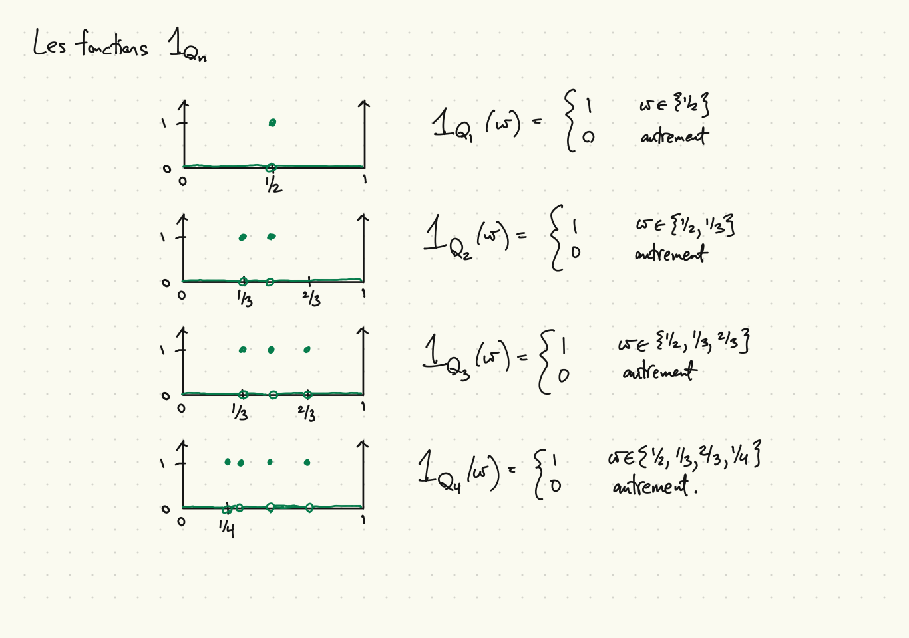
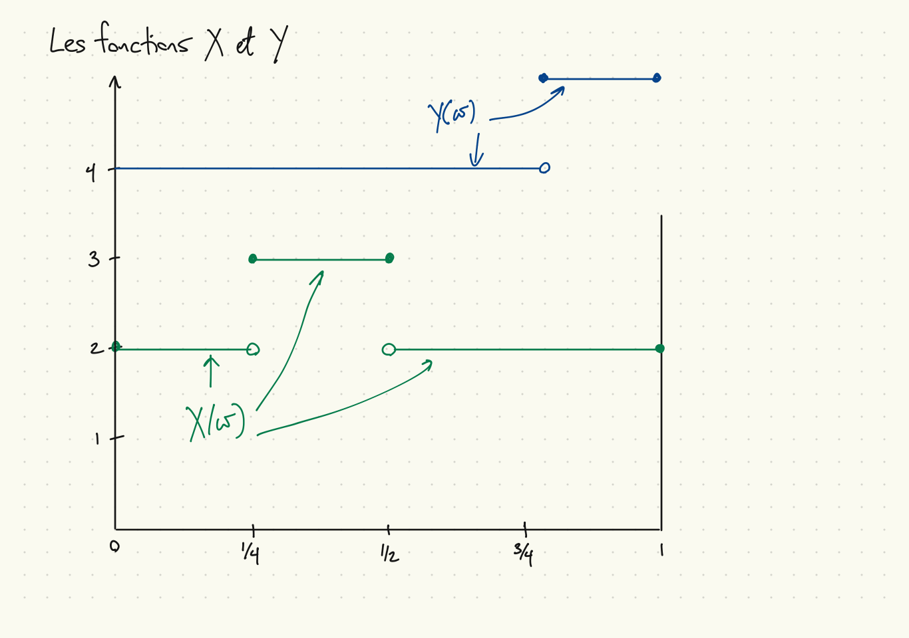
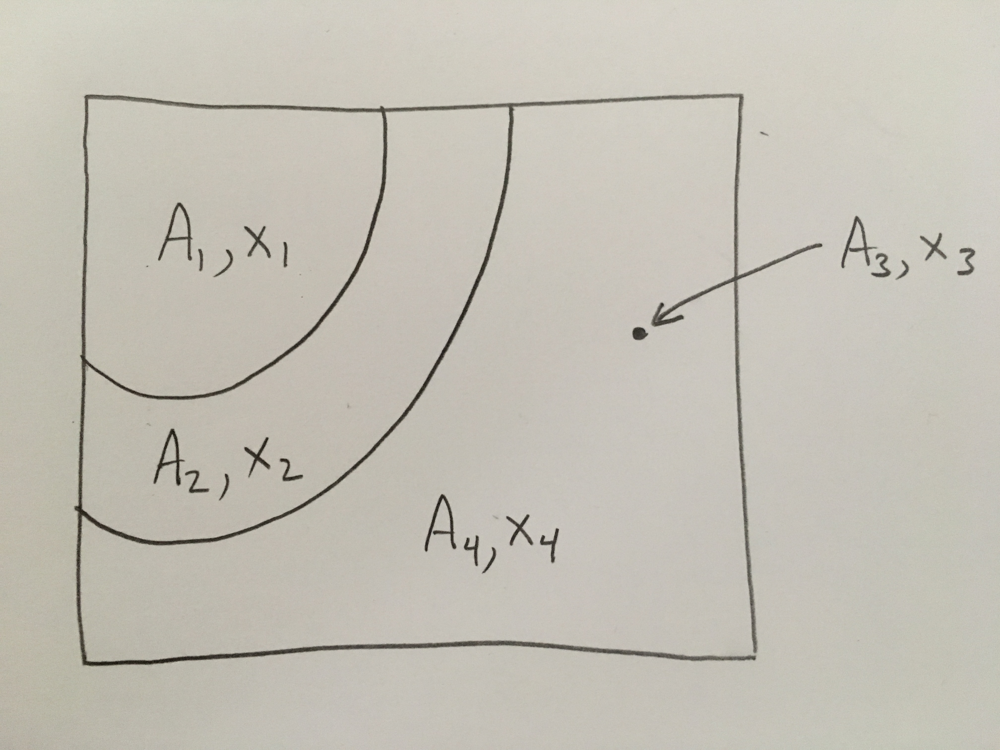
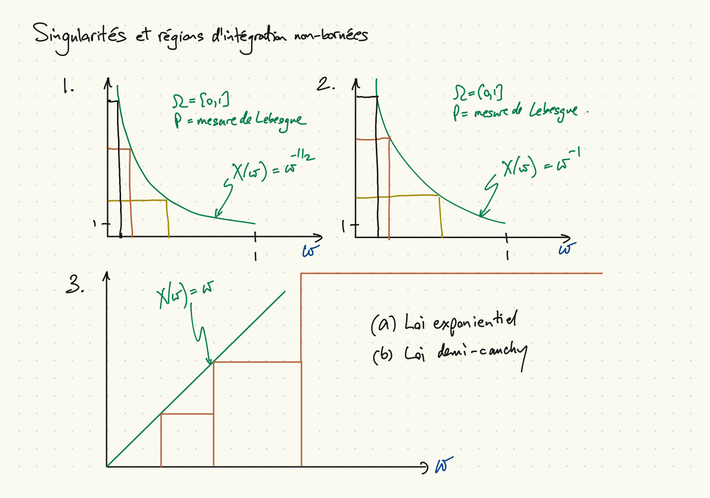

## Intégration riemannienne

$$ L \int_a^b X = 
\sup\left\{
\sum_{i=1}^n (t_i-t_{i-1})
\inf_{t\in [t_{i-1},t_i]} X(t) \colon a=t_0<t_1<\ldots<t_n = b
\right\} $$

$$ U \int_a^b X = 
\inf\left\{
\sum_{i=1}^n (t_i-t_{i-1})
\sup_{t\in [t_{i-1},t_i]} X(t) \colon a=t_0<t_1<\ldots<t_n = b
\right\} $$
Notes :

* L'existence et la valeur de l'intégral.
* Extensions : (2ième cas : une singularité à $a$ et/ou à $b$)
$$ \int_{0}^\infty X(t)\, dt = \lim_{b\to \infty} \int_0^b X(t)\, dt,
\quad \int_a^b X(t)\, dt = \lim_{c \downarrow a} \lim_{d \uparrow b} \int_c^d X(t)\, dt. $$

##


##


## Problèmes pour l'intégration riemannienne

* $L \int_0^1 1_\mathbb{Q}(t) = 0$ et $U \int_0^1 1_\mathbb{Q}(t) = 1$

* Soit $\mathbb{Q}_n$ l'ensemble des $n$ premiers rationnels dans $[0,1]$. (L'ordre n'est pas importante.)

* Pour tous $n$, $L \int_0^1 1_{\mathbb{Q}_n}(t) = U \int_0^1 1_{\mathbb{Q}_n}(t) = 0$.

* Notez que
    * $\lim_{n\to \infty} 1_{\mathbb{Q}_n}(t) = 1_\mathbb{Q}(t)$ pour tous $t$,
    * $0 = \lim_{n\to \infty} U \int_0^1 1_{\mathbb{Q}_n}(t) \neq U \int_0^1 1_\mathbb{Q}(t) = 1$.
    * $1_{\mathbb{Q}_n}(t) \leq 1_{\mathbb{Q}_{n+1}}(t)$ pour tous $t$,

* $\delta$ de Dirac comme pansement lorsqu'il y a des points avec probabilité positive : défini comme
\[
  \int_{-\infty}^\infty \delta(t) g(t) \, dt = g(0),
\]
et pour tous $t \neq 0$,
\[
  \delta(t) = 0.
\]

##


## Une variable aléatoire simple sur $\Omega = [0,1]$

* Trois façons d'écrire la même variable aléatoire :

    1. $X(\omega) = 2 \cdot 1_{[0,1/4) \cup (1/2,1]}(\omega) + 3 \cdot 1_{[1/4,1/2]}(\omega)$
    1. $X(\omega) = 2 \cdot 1_{[0,1/4)}(\omega) + 2 \cdot 1_{(1/2,1]}(\omega) + 3 \cdot 1_{[1/4,1/2]}(\omega)$
    1. $X(\omega) = 2 \cdot 1_{\Omega}(\omega) + 1 \cdot 1_{[1/4,1/2]}(\omega)$
    
* L'image de $X$ est $\{x_1,x_2\} = \{2, 3\}$, un ensemble fini.

* Dans 1, $X$ est de la forme canonique
$$ X(\omega) = \sum_{x \in X(\Omega)} x \cdot 1_{\{X^{-1}(\{x\})\}}(\omega). $$

* Dans 2, $X$ n'est pas de cette forme, mais $[0,1/4)$, $[1/4,1/2]$ et $(1/2,1]$ forment une partition de $[0,1]$.

* Dans 3, $\{[0,1],[1/4,1/2]\}$ n'est pas une partition de $[0,1]$.

##


## Une variable aléatoire simple sur $\Omega = [0,1]^2$

{width=40%}

Ici,
\[
  X(\omega) = \begin{cases} x_1 & \omega \in A_1 \\ x_2 & \omega \in A_2 \\ x_3 & \omega \in A_3 \\ x_4 & \omega \in A_4. \end{cases}
\]
En général (mais pas avec la mesure de Lebesgue), $P(A_3) > 0$ est possible.

## L'espérance d'une variable aléatoire

* Pour une variable aléatoire simple ($X(\Omega)$ est fini):
$$ E[X] = \sum_{x \in X(\Omega)} x \cdot P(X^{-1}(\{x\})). $$

* Pour une variable aléatoire non-négative :
$$ E[X] = \sup \{E[Y] \colon Y \leq X,\, Y\,\mbox{simple}\}. $$

* Pour une variable aléatoire générale :
$$ E[X] = E[X^+] - E[X^-]. $$
* Notes :
    * Quand l'expression de $X$ simple n'est pas de forme canonique.
    * Cohérence des trois définitions.
    * Valeurs possibles; quand la troisième n'est pas bien définie.

## Exemples pertinents de l'espérance d'une v.a. simple

* Soit $(\Omega, {\cal F}, P)$ l'espace de probabilité $([0,1], {\cal B}, \mu)$ où $\mu$ est la mesure de Lebesgue.

* Pour tout $n$,
\[
  E[1_{\mathbb{Q}_n}] = 1 \cdot \mu(\mathbb{Q}_n) + 0 \cdot \mu(\Omega \backslash \mathbb{Q}_n) = 0.
\]

* $1_\mathbb{Q}$ est une v.a. simple! Par additivité dénombrable,
\[
  E[1_\mathbb{Q}] = 1 \cdot \mu(\mathbb{Q} \cap [0,1]) + 0 \cdot \mu(\mathbb{Q}^c \cap [0,1]) = 0.
\]

* Rappel : pour l'intégration riemannienne, $U \neq L$, échec de convergence monotone.

## Linéarité de l'espérance, variables aléatoires simples I

Même $X(\omega)$ sur $\Omega = [0,1]$ qu'on a vu avant :
\[
  X(\omega) = \begin{cases}
    2 & \omega \in A_1 \equiv [0,1/4), \\
    3 & \omega \in A_2 \equiv [1/4,1/2] \\
    2 & \omega \in A_3 \equiv (1/2,1].
  \end{cases}
\]

Une autre variable aléatoire $Y(\omega)$ sur $\Omega$ :
\[
  Y(\omega) = \begin{cases} 5 & \omega \in B_1 \equiv [0,3/4], \\ 4 & \omega \in B_2 = (3/4,1]. \end{cases}
\]

Toutes les intersections $A_i \cap B_j$ :

| \hspace{2cm}  | $A_1=[0,1/4)$   | $A_2=[1/4,1/2]$ | $A_3=(1/2,1]$  |
|:-------------:|:---------------:|:---------------:|:--------------:|
|$B_1=[0,3/4]$  | $A_1$           | $A_2$           | $(1/2,1]$      |
|$B_2=(3/4,1]$  | $\emptyset$     | $\emptyset$     | $B_2$          |

## Linéarité de l'espérance, variables aléatoires simples II

\[
  \begin{aligned}
    E[aX + bY] &= E\left[\sum_{i,j} (ax_i + by_j) 1_{A_i \cap B_j}\right] \\
    &= \sum_{i,j} (ax_i + by_j) P(A_i \cap B_j) \\
    &= a\sum_i x_i \sum_j P(A_i \cap B_j) + b \sum_j y_j \sum_i P(A_i \cap B_j) \\
    &= a\sum_i x_i P(A_i) + b\sum_j y_j P(B_j) \\
    &= aE[X] + bE[Y].
  \end{aligned}
\]

Notes :

* L'additivité établie l'égalité des formes 1 et 2 de $E[X]$.
* La linéarité établie l'égalité des formes 2 et 3 de $E[X]$.

## Monotonicité, variables aléatoires simples

Résultat : pour des variables aléatoires simples $X$ et $Y$,
$$ X \leq Y \Rightarrow E[X] \leq E[Y]. $$

Preuve :
\[
  \begin{aligned}
    X \leq Y &\Rightarrow Y-X \geq 0 \\
    &\Rightarrow E[Y-X] \geq 0 \\
    &\Rightarrow E[Y] - E[X] \geq 0 \\
  \end{aligned}
\]

Conclusion immédiate : la définition suivante est cohérente.

Pour toute variable aléatoire $X \geq 0$,
\[
  E[X] \equiv \sup_{Y \leq X,\, Y\, \mbox{simple}} E[Y].
\]

## Monotonicité, variables aléatoires non-négatives

* Soit $X$, $Y$ des variables aléatoires non-négatives, $X \leq Y$.

* $E[X] = \sup_{Z \leq X,\, Z\, \mbox{simple}} E[Z]$

* $E[Y] = \sup_{Z \leq Y,\, Z\, \mbox{simple}} E[Z]$

* $E[X]$ est le sup d'un ensemble plus petit, alors $E[X] \leq E[Y]$.

## Espérances des variables aléatoires arbitraires

* Soit $X$ une variable aléatoire arbitraire.
* Soit $X^+(\omega) = \max(X(\omega), 0)$, $X^-(\omega) = \max(-X(\omega), 0)$.
* $X^+$ et $X^-$ sont des variables aléatoires non-négatives.
* $X^+ - X^- = X$.
* Soit $v^+ \equiv E[X^+]$, $v^- \equiv E[X^-]$.
* $E[X]$ défini par :

|$E[X^+]$\hspace{1cm}      |$E[X^-]$\hspace{1cm}      |$E[X]$\hspace{1cm}     |
|:------------:|:------------:|:---------:|
|$v^+ < \infty$|$v^- < \infty$|$v^+ - v^-$|
|$v^+ = \infty$|$v^- < \infty$|$\infty$   |
|$v^+ < \infty$|$v^- = \infty$|$-\infty$  |
|$v^+ = \infty$|$v^- = \infty$|pas défini |

* Attention : la valeur d'une v.a. n'est jamais $\infty$ ou $-\infty$. La valeur d'un $\sup$, $\inf$ ou $\lim$ peut l'être.

## Les espérances et les intégrales impropres

Quelques choses à noter dans la définition, pour $X \geq 0$,
$$ E[X] = \sup \{E[Y] \colon Y \leq X,\, Y\,\mbox{simple}\}. $$

* Un seul sup/inf/limite.
* L'importance de $X \geq 0$ et l’unidirectionnalité (cf. $L$ et $U$ pour l'intégration riemannienne)
* Aucune définition spéciale pour les singularités ou pour $\Omega = \mathbb{R}$.
* Pas besoin d'un pansement comme le $\delta$ de Dirac.

Exemples :

1. $X(\omega) = 1/\sqrt{\omega}$, mesure de Lebesgue sur $[0,1]$.
1. $X(\omega) = 1/\omega$, mesure de Lebesgue sur $[0,1]$.
1. $X(\omega) = \omega$, loi exponentielle sur $\mathbb{R}_+$.
1. $X(\omega) = \omega$, loi demi-cauchy sur $\mathbb{R}_+$.
1. $X$ de la Figure 4.2.1.

##


## La fonction $\Psi_n(x)$

```{r Psi}
Psi_fcn <- function(x, n)
{
  result <- pmin(n, 2^(-n)*floor(2^n*x))
}

x <- seq(0, 5, by=2^(-10))
y1 = Psi_fcn(x, 1)
y2 = Psi_fcn(x, 2)
y3 = Psi_fcn(x, 3)
```

## Graphique de la fonction $\Psi_n(x)$, $n=1,2,3$

```{r Psi_graph}
plot(x, Psi_fcn(x, 1), 'l', xlim=c(0, 2))
lines(x, Psi_fcn(x, 2), col='green')
lines(x, Psi_fcn(x, 3), col='blue')
```

## Des variables aléatoires $X$, $X_1$, $X_2$, $X_3$

```{r X_n_graph}
f <- function(x)
{
  (1/gamma(0.5)^2) * x^-0.5 * (1-x)^-0.5
}

x = seq(0, 1, by=2^(-10))
X = f(x)
X1 = Psi_fcn(f(x), 1)
X2 = Psi_fcn(f(x), 2)
X3 = Psi_fcn(f(x), 3)
```

## Graphique des fonctions $X$, $X_1$, $X_2$, $X_3$

```{r X_graph}
plot(x, X, 'l', col='red', ylim=c(0,4))
lines(x, X1, col='black'); lines(x, X2, col='green');
lines(x, X3, col='blue')
```

## Convergence monotone de $X_n$ simple à $X$ non-négative

* Les fonctions $\Psi_n \colon \mathbb{R} \to \mathbb{R}$ :
$$ \Psi_n(x) = \min(n,2^{-n} \lfloor 2^n x \rfloor). $$
* Propriétés de $\Psi_n(x)$ :
    * $0 \leq \Psi_n(x) \leq x$, $x \geq 0$.
    * Pour tout $x \in \mathbb{R}$, $\Psi_n(x) \nearrow x$.
    * Pour tout $n$, $\Psi_n(\mathbb{R})$ est fini.
* Construction $X_n(\omega) = \Psi_n(X(\omega))$.
* Propriétés de $X_n$ :
    * $X_n$ est simple
    * $X_n \leq X_{n+1} \leq X$
    * $\lim_{n\to \infty} X_n(\omega) = X(\omega)$, $\omega \in \Omega$.
    * $E[X_n] \leq E[X]$ (définition de $E[X]$)
    * $\lim_{n\to \infty} E[X_n(\omega)] \leq E[X]$
* Pourquoi pas $\Psi_n(x) = \min(n, n^{-1} \lfloor nx \rfloor)$? $\Psi_n(x) = 2^{-n} \lfloor 2^n x \rfloor)$?
* Remarquez la discrétisation de $X(\Omega)$, pas $\Omega$.

## Théorème de convergence monotone

* Supposez que $X_1, X_2,\ldots$ sont des variables aléatoires non-négatives avec $X_n(\omega) \nearrow X(\omega)$ pour tout $\omega \in \Omega$.
Alors $X$ est une variable aléatoire et $E[X] = \lim_{n\to \infty} E[X_n]$.

* Remarque : les $X_n$ ne sont pas forcément simples.

* Par monotonicité, $E[X_1] \leq E[X_2] \leq \ldots \leq E[X]$.

* Attention : $E[X_n] = \infty$, $E[X] = \infty$ possible.

* Immédiatement, $\lim_{n\to \infty} E[X_n] \leq E[X]$.

* Il reste à prouver que $\lim_{n\to \infty} E[X_n] \geq E[X]$.

## Preuve de $\lim_{n\to \infty} E[X_n] \geq E[X]$

* Soit $Y$ simple, $Y \leq X$ (alors $E[Y] \leq E[X]$). Soit $\epsilon > 0$.
* $Y = \sum_i v_i 1_{A_i}$ où $\{A_i\}$ est une partition de $\Omega$ en événements et $v_i \leq X(\omega)$ pour tout $\omega \in A_i$.
* Pour tout $i$ et $n$, soit $A_{in} \equiv \{\omega \in A_i \colon X_n(\omega) \geq v_i - \epsilon\}$.
* Alors pour tout $i$, $\{A_{in}\} \nearrow A_i$. (monotonicité, convergence) 
* Alors $E[X_n] \geq \sum_i (v_i - \epsilon) P(A_{in})$. (à droite : $E[Y_n]$, $Y_n$ simple)
* Par convergence de probabilité :
\[
  \lim_{n\to \infty} \sum_i (v_i - \epsilon) P(A_{in}) = \left(\sum_i v_i P(A_i)\right) - P(\cup_i A_i) \epsilon,
\]
* Alors $lim_{n\to \infty} E[X_n] \geq E[Y] - \epsilon$.
* $\epsilon > 0$ est arbitraire alors $\lim_{n\to \infty} E[X_n] \geq E[Y]$.
* $Y$ est arbitraire, alors $\lim_{n\to \infty} E[X_n] \geq E[X]$.

## Remarques

* On peut affaiblir la condition $X_n(\omega) \nearrow X(\omega)$ en
$$ P(\{X_n(\omega) \nearrow X(\omega)\}) = 1. $$
* Autrement dit, $X_n \nearrow X$ presque surement.
* Importance de monotonicité, positivité
* Échec de convergence monotone pour l'intégration riemannienne
* Linéarité de $E[\cdot]$ pour variables aléatoires positives :
soit $X_n = \Psi_n(X)$, $Y_n = \Psi_n(Y)$, $a,b\geq 0$. Alors
\[
  \begin{aligned}
    E[aX + bY] &= \lim_n E[aX_n + bY_n] \\
    &= \lim_n aE[X_n] + bE[Y_n]
= aE[X] + bE[Y].
  \end{aligned}
\]

## Aperçu des chapitres 5 et 6

* Chapitre 5
    * Inégalités de Markov, Chebychev, Cauchy-Schwarz, Jensen
    * Convergence presque sur, convergence en probabilité
    * Lois de grand nombres
* Chapitre 6
    * Lois, fonctions de répartition, de densité
