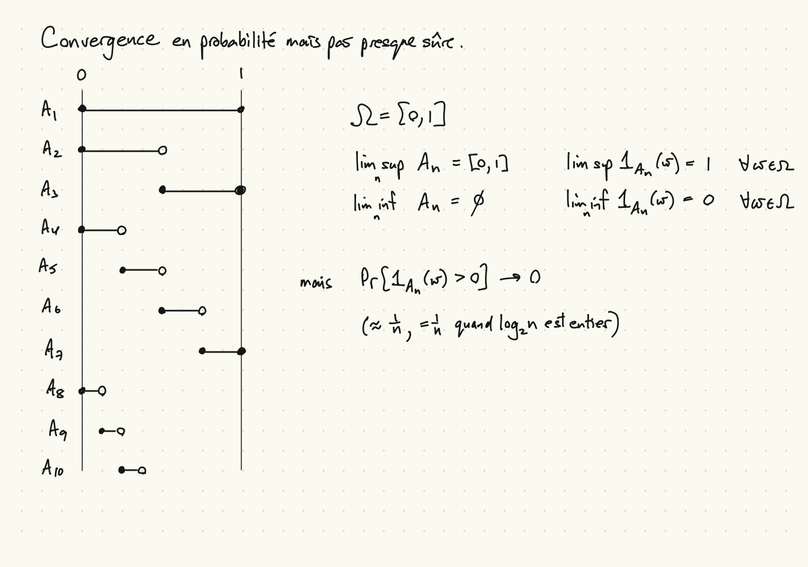

```{r setup, include=FALSE}
knitr::opts_chunk$set(echo = FALSE)
```

## Inégalité de Markov

* Soit $X\geq 0$ une variable aléatoire, soit $\alpha \in (0,\infty)$.
* Inégalité de Markov :
\[
  E[X] \geq \alpha P[X \geq \alpha]
\]
* Preuve :
    * Soit
    \[
      Z \equiv
      \begin{cases}
        0 & X(\omega) < \alpha, \\
        \alpha & X(\omega) \geq \alpha.
      \end{cases}
    \]
    * $Z \leq X$ alors par monotonicitè,
    \[
      E[Z] = \alpha P[X \geq \alpha] \leq E[X].
    \]
* Questions :
    1. Donnez un exemple d'un $X \geq 0$ qui donne une égalité.
    2. Donnez des conditions nécessaires et suffisantes pour une égalité.

##


## Inégalité de Chebychev

* Soit $Y$ une variable aléatoire ou $\mu_Y = E[Y]$ existe et est finie.
* Soit $\epsilon > 0$.
* Inégalité de Chebychev : 
\[
  P[|Y-\mu_Y| \geq \epsilon] \leq \frac{1}{\epsilon^2} \mathrm{Var}[Y].
\]
* Preuve :
    * Soit $X = (Y-\mu_Y)^2$, $\alpha = \epsilon^2$.
    * Alors par l'inégalité de Markov,
    \[
      P(|Y-\mu_Y| \geq \epsilon) = P(X \geq \epsilon^2) \leq \frac{1}{\epsilon^2}\mathrm{Var}[Y].
    \]
* Notes :
    * $\mathrm{Var}[Y] = \infty$ est possible, auquel cas l'inégalité ne contraint pas.
    * $\epsilon^{-2}$ peut être très grand, mais c'est fini.
    * Application : borner la probabilité d'une déviation plus grande qu'epsilon, pour chaque $X_n$ d'une suite, où $\mathrm{Var}[X_n] \rightarrow 0$. On veut choisir $n$ après $\epsilon$.
    
## Définitions

* Soit $Z_1, Z_2,\ldots$ une suite de v.a., $Z$ une v.a.
* Convergence ponctuelle de $Z_n$ à $Z$ : pour tout $\omega \in \Omega$,
\[
  \lim_{n\to \infty} Z_n(\omega) = Z(\omega).
\]
* Convergence de $Z_n$ à $Z$ presque sûre, $Z_n \overset{p.s.}{\to} Z$ :
\[
  P[\{Z_n \to Z\}] = 1,\;\mbox{ou}\; P(Z_n \to Z) = 1.
\]
* Convergence de $Z_n$ à $Z$ en probabilité, $Z_n \overset{p}{\to} Z$ : pour tout $\epsilon > 0$,
\[
  P[\{|Z_n - Z| \geq \epsilon\}] \to 0,\;\mbox{ou}\; P(|Z_n - Z| \geq \epsilon) \to 0.
\]

## Convergence en probabilité mais pas convergence p.s.

* Prenez l'espace de probabilité $(\Omega, {\cal F}, P)$ où $\Omega = [0,1]$, ${\cal F} = {\cal B}$, $P$ la mesure de Lebesgue.
* Soit $A_1 = \Omega = [0,1]$, $A_2 = [0,1/2)$, $A_3 = [1/2,1]$,
$A_4 = [0,1/4)$, $A_5 = [1/4,1/2)$, $A_6 = [1/2,3/4)$, $A_7 = [3/4,1]$, $A_8 = [0,1/8)$, ... (prochaine diapo).
* Soit $X = 0$ et pour tout $n \in \mathbb{N}$, $X_n = 1_{A_n}(\omega)$.
* Convergence presque sûre?
    * Pour tous $\omega$, $\liminf_n X_n(\omega) = 0$, $\limsup_n X_n(\omega) = 1$.
    * Échec de convergence pour tout $\omega \in \Omega$!
    * Alors $P[\{X_n \to X\}] = 0$.
* Convergence en probabilité?
    * $P(X_n = X) \approx 1-1/n \to 1$.
    * Alors pour tout $\epsilon > 0$, $P(|X_n - X| \geq \epsilon) \to 0$.

##


## Une condition suffisante pour convergence p.s.

La condition : pour tout $\epsilon > 0$, $\sum_{n=1}^\infty P(|Z_n - Z|\geq \epsilon) < \infty.$

Preuve de suffisance :

* Soit $\epsilon > 0$ et supposez que $\sum_{n=1}^\infty P(|Z_n - Z|\geq \epsilon) < \infty.$
* Alors
\[
  \lim_{m \to \infty} \sum_{k=m}^\infty P(|Z_k - Z| \geq \epsilon) = 0.
\]
* Pour $m$ fixe,
\[
  \begin{aligned}
    P(\cap_{n=1}^\infty \cup_{k=n}^\infty |Z_k - Z| \geq \epsilon)
    &\leq P(\cup_{k=m}^\infty |Z_k - Z| \geq \epsilon) \\
    &\leq \sum_{k=m}^\infty P(|Z_k - Z|\geq \epsilon).
  \end{aligned}
\]
* Puisque $m$ est arbitraire, $P(|Z_k - Z| \geq \epsilon\; i.o.) = 0$.

##


## Preuve, continuée

Rappel : la condition suffisante de l'avant-dernière diapo entraine $P(|Z_k - Z| \geq \epsilon\; i.o.) = 0$.

Alors (nous utilisons ce résultat à la dernière équation)
\[
  \begin{aligned}
    P(\exists \epsilon > 0, |Z_n - Z| \geq \epsilon\; i.o)
    &\leq P(\exists \epsilon' > 0, \epsilon' \in \mathbb{Q}, |Z_n - Z| \geq \epsilon\; i.o.) \\
    &= P(\cup_{\epsilon \in \mathbb{Q}_{++}} |Z_n - Z| \geq \epsilon\; i.o.) \\
    &\leq \sum_{\epsilon \in \mathbb{Q}, \epsilon > 0} P(|Z_n - Z| \geq \epsilon\; i.o.) = 0.
  \end{aligned}
\]

Alors
\[
  P(\forall \epsilon > 0, |Z_n - Z| < \epsilon\; a.a.) = 1,
\]
\[
  P(Z_n \to Z) = 1.
\]

## Convergence presque sûre $\to$ convergence en probabilité

Preuve :

* Supposez que $P(Z_n \to Z) = 1$ (convergence p.s.).
* Soit $\epsilon > 0$.
* Soit $A_n = \{\exists m \geq n, |Z_m - Z| \geq \epsilon\}$.
* Alors
\[
  A_n \searrow \cap_n A_n \subseteq \{Z_n \not\to Z\}.
\]
\[
  P(A_n) \to P(\cap_n A_n) \leq P(Z_n \not\to Z) = 0.
\]
\[
  P(|Z_n - Z| \geq \epsilon) \leq P(A_n) \to 0.
\]
* Puisque $\epsilon > 0$ est arbitraire, pour tout $\epsilon > 0$, $P(|Z_n - Z| \geq \epsilon) \to 0$ (convergence en probabilité).

## Deux exemples

Soit $Y = Z = 0$, $Y_n$, $Z_n$ des suites de v.a. sur un espace de probabilité $(\Omega, {\cal F}, P)$ telles que

* $\Pr[Y_n = 0] = 1-1/n^2$, $\Pr[Y_n = 1] = 1/n^2$.
* $\Pr[Z_n = 0] = 1-1/n$, $\Pr[Z_n = 1] = 1/n$.

Par exemple, sur $(\mathbb{R}, {\cal B}, P)$, où $P((a,b]) = \min(b,1) - \max(a,0)$ pour $b \geq a$,

* $Y_n = 1_{[0, 1/n^2]}$
* $Z_n = 1_{[0, 1/n]}$

## Deux exemples, suite

Pour la suite $Y_n$ :

* $\Pr[Y_n \neq Y] = 1/n^2 \to 0$ alors $Y_n \overset{p}{\to} Y$.
* $\sum_{n=1}^\infty \Pr[Y_n \neq Y] = \sum_{n=1}^\infty {1/n^2} = \pi^2/6 < \infty$ alors $Y_n \overset{a.s.}{\to} Y$.

Pour la suite $Z_n$ :

* $\Pr[Z_n \neq Z] = 1/n \to 0$ alors $Z_n \overset{p}{\to} Z$.
* Mais $\sum_{n=1}^\infty \Pr[|Z_n - Z| \geq 1] = \sum_{n=1}^\infty 1/n = \infty$.
* Si $Z_n = 1_{[0,1/n]}$ et $P$ est la mesure de Lebesgue sur $\Omega = [0,1]$, (comme dans l'exemple de la diapo précédente)
$P(Z_n \to Z) = 1$ (la condition est suffisante, pas nécessaire).
* Par contre, si les $Z_n$ sont indépendants, par Borel-Cantelli (ii)
\[
  P(|Z_n - Z| = 1\; i.o.) = 1, \quad P(Z_n \to Z) = 0.
\]

## Une faible loi de grands nombres

* Une faible loi de grands nombres :
    * Soit $X_1,X_2,\ldots$ des v.a. indépendents, $S_n = \frac{1}{n} \sum_{i=1}^n X_i$.
    * Supposez que pour tous $n$, $E[X_n] = m < \infty$ et $\mathrm{Var}[X_n] < v < \infty$.
    * Alors $S_n \overset{p}{\to} m$.
* Preuve :
    * Pour tous $n$, $E[S_n] = m$ et $\mathrm{Var}[S_n] \leq v/n$.
    * Par l'inégalité de Chebyshev, $P(|S_n - m| \geq \epsilon) \leq \frac{v}{n}\frac{1}{\epsilon^2} \to 0$.

## Une forte loi de grands nombres

* Une forte loi de grands nombres
    * Soit $X_1,X_2,\ldots$ des v.a. indépendents, $S_n = \frac{1}{n} \sum_{i=1}^n X_i$.
    * Supposez que pour tous $n$, $E[X_n] = m < \infty$, $E[(X_n-m)^4] \leq a < \infty$.
    * Alors $P(S_n \to m) = 1$.

## Preuve, forte loi de grands nombres

* Notez que $(X_i - m)^2 \leq (X_i-m)^4 + 1$ pour tout $\omega \in \Omega$. (Si $(X_i-m)^2 > 1$, $(X_i - m)^2 < (X_i - m)^4$.
* Supposez que $m = 0$, sans perte de généralité.
* Remarquez que $S_n^4 = \frac{1}{n^4} \sum_{i,j,k,l} X_i X_j X_k X_l$.
* Alors
\[
  \begin{aligned}
    E[S_n^4] &= \frac{1}{n^4} \sum_{i,j,k,l} E[X_i X_j X_k X_l] \\
    &= \frac{1}{n^4} \left[ \sum_i E[X_i^4] + {4 \choose 2} \sum_i \sum_{j>i} E[X_i^2 X_j^2] \right] \\
    &\leq \frac{1}{n^4} (na + 3n(n-1)v^2).
  \end{aligned}
\]
* Alors
\[
  P(|S_n| \geq \epsilon) = P(|S_n|^4 \geq \epsilon^4) \leq \frac{a + 3v^2}{n^2\epsilon^4}
\]
et la somme suivante converge :
$\sum_{n=1}^\infty P(|S_n| \geq \epsilon) < \infty$.

## Inégalité de Jensen

* Soit $\phi \colon \mathbb{R} \to \mathbb{R}$ convexe.
* Soit $X$ une v.a. avec $E[X]$ fini.
* Par la convexité de $\phi$, il y une fonction $g \colon \mathbb{R} \to \mathbb{R}$ telle que
    * $g(x) = ax+b$
    * $g(x) \leq \phi(x)$
    * $g(E[X]) = \phi(E[X])$
* Il est possible que $\phi$ n'ait pas de dérivée à $E[X]$, auquel cas $g$ n'est pas unique.
* L'inégalité de Jensen :
\[
  E[\phi(X)] \geq E[g(X)] = aE[X] + b = \phi(E[X]).
\]
* Note : Si $g$ n'est pas unique, tous les choix donnent le même résultat.

##


## Applications de l'inégalité de Jensen

1. Kurtosis $K$, s'il existe, est toujours plus grand que 1, où
\[
  K \equiv \frac{E[(Z-\mu)^4]}{E[(Z-\mu)^2]^2}.
\]
Supposons que les quatre premiers moments existent et sont finis.
Soit $Y=Z-\mu$. Prenez $\phi(x) = x^2$, $X = Y^2$.
1. Kurtosis d'un mélange-échelle $Z$ de v.a. gaussiennes. Soit $Y=Z-\mu$.
\[
  E[Y^4] = E[E[X^4|\sigma^2]] = E[3\sigma^4] \geq 3E[\sigma^2]^2,
\]
\[
  E[Y^2] = E[E[X^2|\sigma^2]] = E[\sigma^2],
\]
\[
  K \geq 3.
\]
Première équation : $X = \sigma^2$, $\phi(x) = x^2$.
1. La fonction d'utilité $u(x)$ concave, richesse $X$. ($\phi(x) = -u(x)$)
\[
  -E[u(X)] = E[-u(X)] \geq -u(E[X]), \quad u(E(X)) \geq E[u(X)].
\]

## Une note sur les distributions

* La fonction de répartition : $F(x) \equiv \Pr[(-\infty,x]]$.

* Monotonicité de $F$ par monotonicité de probabilité.

* Continuité à droite : $x_n \searrow x \Rightarrow (-\infty,x_n] \searrow (-\infty,x] \Rightarrow F(x_n) \to F(x)$, par continuité de probabilité.

* Continuité à gauche? : $x_n \nearrow x \Rightarrow (-\infty,x_n] \nearrow (-\infty,x) \Rightarrow F(x_n) \to F(x) - \Pr[\{x\}]$.

* $\lim_{x\to \infty} F(x) = P(\Omega) = 1$, $\lim_{x\to -\infty} F(x) = P(\emptyset) = 0$ par continuité de probabilité.

## Aperçu des chapîtres 9 et 10

* Chapître 9
    * Lemme de Fatou
    * Théorème de convergence monotone, une méthode plus flexible de démontrer
    $\lim_{n\to \infty} E[X_n] = E[X]$.
    * Deux applications : les dérivées des espérances, la fonction génératrice des moments.

* Chapître 10
    * Convergence faible, en loi

