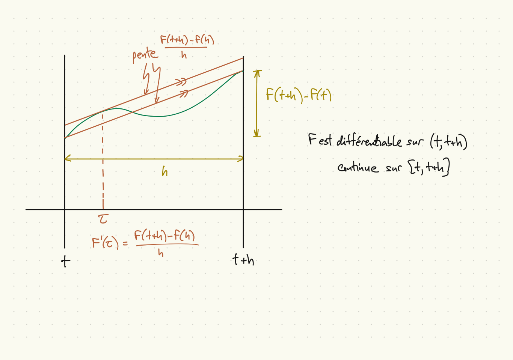

```{r setup, include=FALSE}
knitr::opts_chunk$set(echo = FALSE)
```

## Lemme de Fatou

* Lemme de Fatou : pour une suite $X_n \geq 0$ de v.a.
$$ E[\liminf_{n\to \infty} X_n] \leq \liminf_{n\to \infty} E[X_n]. $$

* Notes :
    1. Hypothèse très faible concernant $X_n$.
    1. Résultat pour $X_n \geq C > -\infty$ suit immédiatement.
    1. Les deux cotés peuvent être infinis.
    
* Construction d'une séquence convergente : $Y_n \equiv \inf_{k\geq n} X_k$.
    1. $0 \leq Y_n \leq X_n$.
    1. $Y_n \leq Y_{n+1}$ ($\{n, n+1, \ldots \}$ décroissant en $n$).
    1. $Y_n \nearrow Y \equiv \liminf_{n\to \infty} X_n$.

* Preuve :
$$ \liminf_n E[X_n] \geq \liminf_n E[Y_n] = \lim_n E[Y_n] = E[Y] = E[\liminf_n X_n] $$

## Lemme de Fatou pour $X_n \leq C < \infty$

* Si $X_n \leq C < \infty$, $-X_n \geq -C > -\infty$ et par le lemme de Fatou,
\[
  \liminf_n E[-X_n] \geq E[\liminf_n -X_n],
\]
\[
  \liminf_n -E[X_n] \geq E[-\limsup_n X_n],
\]
\[
  -\limsup_n E[X_n] \geq -E[\limsup_n X_n],
\]
\[
  \limsup_n E[X_n] \leq E[\limsup_n X_n].
\]

## Théorème de convergence dominée

* Pour une séquence $X_n$ de variables aléatoires, $X$ et $Y$ v.a. telles que
$P(X_n \to X) = 1$, $|X_n| \leq Y$ et $E[Y] < \infty$.
$$ \lim_{n\to \infty} E[X_n] = E[X]. $$

* Notes :
    1. La dominance par une $Y$ à moyenne finie est plus faible qu'une borne uniform pour $|X_n|$ ($Y=c$); le résultat est donc plus fort.
    1. Même v.a. dominante $Y$ pour tous les $n$.

* Preuve :
$$ E[Y] + E[X] = E[Y+X] = E[Y+\lim_n X_n] = E[Y+\liminf_n X_n] $$
$$ E[Y+\liminf_n X_n] \leq \liminf_n E[Y+X_n] = E[Y] + \liminf_n E[X_n] $$
$$ E[Y] - E[X] = \ldots \leq \ldots = E[Y] - \limsup_n E[X_n]. $$
$$ \limsup_n E[X_n] \leq E[X] \leq \liminf_n E[X_n]. $$
$$ \lim_n E[X_n] = E[X]. $$

## Sur les ensembles non-dénombrables de variables aléatoires

* Soit $\{X_t\}_{t\geq 0}$, un ensemble non-dénombrable de variables aléatoires.
* Exemples :
    * $X_s = e^{sX}$, dont l'espérance est $M_X(s)$, une fonction de $s$ réel.
    * $X \sim N(\mu, \sigma^2)$, $\mu$ et $\sigma^2$ inconnus. $E[f(X)]$ est une fonction de $\mu$, $\sigma^2$,
    * $X_t$ est un processus aléatoire en temps continu.
* Supposons que
    * $\lim_{t \downarrow 0}X_t(\omega) = X_0(\omega)$, $\omega \in \Omega$, et
    * il exist une v.a. $Y$ telle que $|X_t| < Y$ et $E[Y] < \infty$.
* Alors pour toute suite $t_n \downarrow 0$,
$$ E[X_{t_n}] \to E[X_0]. $$
* Alors
$$ \lim_{t\downarrow 0} E[X_t] = E[X_0]. $$

## La dérivée de l'espérance

* Soit $\{F_t\}_{a<t<b}$ un ensemble de variables aléatoires.
* Conditions suffisantes pour $\frac{dE[F_t]}{dt} = E[F_t']$, où $F_t' = \frac{dF_t}{dt}$ :
    1. Pour tout $t \in (a,b)$ : $-\infty < E[F_t] < \infty$.
    1. Il existe une v.a. $Y$ telle que $E[Y] < \infty$ et pour tout $t \in (a,b)$ et $\omega \in \Omega$, $F_t'(\omega)$ existe et $|F_t'(\omega)| \leq Y(\omega)$.
* Preuve : fixez $t\in (a,b)$. Alors
    1. $F_t' = \lim_{n\to \infty} n(F_{t+1/n}-F_t)$, la limite d'une séquence de
    variables aléatoires, est une variable alétoire.
    1. Pour tout $h$, $0 < h < b-t$,
    (théorème des accroissements finis, mean value theorem)
    $$ \left|\frac{F_{t+h}-F_t}{h}\right| \leq Y. $$
    1. Alors
    $$ \lim_{h \downarrow 0} \frac{E[F_{t+h}]-E[F_t]}{h}
    = \lim_{h \downarrow 0} E\left[\frac{F_{t+h}-F_t}{h}\right]
    = E\left[\lim_{h \downarrow 0} \frac{F_{t+h}-F_t}{h} \right] $$
    $$ \frac{dE[F_t]}{dt} = E[F_t'] \leq E[Y] < \infty. $$ 

## Théorème des accroissements finis


## Fonction génératrice des moments

* Définition : pour une v.a. $X$, $M_X(s) = E[e^{sX}]$, $s\in R$.
* Notes
    * $M_X$ n'existe pas toujours, même si $E[X] < \infty$.
    * $M_{X+Y}(s) = M_X(s)M_Y(s)$ pour v.a. indépendentes $X,Y$.
    * Il y a des tableaux avec plusieurs v.a. standardes
    * La fonction caractéristique est semblable et souvent plus utile

## Résultat sur $M_X(s)$

* Supposons que $X$ est une v.a. et qu'il existe $s_0 > 0$ tel que $M_X(s) < \infty$ pour $|s|<s_0$.
* Alors $E[|X^n|] < \infty$ pour tout $n$ et
$$ M_X(s) = \sum_{n=0}^\infty E[X^n] s^n / n!. $$
* Preuve :
    1. Soit $Z_n = \sum_{k=0}^n (sX)^k / k!$.
    1. $Z_n \to e^{sX}$ (définition de somme infinie, expansion de la fonction exponentielle)
    1. Fixez $s$, $|s|<s_0$
    $$ |Z_n| \leq \sum_{k=0}^n |sX|^k / k! \leq e^{sX} + e^{-sX} \equiv Y, $$
    $$ E[Y] = M_X(s) + M_X(-s) < \infty. $$
    1. Par convergence dominée, $E[e^{sX}] = \lim_{n\to \infty} E[Z_n] = \sum_{n=0}^\infty E[X^n]s^n/n!$.
    
## Signification de « génératrice des moments »

* Rappel $M_X(s) = \sum_{n=0}^\infty E[X^n]\frac{s^n}{n!} = 1 + \sum_{n=1}^\infty E[X^n] \frac{s^n}{n!}$.
* Première dérivée:
\[
  \begin{aligned}
    M_X'(s) &= \sum_{n=1}^\infty E[X^n] \frac{ns^{n-1}}{n!} \\
    &= \sum_{n=1}^\infty E[X^n] \frac{s^{n-1}}{(n-1)!} \\
    &= \sum_{n=0}^\infty E[X^{n+1}] \frac{s^n}{n!}
  \end{aligned}
\]
* $m$-ième dérivée :
\[
  M_X^{(m)}(s) = \sum_{n=0}^\infty E[X^{n+m}]\frac{s^n}{n!}
\]
* $M_X(0) = 1$, $M_X'(0) = E[X]$, $M_X^{(m)}(0) = E[X^m]$.

## Mesures associées aux variables aléatoires

* Soit $X$ une variable aléatoire sur un espace de probabilité $(\Omega,{\cal F},P)$
* $(\mathbb{R}, {\cal B}, \mu)$ est un espace de probabilité elle aussi, où
$$ \mu = {\cal L}(X) = PX^{-1} $$
est la *distribution* ou la $loi$ de $X$.
* Si $B \in {\cal B}$, $X^{-1}(B) \in {\cal F}$ et $\mu(B) = P(X^{-1}(B)) = (PX^{-1})(B)$.
* Pour $-\infty \leq a \leq b \leq \infty$,
    * $[a,b] \subset \mathbb{R}$,
    * $[a,b] \in {\cal B}$,
    * $\mu([a,b]) = P(\{X \in [a,b]\}),$
    * $\{X \in [a,b]\} \subset \Omega$,
    * $\{X \in [a,b]\} \in {\cal F}$.

## Exemple, suites de tirages au pile ou face, partie I

* Soit $\Omega = \{(r_1,r_2,\ldots) \colon r_i \in \{\mathrm{pile},\mathrm{face}\}\}$.
* Soit ${\cal F}$, $P$ les extension de ${\cal J}$ et $P$ de Rosenthal, 2.6.
* Rappel: la probabilité de l'histoire $A_{a_1a_2\ldots a_n}$ est $2^{-n}$.
* Soit $X_n \colon \Omega \to \mathbb{R}$ définie par
\[
  X_n(\omega) = \begin{cases} 1 & r_n = \mathrm{face}, \\ 0 & r_n = \mathrm{pile}. \end{cases}
\]
* On peut calculer $E[X_n] = 1/2$, $\mathrm{Var}[X_n] = 1/4$.
* Soit $S_n = \frac{1}{n} (X_1 + \ldots + X_n)$.
* Soit $z_n = \sqrt{n}(S_n - \frac{1}{2})/(1/2)$.
* Soit $\omega^* = (0,0,1,0,1,0,1,0,0,0,1,1,1,0,0,1,\ldots)$. Alors
    - $S_4(\omega^*) = 1/4$,
    - $S_8(\omega^*) = 3/8$,
    - $S_{16}(\omega^*) = 7/16$.

## Exemple, partie II, \textcolor{blue}{$n=4$}, \textcolor{red}{$n=8$}, \textcolor{green}{$n=16$}

```{r lln, echo=FALSE}
plot(NULL, xlim=c(0,1), ylim=c(0,0.5), ylab="masse de probabilité", xlab="S_n")
ns = c(4,8,16)
cols = c('blue', 'red', 'green')
obs = c(1, 3, 7)
for (i in 1:3) {
  n = ns[i]
  grid = seq(0,n)
  Svals = grid/n
  pvals = dbinom(grid, n, 0.5)
  points(Svals, pvals, col=cols[i])
  abline(v=obs[i]/n, col=cols[i])
}
```

## Exemple, partie III, la loi $N(0,1)$

* Soit $(\mathbb{R}, {\cal B}, P)$ l'espace de probabilité avec
$$ P(B) = \int_B f\, d\lambda, \quad B \in {\cal B}, $$
où $f \colon \mathbb{R} \to \mathbb{R}$ est définie par
$$ f(x) = \frac{1}{\sqrt{2\pi}} e^{x^2/2} $$
et $\lambda \colon {\cal B} \to \mathbb{R}$ est la mesure de Lebesgue.
* $f$ est la densité pour la loi $P$, $N(0,1)$, $F(x) = P((-\infty,x])$ est la fonction de répartition.

## Exemple, partie IV, \textcolor{blue}{$n=4$}, \textcolor{red}{$n=8$}, \textcolor{green}{$n=16$}

```{r clt, echo=FALSE}
z = seq(-4, 4, by=0.01)
plot(z, dnorm(z), 'l', ylab='densité ou masse de probabilité', xlab="z_n")
ns = c(4,8,16)
cols = c('blue', 'red', 'green')
obs = c(1, 3, 7)
for (i in 1:3) {
  n = ns[i]
  grid = seq(0,n)
  zvals = 2 * sqrt(n) * (grid/n - 0.5)
  pvals = dbinom(grid, n, 0.5)
  points(zvals, pvals, col=cols[i])
  abline(v=2*sqrt(n)*(obs[i]/n - 0.5), col=cols[i])
}
```

## Convergence en loi

* Soit $\mu_n$ une suite de mesures de probabilité boreliennes, $\mu$ une mesure de probabilité borelienne.
* $\mu_n \Rightarrow \mu$ ($\mu_n$ converge en loi à $\mu$) si pour chaque fonction $f \colon \mathbb{R} \to \mathbb{R}$, continue et bornée,
$$ \int_{\mathbb{R}} f\, d\mu_n \to \int_{\mathbb{R}} f\, d\mu. $$
* Une condition équivalente: pour tout $x \in \mathbb{R}$,
$$ \mu(\{x\}) = 0 \Rightarrow F_n(x) \to F(x), $$
où $F_n(x) \equiv \mu_n((-\infty,x])$, $F(x) \equiv \mu((-\infty,x])$.
* $\mu_n$ est une suite de mesures, pas une suite de variables aléatoires.
* Cependant, si $X_n$ est une suite de variables aléatoires sur $(\Omega,{\cal F},P)$, ${\cal L}_n = PX_n^{-1}$ est une suite de mesures.

## Aparté

* Soit $A$, $B$, $C$ des propositions sur $\omega$.

* Par exemple, $X(\omega) < c$, $X_n(\omega) > d$.

* Si $A\,\mbox{et}\, B \Rightarrow C$,

$$\neg C \Rightarrow \neg A\, \mbox{ou}\, \neg B,$$

$$ \{\neg C\} \subseteq \{\neg A\} \cup \{\neg B\} $$

## Convergence en probabilité et en loi

* Si $X_n \overset{p}{\to} X$,
$\mu_n \equiv {\cal L}(X_n) \Rightarrow {\cal L}(X) \equiv \mu$.
* Résultat équivalent : Si pour tout $\epsilon > 0$, $P(|X_n-X|\geq \epsilon) \to 0$,
$$ \mu(\{x\}) = 0 \Rightarrow F_n(x) \to F(x). $$
* Preuve : fixez $x \in \mathbb{R}$, $\epsilon > 0$. Alors pour tout $\omega \in \Omega$, $n \in \mathbb{N}$,
$$ X(\omega) > x + \epsilon\;\mbox{et}\; |X_n(\omega) - X(\omega)| < \epsilon \Rightarrow X_n(\omega) > x, $$
alors pour tout $n \in \mathbb{N}$,
$$ \{X_n \leq x\} \subseteq \{X \leq x + \epsilon\} \cup \{|X_n - X| \geq \epsilon\} $$
$$ F_n(x) \leq F(x+\epsilon) + P(|X_n-X| \geq \epsilon) $$
$$ \sup_n F_n(x) \leq F(x+\epsilon) + \sup_n P(|X_n-X| \geq \epsilon) $$
$$ \limsup_n F_n(x) \leq F(x+\epsilon) + 0, $$
et puisque $\epsilon > 0$ est arbitraire,
$$ \limsup_n F_n(x) \leq F(x). $$

## Preuve, continuée

* même $x \in \mathbb{R}$, fixez $\epsilon > 0$.
Pour tout $\omega \in \Omega$, $n \in \mathbb{N}$,
$$ X_n > x\;\mbox{et}\; |X_n-X| < \epsilon \Rightarrow X > x - \epsilon, $$
alors pour tout $n \in \mathbb{N}$,
$$ \{X \leq x-\epsilon\} \subseteq \{X_n \leq x\} \cup \{|X_n-X| \geq \epsilon\}, $$
alors
$$ F(x-\epsilon) \leq \liminf_n F_n(x) + \liminf_n P(|X_n-X| \geq \epsilon) $$
$$ F(x-\epsilon) \leq \liminf_n F_n(x) + 0 $$
* $\epsilon$ arbitraire, alors
$$ F(x) - \mu(\{x\}) \leq \liminf_n F_n(x) $$
* Maintenant si $\mu(\{x\}) = 0$, (c-à-d $P(\{X=x\}) = 0$)
$$ \liminf_n F_n(x) = \limsup_n F_n(x) = \lim_n F_n(x) = F(x). $$

## Aperçu du cours 7

* Fonction caractéristique
* Théorème central limite