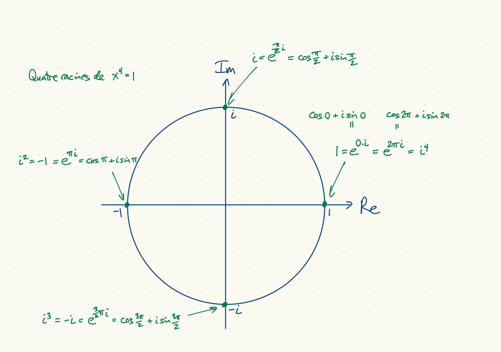
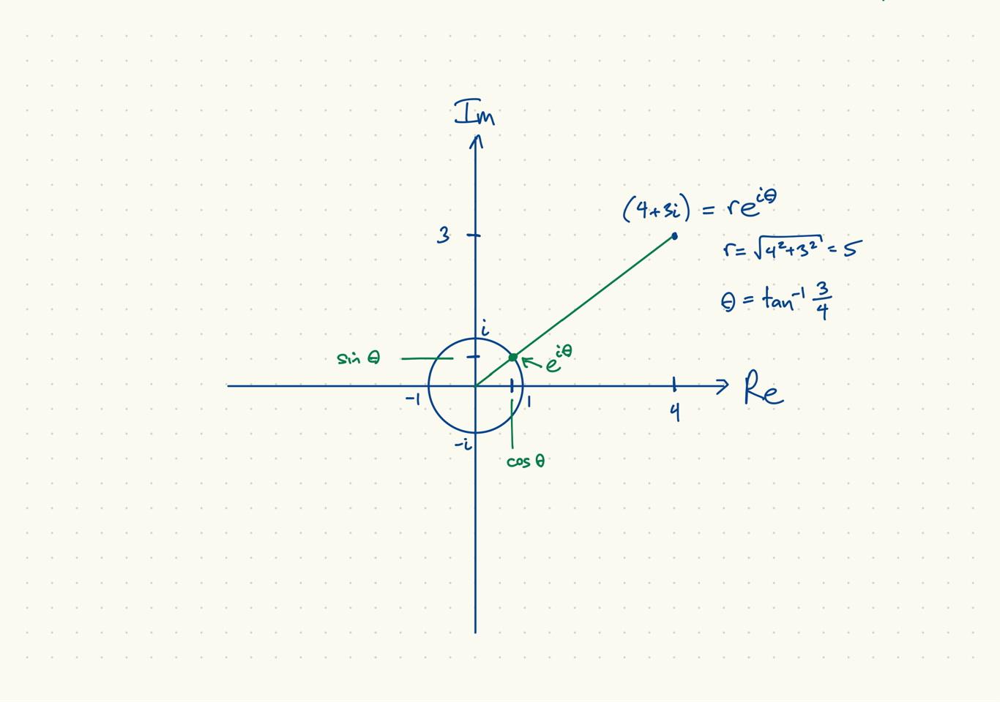
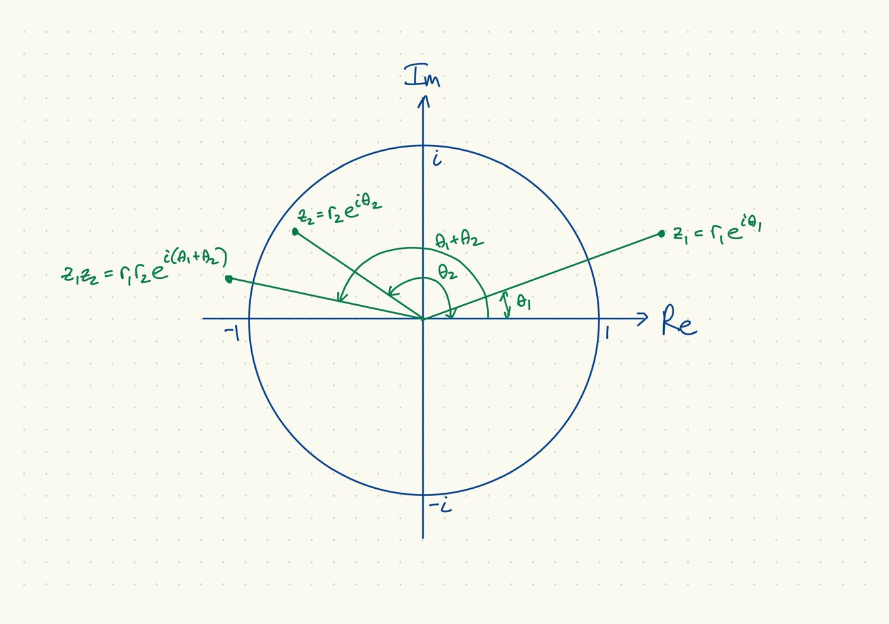
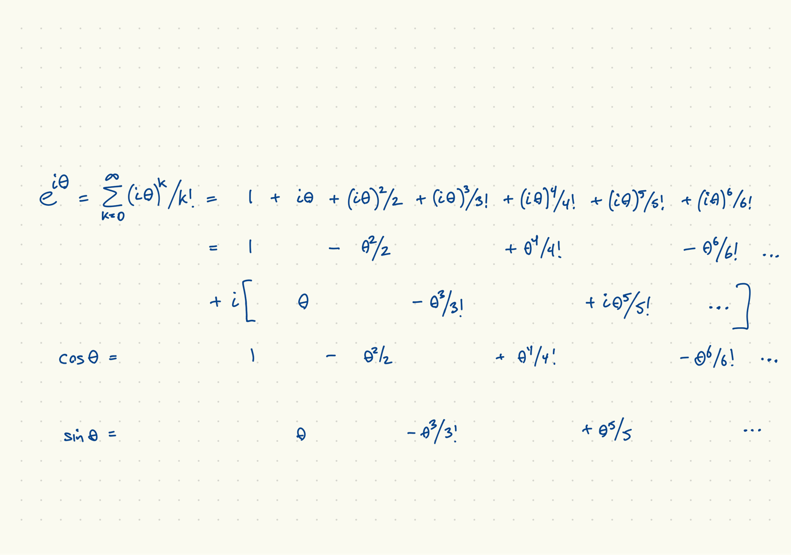
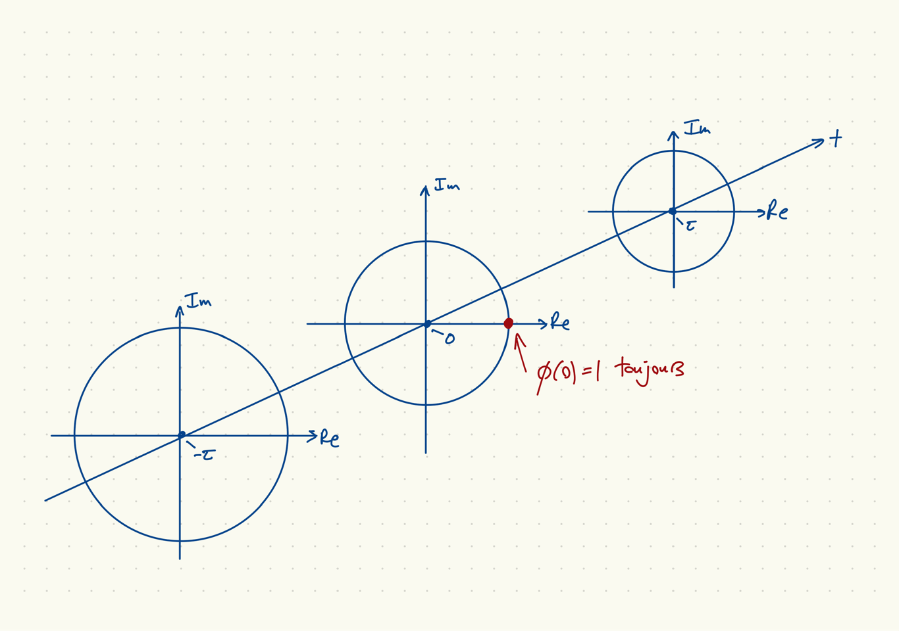
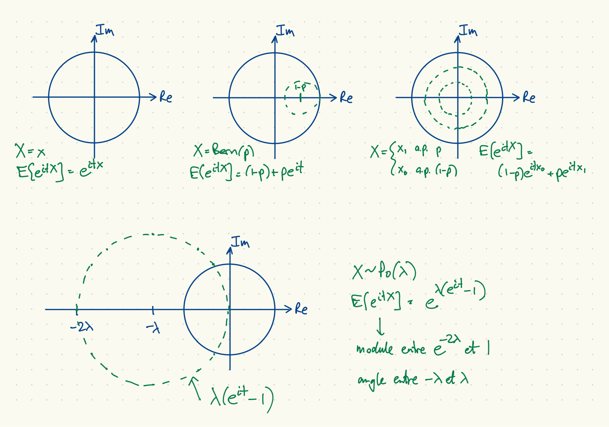
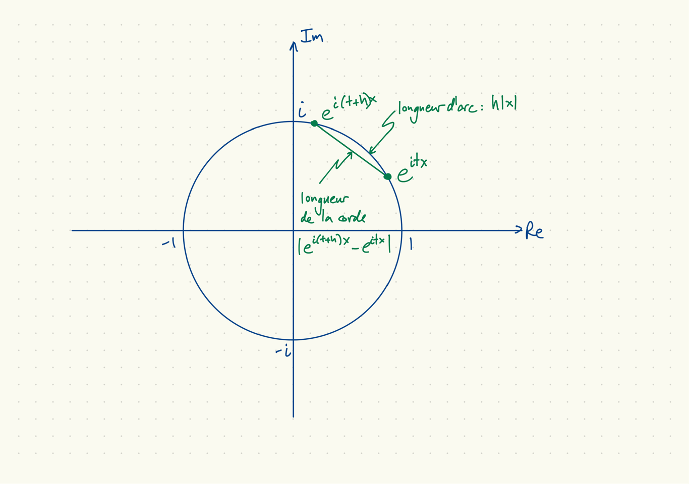

## Quatre racines de $x^4 = 1$


## Le module et l'argument (l'angle) d'un nombre complexe


## Multiplication des nombres complexes


## Des expansions des fonctions $\exp(\cdot)$, $\cos(\cdot)$, $\sin(\cdot)$


## La fonction caractéristique $\phi$

* Comme la fonction de répartition $F$, $\phi$ est une autre représentation de la loi d'une v.a. qui existe et qui est unique.
* Applications :
    * Calcul des moments (mais moins convenable que la fonction génératrice des moments)
    * L'opération de convolution versus l'opération de multiplication, pour le produit des v.a. indépendantes.
    * Utilisée pour prouver le théorème central limite
    * Inférence quand les moments n'existent pas.

## La fonction caractéristique comme un films


## Propriétés de la fonction caractéristique

1. $\phi_X(0) = E[e^0] = 1$, peut importe $X$.
1. $|\phi_X(t)| = |E[e^{itX}]| \leq E[|e^{itX}|] = 1$.
1. Si $X$ et $Y$ sont indépendantes,
\[
  \begin{aligned}
    \phi_{X+Y}(t) &= E[e^{it(X+Y)}] = E[e^{itX}e^{itY}] = E[e^{itX}]E[e^{itY}] \\
    &= \phi_X(t) \phi_Y(t).
  \end{aligned}
\]
1. $\phi(t) = E[\cos tX] + iE[\sin tX]$, par linéarité de l'espérance.
1. Pour $X$ réelle,
    a. $\Re(\phi(t)) = E[\cos tX]$ est paire.
    a. $\Im(\phi(t)) = E[\sin tX]$ est impaire.
1. Pour $X$ symétrique ($F(-x) = 1-F(x)$ au points de continuité), $\phi$ est réelle.

## Fonction caractéristique d'une loi $U(a,b)$

$$ \phi(t) = E[e^{itX}] = E[\cos tX + i \sin tX] = \frac{1}{b-a} \int_a^b \cos tx + i \sin tx \, dx $$
$$ \phi(t) = \frac{1}{t(b-a)} \left[ \sin tx - i \cos tx \right]_a^b 
= \frac{1}{it(b-a)} \left[ \cos tx + i \sin tx \right]_a^b $$
$$ \phi(t) = \frac{e^{itb} - e^{ita}}{it(b-a)} $$

* Cas spécial $a = -\theta$, $b = \theta$ :
$$ \phi(t) = \frac{\sin \theta t}{\theta t}. $$
* Cas spécial, $a=-1$, $b=1$ :
$$ \phi(t) = \frac{\sin t}{t} \equiv \mathsf{sinc}(t). $$

## La fonction $\mathsf{sinc}$

```{r sinc}
t = seq(-6*pi, 6*pi, length.out = 200)
plot(t, sin(t)/t, type='l')
lines(t, 1/abs(t), col='red')
```

## Cas discret

1. $X = x$
\[
  \phi_X(t) = E[e^{itx}] = e^{itx}.
\]
1. $X \sim \mathrm{Bern}(p)$
\[
  \phi_X(t) = (1-p) + pe^{it}.
\]
1. Bernoulli avec valeurs arbitraires
\[
  X = \begin{cases}
  x_0 & \mbox{avec probabilité}\, (1-p), \\
  x_1 & \mbox{avec probabilité}\, p. \\
  \end{cases}
\]
\[
  \phi_X(t) = E[e^{itX}] = (1-p) e^{itx_0} + p e^{itx_1}.
\]
1. Cas spécial $p=1/2$, $x_0 = -\theta$, $x_1 = \theta$
\[
  \phi_X(t) = (e^{-i\theta t} + e^{i\theta t})/2 = \cos \theta t.
\]
1. $X \sim \mathrm{Po}(\lambda)$
\[
  \phi_X(t) = \exp[\lambda(e^{it}-1)].
\]

## Cas discret, illustrations


## Illustration, cas Bernoulli avec valeurs $x_0 = 1$ et $x_1 = 6$

Voici le code pour les trois prochaines figures:
```{r bern}
t = seq(-2*pi, 2*pi, length.out = 200)
x0 = 1; x1 = 6; p = 0.25
phi = (1-p)*exp(complex(imaginary=t*x0))
phi = phi + p*exp(complex(imaginary=t*x1))

cercle = exp(complex(imaginary=t))
```

## Trajet dans le cercle unitaire

```{r berncirc}
plot(Re(phi), Im(phi), type='l', xlim=c(-1,1), ylim=c(-1,1))
lines(Re(cercle), Im(cercle), col='red')
```

## Partie réelle

```{r bernre}
plot(t, Re(phi), type='l', ylim=c(-1,1))
```

## Partie imaginaire

```{r bernim}
plot(t, Im(phi), type='l', ylim=c(-1,1))
```

## Illustration, cas Poisson, $\lambda = 2$

Voici le code pour les trois prochaines figures:
```{r Po}
t = seq(-2*pi, 2*pi, length.out = 200)
lambda = 2
phi = exp(lambda*(exp(complex(imaginary = t))-1))
```

## Trajet dans le cercle unitaire

```{r Pocirc}
plot(Re(phi), Im(phi), type='l', xlim=c(-1,1), ylim=c(-1,1))
lines(Re(cercle), Im(cercle), col='red')
points(0, 0, col='green')
```

## Partie réelle

```{r Pore}
plot(t, Re(phi), type='l', ylim=c(-1,1))
```

## Partie imaginaire

```{r Poim}
plot(t, Im(phi), type='l', ylim=c(-1,1))
```

## Fonction caractéristique d'une loi $N(0,1)$

* Puisque $\sin(tx)$ est impair, $e^{-x^2/2}$ est pair,
$$ \phi(t) = \frac{1}{\sqrt{2\pi}} \int_{-\infty}^\infty \cos tx \cdot e^{-x^2/2}\, dx $$
$$ \phi'(t) = \frac{1}{\sqrt{2\pi}} \int_{-\infty}^\infty -\sin tx \cdot x e^{-x^2/2}\, dx $$
* Intégration par parties, $u = -\sin tx$, $dv = xe^{-x^2/2}\,dx$, $du = -t\cos tx$, $v = -e^{-x^2/2}$, donne
$$ \phi'(t) = [uv]_{-\infty}^\infty - \frac{1}{\sqrt{2\pi}} \int_{-\infty}^\infty t \cos tx \cdot e^{-x^2/2} \, dx = -t \phi(t). $$
* La solution de l'équation différentielle $\log \phi(0) = 0$,
$\frac{d\log \phi(t)}{dt} = -t$
est $\log \phi(t) = \int_0^t -s\, ds = -t^2/2$.
* Alors $\phi(t) = e^{-t^2/2}$.

## Fonction caractéristique d'une loi $N(\mu,\sigma^2)$

Si $X \sim N(0,1)$ et $Y=\mu + \sigma X$ alors $Y \sim N(\mu, \sigma^2)$ et
\[
  \phi_Y(t) = E[e^{i(\mu + \sigma X)t}] = e^{i\mu t} E[e^{i(t\sigma)X}]
  = e^{i\mu t} \phi_X(\sigma t) = e^{i\mu t} e^{-\sigma^2 t^2/2}
\]

La densité de $Y$ est de la même forme fonctionnelle :
\[
  f_Y(y) = \frac{1}{\sqrt{2\pi \sigma^2}}
  \exp\left[-\frac{1}{2} \frac{(x-\mu)^2}{\sigma^2}\right].
\]

## Continuité de la fonction caractéristique

\[
\begin{aligned}
  \left| \phi_x(t+h) - \phi_x(t) \right| &= \left| \int (e^{i(t+h)x} - e^{itx}) \mu(dx) \right| \\
  &\leq \int \left| e^{i(t+h)x} - e^{itx} \right| \mu(dx).
\end{aligned}
\]

* Deux bornes qui ne dépend pas de $t$
$$ \left| e^{i(t+h)x} - e^{itx} \right| \leq h|x|, \qquad \left| e^{i(t+h)x} - e^{itx} \right| \leq 2. $$
* Selon la deuxième, (convergence dominée)
$$ \lim_{h \downarrow 0} E\left[\left| e^{i(t+h)X} - e^{itX} \right|\right]
= E\left[\lim_{h \downarrow 0} \left| e^{i(t+h)X} - e^{itX} \right|\right] $$
* Selon la première,
$$ E\left[\lim_{h \downarrow 0} \left| e^{i(t+h)X} - e^{itX} \right|\right] = E[0] = 0. $$

## Arc et corde


## Dérivée de la fonction caractéristique

* Soit $X$ une variable aléatoire, $\phi(t)$ sa fonction caractéristique.
* Si $E[|X|^k] < \infty$, alors pour $0 \leq j \leq k$, $\phi^{(j)}(t) = E[(iX)^j e^{itX}]$.
* Preuve par induction : fixons $k$ et supposons que $E[|X|^k] < \infty$.
    * $E[(iX)^0 e^{itX}] = E[e^{itX}] = \phi(t) = \phi^{(0)}(t)$, alors vrai pour $j=0$.
    * Supposez que $\phi^{(j-1)}(t) = E[(iX)^{j-1} e^{itX}]$.
    * $|(iX)^j e^{itX}| = |i|^j|X|^j|e^{itX}| = |X|^j$
    * $E[|X|^k] < \infty \Rightarrow E[|X|^j] < \infty$
    * $\phi^{(j)}(t) = E\left[ \frac{d}{dt} (iX)^{j-1} e^{itX} \right] = E[(iX)^j e^{itX}]$
* Génération des moments :
$$ \phi^{(j)}(0) = i^j E[X^j] $$
* Attention : $\phi_X(t) = \exp(-\gamma |t|)$ pour $X$ Cauchy symétrique avec paramètre d'échelle $\gamma$, n'est pas différentiable à $t=0$.

## Propriétés de la fonction $(\sin \theta t) / t = \theta \mathsf{sinc}(\theta t)$

1. Pour $\theta = 0$, $(\sin \theta t) / t \equiv 0$.
1. Pour $\theta \neq 0$, $t=k\pi/\theta$, $k = \pm 1, \pm 2, \ldots$,
$$ \frac{\sin \theta t}{t} = 0. $$
1. Pour $\theta \neq 0$,
$$ \lim_{t \to 0} \frac{\sin \theta t}{t}
= \frac{\lim_{t \to 0} \theta \cos \theta t}{\lim_{t \to 0} 1} = \theta $$
$$ \lim_{t\to \infty} \frac{\sin \theta t}{t} = 0. $$
1. Pour $\theta \neq 0$, la fonction est paire :
$$ \frac{\sin \theta (-t)}{-t} = \frac{\sin \theta t}{t} $$
1. Lemme 11.1.3 du livre,
$$ \lim_{T\to \infty} \int_{-T}^T \frac{\sin \theta t}{t} \, dt
= \begin{cases} \pi & \theta > 0 \\ 0 & \theta = 0 \\ -\pi & \theta < 0 \end{cases} $$

## Théorème d'inversion I

* Soit $\mu$ une mesure borélienne, $\phi(t)$ sa fonction caractéristique. Alors
si $a<b$ et $\mu(\{a\}) = \mu(\{b\}) = 0$,
$$ \mu([a,b]) = \frac{1}{2\pi} \lim_{T\to \infty} \int_{-T}^T \frac{e^{-ita}-e^{-itb}}{it} \phi(t)\,dt $$
* Puisque
$$ \left|\frac{e^{-ita}-e^{-itb}}{it}\right| = \left|\int_a^b e^{itr}\, dr\right| < \infty $$
l'intégral entre $-T$ et $T$ est fini.
* Par Fubini,
\[
\begin{aligned}
  \int_{-T}^T \frac{e^{-ita}-e^{-itb}}{it} &\int_{\mathbb{R}} e^{itx} \, \mu(dx) \,dt \\
  &= \int_{\mathbb{R}} \int_{-T}^T
\frac{e^{it(x-a)} - e^{it(x-b)}}{it} \, dt \, \mu(dx).
\end{aligned}
\]

## Théorème d'inversion II

La partie imaginaire de l'intégrand est impair, l'intégral est réel,
$$ \lim_{T\to \infty} \int_{-T}^T \frac{e^{-ita}-e^{-itb}}{it}
\phi(t)\,dt = \int_{\mathbb{R}} \int_{-\infty}^\infty
\frac{\sin t(x-a)}{t} - \frac{\sin t(x-b)}{t} \,dt \, \mu(dx). $$
$$ \frac{1}{2\pi} \lim_{T\to \infty} \int_{-T}^T \frac{e^{-ita}-e^{-itb}}{it}
\phi(t)\,dt = \frac{1}{2} \int_{\mathbb{R}} \mathsf{sign}(x-a) - \mathsf{sign} (x-b) \,\mu(dx). $$

* La valeur de l'intégral est
$$ \frac{1}{2} (\mu(\{a\}) + \mu(\{b\}) + \mu((a,b)). $$

## La dualité en cas de $\phi_X(t)$ intégrable

Théorème d'inversion spécial quand $\phi_X(t)$ est intégrable :

$X$ a une densité
\[
  f_X(x) = \frac{1}{2\pi} \int_{\mathbb{R}} e^{-itx} \phi_X(t) dt.
\]

## Unicité de la fonction caractéristique

* Théorème d'unicité ${\cal L}(X) = {\cal L}(Y) \Leftrightarrow \phi_X(t) = \phi_Y(t)$
* $\Rightarrow$ de la définition de la fonction caractéristique en termes de $\mu$
* $\Leftarrow$ du théorème d'inversion. Probabilités des intervalles par continuité de probabilité, autres événements par unicité des extensions.

## Théorème de continuité

* Soit $\mu,\mu_1,\mu_2,\ldots$ des mesures boréliennes, $\phi,\phi_1,\phi_2,\ldots,$ leurs fonctions caractéristiques. Alors $\mu_n$ converge en loi à $\mu$ ssi $\phi_n(t) \to \phi(t)$, $t\in \mathbb{R}$.
* Par la définition de convergence en loi et la continuité des fonctions $\cos xt$ et $\sin xt$ en $x$ pour $t$ donné, si $\mu_n$ converge en loi à $\mu$, $\phi_n(t) \to \phi(t)$ pour $t\in \mathbb{R}$.
* L'autre direction est plus difficile.

## Théorème centrale limite I

* Supposez que $X_1,X_2,\ldots,$ sont iid, avec moyenne 0, variance 1.
* Soit $Y_n = \sqrt{n} \frac{1}{n} \sum_{k=1}^n X_k$. La fonction caractéristique de $Y_n$ est
$$ \phi_n(t) = \phi_X^n\left(\frac{t}{\sqrt{n}}\right)
= \left[ 1 + \frac{it}{\sqrt{n}} E[X_1] + \frac{1}{2} \left(\frac{it}{\sqrt{n}}\right)^2 E[X_1^2] + o(n^{-1}) \right]^n. $$
* Avec $E[X_1] = 0$, $E[X_1^2] = 1$,
$$ \phi_n(t) = \left(1 - \frac{1}{2}\frac{t^2}{n} + o(n^{-1})\right)^n. $$
$$ \log \phi_n(t) = n\log \left( 1 - \frac{1}{2}\frac{t^2}{n} + o(n^{-1}) \right)
= n \left( -\frac{1}{2} \frac{t^2}{n} + o(n^{-1}) \right) $$
$$ \log \phi_n(t) \to -\frac{t^2}{2} $$
$$ \phi_n(t) \to e^{-t^2/2}. $$

## Théorème centrale limite II

* Si $Y$ est une variable aléatoire $N(0,1)$, sa fonction caractéristique est
$\phi(t) = e^{-t^2/2}$.
* Puisque $\phi_n(t) \to \phi(t)$, ${\cal L}(Y_n) \Rightarrow {\cal L}(Y)$.
