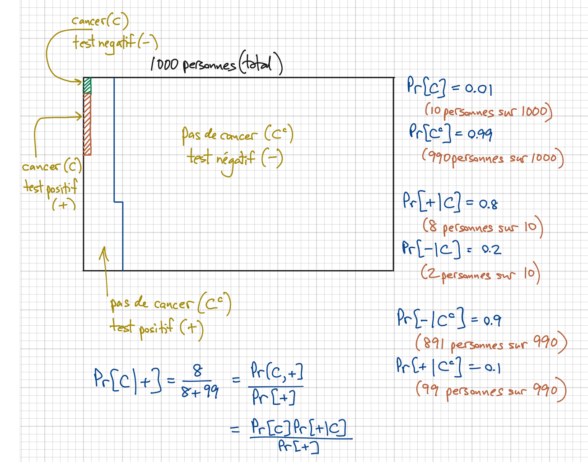
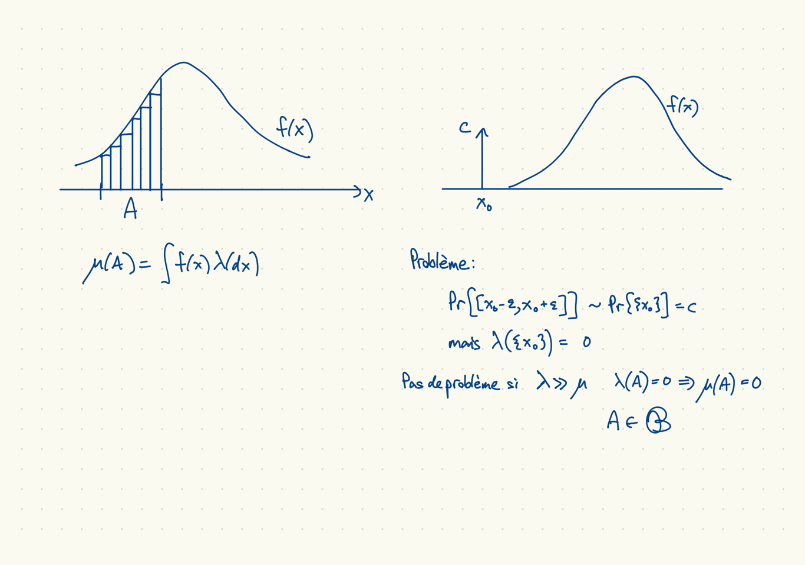
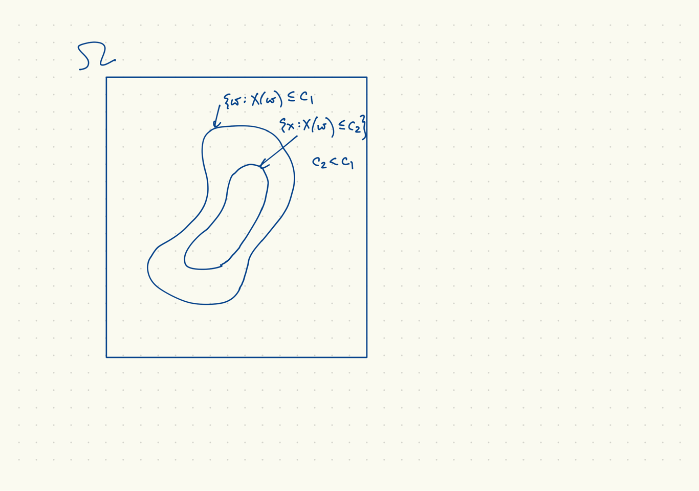
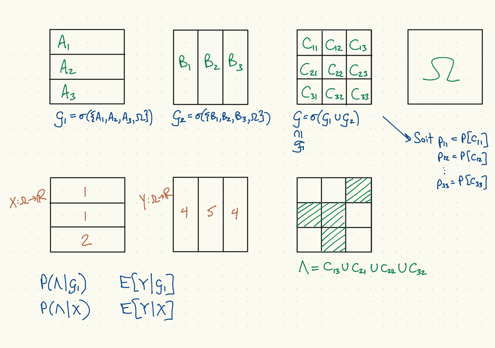
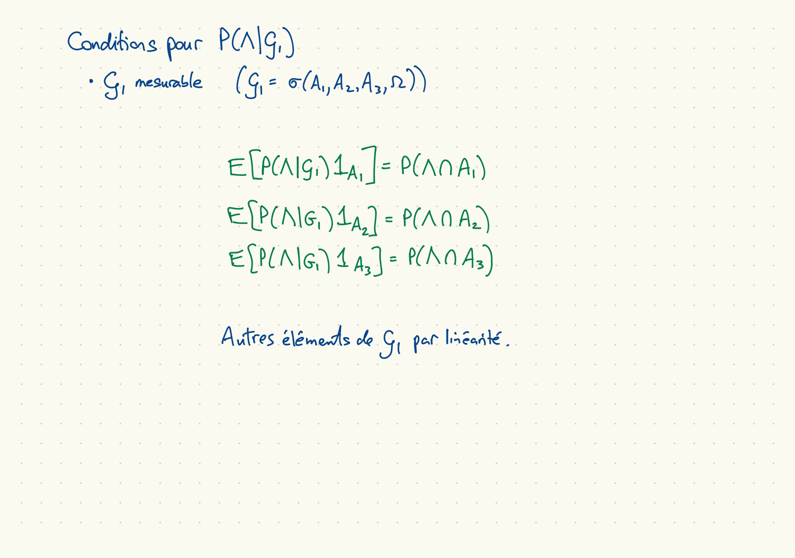
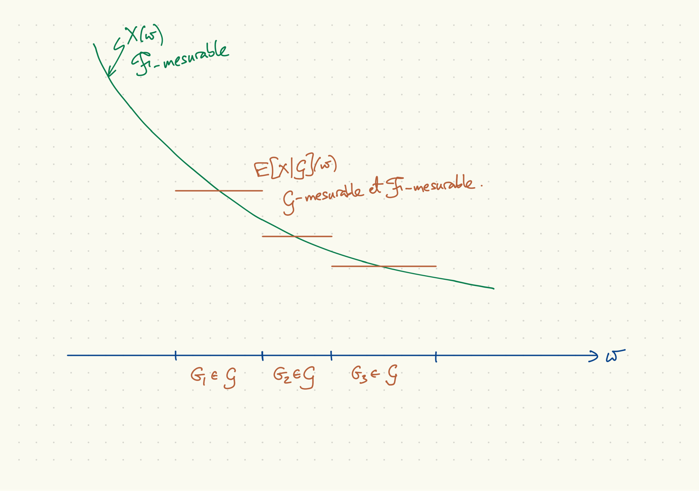
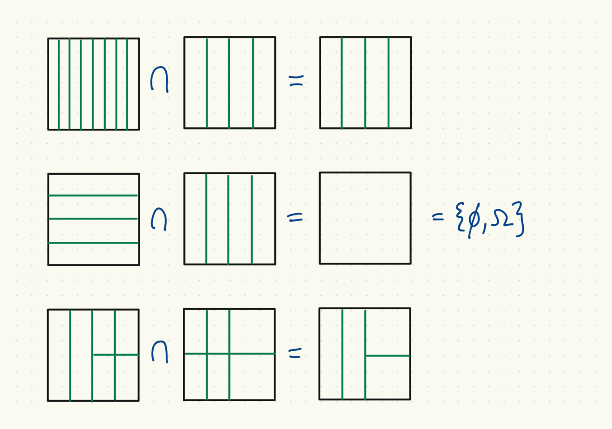

## Théorème de Bayes, événements de probabilité positive

## Un peu de Chapitre 12

* $\mu$, $\nu$, $\lambda$ des mesures boréliennes sur $\mathbb{R}$, $\lambda$ Lebesgue.
* $\mu$ est absolument continue s'il existe $f$ mesurable telle que $\mu(A) = \int_A f(x) \lambda(dx)$, $A$ borelien ($\lambda$-mesurable).
* $\mu$ est absolument continue par rapport à $\nu$ s'il existe $f$, $\nu$-mesurable, telle que $\mu(A) = \int_A f(x) \nu(dx)$, $A \in {\cal B}$.
* $\mu$ est discret si $\sum_{x\in \mathbb{R}} \mu(\{x\}) = \mu(\mathbb{R})$.
* $\mu \ll \nu$ signifie $\nu(A) = 0 \Rightarrow \mu(A) = 0$.
* Théorème Radon-Nikodym : $\mu \ll \lambda \Leftrightarrow \,\text{il existe $f$, $\lambda$-mesurable, telle que}\,\mu(A) = \int_A f(x) \lambda(dx)$, $A$ mesurable.
* $f=\frac{d\mu}{d\lambda}$ est la dérivée Radon-Nikodym de $\mu$ par rapport à $\lambda$.
* $\mu(A) = \int_A \left(\frac{d\mu}{d\lambda}\right) d\lambda$.

## Continuité absolue

## Un peu plus sur la mesurabilité I

* Soit $(\Omega, {\cal F}, P)$ un espace de probabilité.
* Soit $X \colon \Omega \to \mathbb{R}$ une variable aléatoire sur $(\Omega, {\cal F}, P)$.
* Définer $\sigma(X) \equiv \sigma(\{\{X \leq c\} \colon c \in \mathbb{R}\})$.
* Notez que $\{X = c\} = \{X \leq c\} \backslash \left( \cup_n \{X \leq c-1/n\} \right) \in \sigma(X)$
* Si on sait assez pour répondre à la question suivante pour tout $c \in \mathbb{R}$, on connait la valeur de $X(\omega)$ : Est-ce que $\omega \in \{X \leq c\}$?
* Soit ${\cal G} \subseteq {\cal F}$ une tribu.
* Si $X$ est ${\cal G}$-mesurable (c.-à-d. $\{X \leq c\} \in {\cal G}$, tout $c \in \mathbb{R}$),
    * $\sigma(X) \subseteq {\cal G} \subseteq {\cal F}$ (c.-à-d. ${\cal G}$ est (faiblement) plus fine que $\sigma(X)$).
* Une variable aléatoire sur $(\Omega, {\cal F}, P)$ est ${\cal F}$-mesurable par définition. Une fonction $f\colon \Omega \rightarrow \mathbb{R}$ qui n'est pas une variable aléatoire n'est pas ${\cal F}$-mesurable.

## Deux évènements dans $\sigma(X)$

## Un peu plus sur la mesurabilité II

* Si une variable aléatoire est $\sigma(X)$-mesurable, c'est une fonction seulement de $X$---elle dépend de $\omega$ seulement à travers $X(\omega)$.
    * Supposons que la variable aléatoire $Z$ est $\sigma(X)$-mesurable.
    * Pour tous $z \in \mathbb{R}$, il existe une unique $B_z \in {\cal B}$ tel que $\{Z=z\} = \{X \in B_z\}$. (Notez que $\{X \in B_z\} \subseteq \sigma(X)$.)
    * Considérez ceci comme la définition de $B_z$ pour tout $z \in \mathbb{R}$.
    * Alors $Z = f(X)$, où la fonction $f$ est définie par : pour tout $z \in \mathbb{R}$ et tout $x \in B_z$, $f(x) = z$.
    * $\sigma(Z) \subseteq \sigma(X)$ mais $\sigma(X) \subseteq \sigma(Z)$ n'est pas vrai en général.

## Exemple, probabilités et espérances conditionelles

## Définitions de probabilité, espérance conditionnelle

* Soit $X$, $Y$ deux variables aléatoires avec $E[|Y|] < \infty$
* Soit $A$ un évènement : $A \in {\cal F}$.
* Une variable aléatoire $P(A|X)(\omega)$ est une *probabilité conditionnelle* de $A$ sachant $X$ si elle est $\sigma(X)$-mesurable et pour chaque $S \in {\cal B}$,
\[
  E[P[A|X]1_{X \in S}] = P[A \cap \{X \in S\}].
\]
* Une variable aléatoire $E[Y|X](\omega)$ est une *espérance conditionnelle* de $Y$ sachant $X$ si elle est $\sigma(X)$-mesurable et pour chaque $S \in {\cal B}$,
\[
  E[E[Y|X]1_{X\in S}] = E[Y1_{X\in S}].
\]

## Trouver $P(\Lambda|{\cal G}_1)$

## Probabilités conditionnelles de l'événement $\Lambda\in \Omega$

* Par rapport à la sous-tribu ${\cal G}_1$ :
$$ P(\Lambda|{\cal G}_1) =
\begin{cases}
p_{13}/P(A_1) & \omega \in A_1 \\
(p_{21} + p_{22})/P(A_2) & \omega \in A_2 \\
p_{32}/P(A_3) & \omega \in A_3
\end{cases} $$
* Par rapport à la variable aléatoire $X$
$$ P(\Lambda|X) = P(\Lambda|\sigma(X)) =
\begin{cases}
\frac{p_{13}+p_{21}+p_{22}}{P(A_1 \cup A_2)} & \omega \in A_1 \cup A_2 = \{X=1\} \\
p_{32}/P(A_3) & \omega \in A_3 = \{X=2\}
\end{cases} $$
* Par rapport à la sous-tribu minimale $\{\emptyset,\Omega\}$ :
$$ P(\Lambda|\{\emptyset,\Omega\}) = P(\Lambda) = p_{13} + p_{21} + p_{22} + p_{32},\,\mbox{tous}\; \omega \in \Omega $$
* Par rapport à la sous-tribu maximal ${\cal F}$ (ou par rapport à ${\cal G}$) :
$$ P(\Lambda|{\cal F}) = 1_\Lambda(\omega) = P(\Lambda|{\cal G}). $$

## Vérification de $P(\Lambda|{\cal G}_1)$

* À vérifier : $E[P(\Lambda|{\cal G}_1)1_{A}] = P(\Lambda \cap A)$, $A \in {\cal G}_1$.
$$ E[P(\Lambda|{\cal G}_1)1_{A_1}] = E\left[\frac{p_{13}}{P(A_1)}1_{A_1}\right] = \frac{p_{13}}{P(A_1)}E[1_{A_1}] = p_{13} = P(\Lambda \cap A_1) $$
\[
  \begin{aligned}
    E[P(\Lambda|{\cal G}_1)1_{A_2}] = E\left[\frac{p_{21} + p_{23}}{P(A_2)}1_{A_2}\right] &= \frac{p_{21}+p_{22}}{P(A_2)}E[1_{A_2}] \\
    &= p_{21} + p_{22} = P(\Lambda \cap A_2)
  \end{aligned}
\]
$$ E[P(\Lambda|{\cal G}_1)1_{A_3}] = E\left[\frac{p_{32}}{P(A_3)}1_{A_3}\right] = \frac{p_{32}}{P(A_3)}E[1_{A_3}] = p_{32} = P(\Lambda \cap A_3) $$
* Le reste par linéarité de l'espérance, additivité de probabilité

## Construction de $P(\Lambda|{\cal G}_1) = \frac{d\nu}{dP_0}$

* La mesure $\nu$ : $\nu(A) \equiv P(\Lambda \cap A)$, $A \in {\cal G}_1$
$$ \nu(A_1) = P(\Lambda \cap A_1) = p_{13} $$
$$ \nu(A_2) = P(\Lambda \cap A_2) = p_{21} + p_{22} $$
$$ \nu(A_3) = P(\Lambda \cap A_2) = p_{32} $$
* La mesure $P_0$ : $P_0(A) \equiv P(A)$, $A \in {\cal G}_1$.
$$ P_0(A_1) = p_{11} + p_{12} + p_{13} $$
$$ P_0(A_2) = p_{21} + p_{22} + p_{23} $$
$$ P_0(A_3) = p_{31} + p_{32} + p_{33} $$
* Notez que $P_0(A) = 0 \Rightarrow \nu(A) = 0$, $A \in {\cal G}_1$ : c-à-d $\nu \ll P_0$.
* Si $P_0(A)>0$, $P(\Lambda|{\cal G}_1)(\omega) = \nu(A)/P_0(A)$, $\omega \in A \in {\cal G}_1$.

## Trouvez $E[Y|{\cal G}_1]$

Les conditions sur $E[Y|{\cal G}_1]$

* Doit être ${\cal G}_1$-mesurable, où ${\cal G}_1 = \sigma(A_1,A_2,A_3,\Omega)$.
* $E[E[Y|{\cal G}_1] 1_{A_1}] = E[Y1_{A_1}] =$
* $E[E[Y|{\cal G}_1] 1_{A_2}] = E[Y1_{A_2}] =$
* $E[E[Y|{\cal G}_1] 1_{A_3}] = E[Y1_{A_3}] =$
* Autres éléments de ${\cal G}_1$ par linéarité.

## Espérances conditionnelles de $Y$

* Par rapport à la sous-tribu ${\cal G}_1$ :
$$ E[Y|{\cal G}_1] = \begin{cases}
(4(p_{11}+p_{13}) + 5p_{12})/P(A_1) & \omega \in A_1 \\
(4(p_{21}+p_{23}) + 5p_{22})/P(A_2) & \omega \in A_2 \\
(4(p_{31}+p_{33}) + 5p_{32})/P(A_3) & \omega \in A_3 \\
\end{cases} $$
* Par rapport à la variable aléatoire $X$
$$ E[Y|X] = \begin{cases}
\frac{4(p_{11}+p_{13}+p_{21}+p_{23}) + 5(p_{12}+p_{22})}{P(A_1 \cup A_2)} & \omega \in A_1 \cup A_2 = \{X=1\} \\
(4(p_{31}+p_{33}) + 5p_{32})/P(A_3) & \omega \in A_3 = \{X=2\} \\
\end{cases} $$
* Par rapport à la sous-tribu minimale $\{\emptyset,\Omega\}$ :
$$ E[Y|\{\emptyset,\Omega\}] = E[Y] $$
* Par rapport à la sous-tribu maximal ${\cal F}$ :
$$ E[Y|{\cal F}] = Y(\omega) $$

## Espérance conditionnelles : une illustration

## Vérification de $E[Y|{\cal G}_1]$

* À vérifier : $E[E[Y|{\cal G}_1]1_A] = E[Y1_A]$, $A \in {\cal G}_1$ :
* Pour $A = A_1$ :
$$ E[E[Y|{\cal G}_1]1_{A_1}] = \frac{4(p_{11}+p_{13}) + 5p_{12}}{P(A_1)} E[1_{A_1}]
= 4(p_{11}+p_{13}) + 5p_{12} $$
$$ E[Y1_{A_1}] = 4(p_{11}+p_{13}) + 5p_{12} $$
* $A = A_2$, $A = A_3$ semblables
* Le reste par linéarité de l'espérance

## Construction de $E[Y|{\cal G}_1]$ :

* En général, $E[Y|{\cal G}_1](\omega) = E[Y^+|{\cal G}_1](\omega) - E[Y^-|{\cal G}_1](\omega)$.
* Mêmes cas $\infty$, $-\infty$, fini, indéfini, événement par événement
* Ici, $Y = Y^+$, alors $E[Y|{\cal G}_1] = E[Y^+|{\cal G}_1] = \frac{d\rho^+}{dP_0}$, où
\[
  \rho^+(A) \equiv E[Y^+1_A],\quad P_0(A) \equiv P(A),\quad A \in {\cal G}_1,
\]
et notez que $\rho^+ \ll P_0$ alors $\rho^+(A) = \int_A E[Y|{\cal G}_1] P_0(dx)$.
* Pour $A = A_1$,
    * $\rho^+(A_1) = E[Y^+1_{A_1}] = 4(p_{11}+p_{13}) + 5p_{12}$
    * $P_0(A_1) = P(A_1) = p_{11} + p_{12} + p_{13}$
* Les cas $A = A_2$, $A = A_3$ sont semblables.
* Pour chaque $\omega \in A \in {\cal G}_1$, $E[Y^+|{\cal G}_1](\omega) = \rho^+(A)/P_0(A)$.
* Pour $\omega \in A_1$,
\[
  E[Y^+|{\cal G}_1](\omega) = \frac{4(p_{11}+p_{13}) + 5p_{12}}{p_{11} + p_{12} + p_{13}}.
\]

## Exercice 13.2.3

* Soit ${\cal G}_1$ et ${\cal G}_2$ deux sous-tribus de ${\cal F}$.
(a) Si $Z$ est ${\cal G}_1$-mesurable et ${\cal G}_1 \subseteq {\cal G}_2$, $Z$ est ${\cal G}_2$ mesurable :
    * Pour tous $z \in \mathbb{R}$, $\{Z \leq z\} \in {\cal G}_1$ alors $\{Z \leq z\} \in {\cal G}_2$.
(b) Si $Z$ est ${\cal G}_1$-mesurable et ${\cal G}_2$-mesurable, $Z$ est $({\cal G}_1 \cap {\cal G}_2)$-mesurable :
    * Pour tous $z \in \mathbb{R}$, $\{Z \leq z\} \in {\cal G}_1$ et $\{Z \leq z\} \in {\cal G}_2$, alors $\{Z \leq z\} \in {\cal G}_1 \cap {\cal G}_2$.

## Intersection des tribus

## Proposition 13.2.6

* Rappel, définition de la v.a. $E[X|{\cal G}]$ : pour tout $G \in {\cal G}$,
\[
  E[E[X|{\cal G}]1_G] = E[X1_G].
\]
* Soit $X$, $Y$ des variables aléatoires, $X$ est ${\cal G}$-mesurable, $E[Y]<\infty$, $E[XY]<\infty$.
* Proposition : $E[XY|{\cal G}] = XE[Y|{\cal G}]$ avec probabilité 1.
* Preuve :
    * Soit $G_0,G \in {\cal G}$, $X = 1_{G_0}$. Alors
    $$ E[XE[Y|{\cal G}]1_G] = E[E[Y|{\cal G}]1_{G \cap G_0}] = E[Y1_{G \cap G_0}] = E[XY1_{G}]. $$
    $$ E[E[XY|{\cal G}]1_G] = E[XY1_{G}]. $$
    * $G$ est arbitraire, alors $XE[Y|{\cal G}] = E[XY|{\cal G}]$ avec probabilité 1, tous $X=1_{G_0}$.
    * $G_0$ est arbitraire, alors la même chose tient pour $X$ simple (linéarité), positive (convergence dominée), générale.

## Proposition 13.2.7 (espérances itérées)

* Définition de $E[X|{\cal G}]$: $E[E[X|{\cal G}]1_G] = E[X1_G]$, tous $G \in {\cal G}$.
* Proposition : Si ${\cal G}_1 \subseteq {\cal G}_2 \subseteq {\cal F}$, $E[E[Y|{\cal G}_2]|{\cal G}_1] = E[Y|{\cal G}_1]$.
* Preuve : fixez $G \in {\cal G}_1 \subseteq {\cal G}_2$,
$$ E[\; E[E[Y|{\cal G}_2]|{\cal G}_1]\;1_G\;]
= E[E[Y|{\cal G}_2]1_G] = E[Y1_G] $$
$$ E[E[Y|{\cal G}_1]1_G] = E[Y1_G] $$
alors
$$ E[E[Y|{\cal G}_2]|{\cal G}_1] = E[Y|{\cal G}_1] \; \mbox{avec probabilité 1}. $$
* Cas spécial, espérance conditionnelle comme projection :
$$ E[E[Y|{\cal G}]|{\cal G}] = E[Y|{\cal G}] $$
* Deux autres cas spéciaux :
    - $E[E[X|Y]] = E[X]$ pour ${\cal G}_1 = \{\emptyset, \Omega\} \subseteq {\cal G}_2 = \sigma(Y)$.
    - $E[E[X|Y,Z]|Z] = E[X|Z]$ pour ${\cal G}_1 = \sigma(Z) \in {\cal G}_2 = \sigma(Y,Z)$

## Loi de covariance total

La loi de covariance totale :
\[
  \mathrm{Cov}[X,Y] = E[\mathrm{Cov}[X,Y|Z]] + \mathrm{Cov}[E[X|Z],E[Y|Z]]
\]

Preuve: soit $m_X \equiv E[X] = E[E[X|Z]]$, $m_Y \equiv E[Y] = E[E[Y|Z]]$.
Alors
\[
\begin{aligned}
  \mathrm{Cov}[X,Y] = E[E[&(X-m_X)(Y-m_Y)]|Z] \\
  = E[E[&(X-E[X|Z] + E[X|Z] - m_X) \\
  &(Y-E[Y|Z] + E[Y|Z] - m_Y)|Z]]. \\
\end{aligned}
\]
Puisque $E[(E[X|Z] - m_X)(Y-E[Y|Z])|Z] = 0]$,
\[
\begin{aligned}
  \mathrm{Cov}[X,Y] &= E[\mathrm{Cov}[X,Y|Z]] + E[(E[X|Z] - m_X)(E[Y|Z] - m_Y)] \\
  &= E[\mathrm{Cov}[X,Y]|Z] + \mathrm{Cov}[E[X|Z], E[Y|Z]].
\end{aligned}
\]

## Apérçu du cours 9 (Casella et Berger)

* Statistiques exhaustives (sufficient), complètes, minimales, libres (ancillary)
* Estimation ponctuelle, méthode des moments et maximum de vraisemblance
* L'approche bayésienne et les lois a priori, conjointe et a posteriori
* Estimation ponctuelle bayésienne

